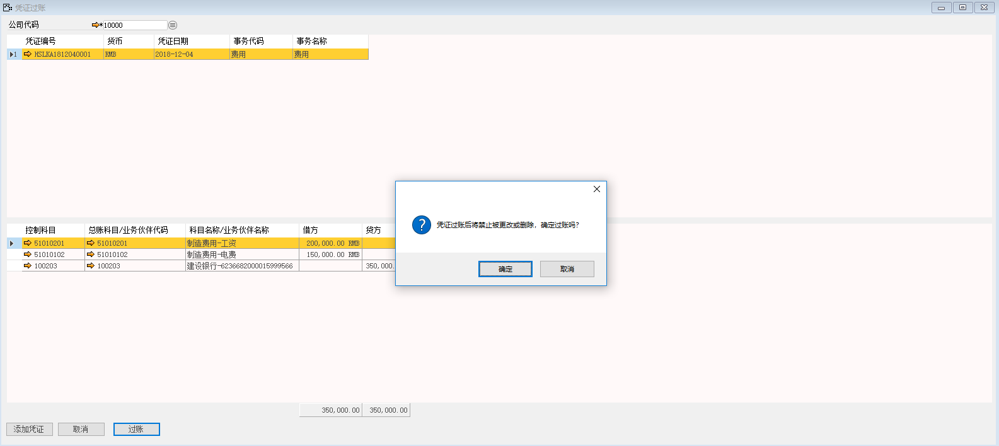

此功能将手动创建的总账凭证过账为正式的日记账分录。

例如：将上文创建的总账凭证进行过账操作，步骤如下：

1、 打开路径：从菜单窗口，总账-凭证过账，进入凭证列表；

2、 选择公司代码-10000、选中要过账的总账凭证行；

 

注：① 添加凭证：点击【添加凭证】按钮，进入总账凭证界面，创建新的总账凭证进行过账操作。

② 凭证过账只能对已批准的总账凭证进行过账，所以在使用【添加凭证】功能时需要将添加的凭证审批通过。