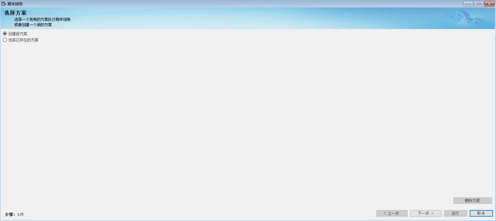
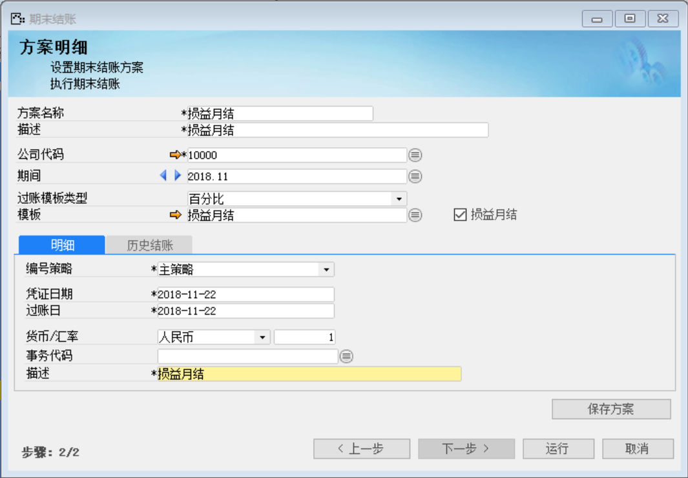
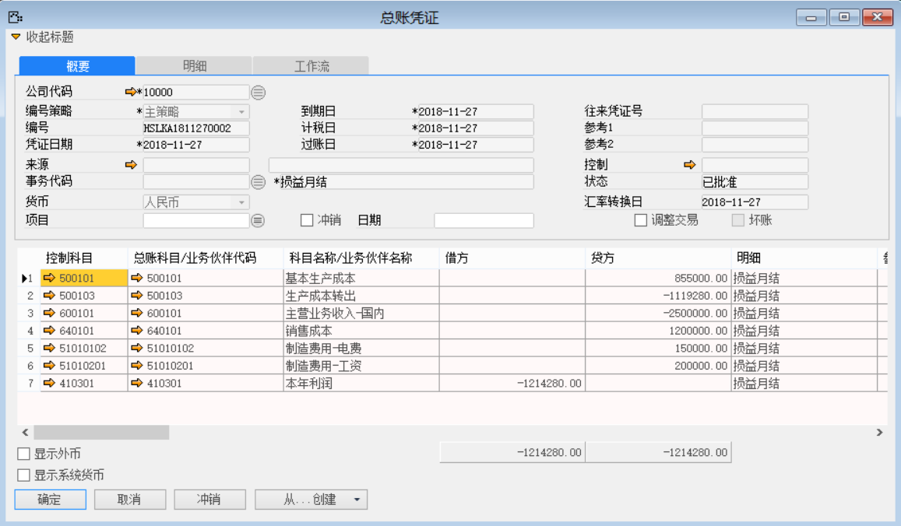

上文配置部分介绍了过账模板的应用，本章介绍利用定义好的损益月结过账模板进行期末结账。

前提：事先定义一个损益月结过账模板

1、 打开路径：从菜单窗口，总账-期末结账，进入选择方案界面；

2、 勾选‘创建新方案’按钮，左击‘下一步’按钮，进入到编辑方案明细界面；

 

3、 编辑方案名称、描述、公司代码、期间、过账模板等信息，编辑完成，左击‘保存方案’按钮，左击‘运行’按钮，进行期末结账；

- 方案名称：损益月结

- 描述：损益月结

- 公司代码：10000

- 期间：2018.11

- 过账模板类型：百分比

- 模板：损益月结

- 描述：损益月结

- 勾选：损益月结

 

4、 系统会自动生成一张总账凭证，再在总账科目下选择本年利润科目，将本张凭证保存，审批，过账，期末结账完成。

