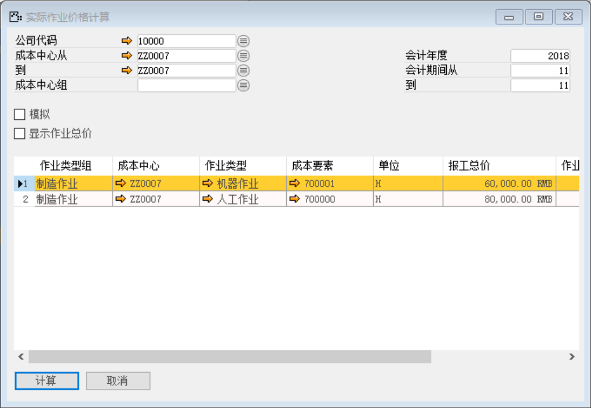
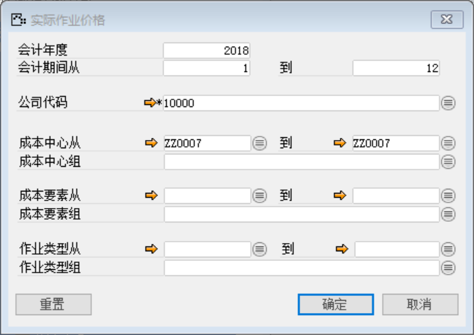
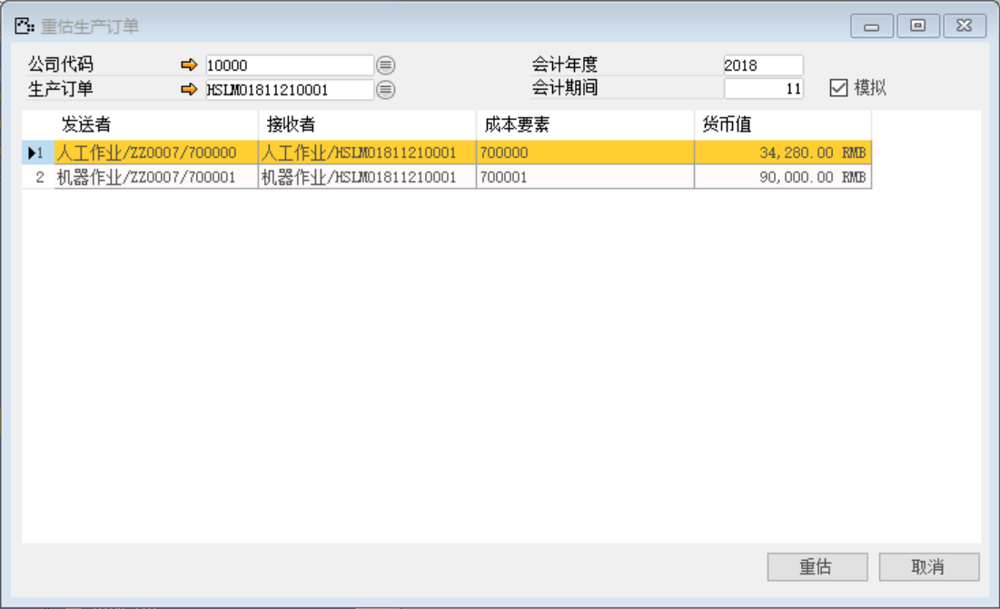
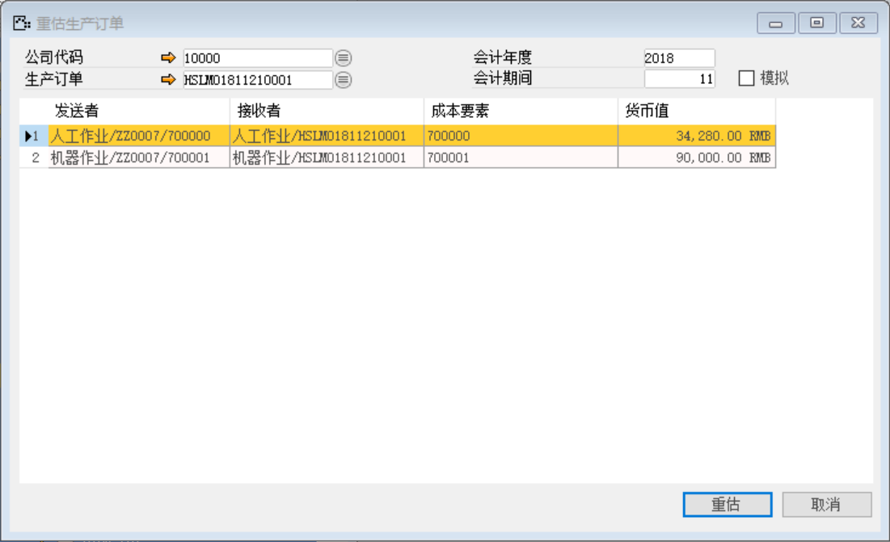
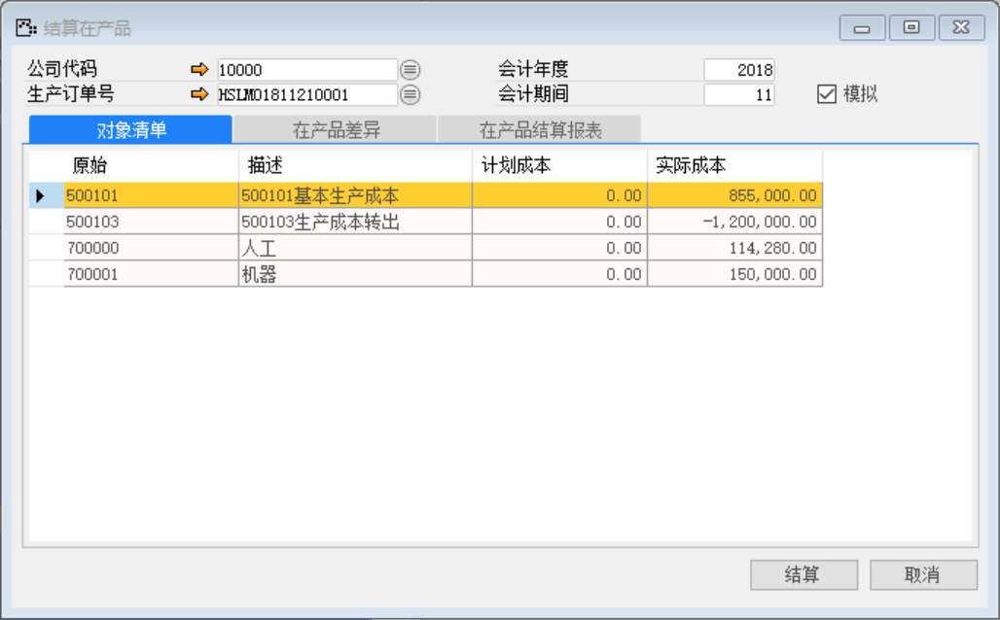
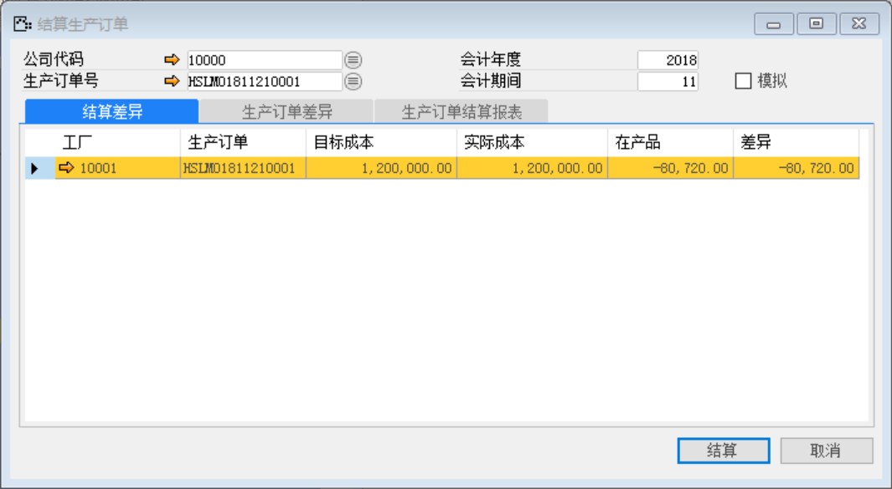

#### **概述**

本章主要讲解在系统内如何进项实际作业价格计算、查看实际作业价格、生产订单重估、在产品结算、生产订单结算、成本差异重估；讲解这些操作前提是已经将成本要素等生产成本还原一系列配置配好，制造费用工资水电的总账凭证已经过账。

#### **步骤**

实际作业价格计算

1、 打开路径：从菜单窗口，管理会计-产品成本结算-作业价格计算，打开创建界面；

2、 编辑成本中心从：ZZ0007到：ZZ0007 ，勾选模拟，左击‘计算’按钮；

 

3、 不勾选模拟。左击‘计算’按钮，进行实际作业价格计算；

 

查看实际作业价格

1、 打开路径：从菜单窗口，管理会计-产品成本结算-查看实际作业价格，打开筛选界面；

2、 编辑会计年度，成本中心，左击‘确认’按钮进入实际作业价格页面；

- 会计年度：2018

- 成本中心从：ZZ0007生产部；

- 到：ZZ0007生产部

 

 

重估生产订单

1、 打开路径：从菜单窗口，管理会计-产品成本结算-重估生产订单，打开界面；

2、 选择公司代码：10000，生产订单：HSLMO1811210001；勾选模拟，左击‘重估’按钮；

 

3、 不勾选模拟，点击【重估】按钮；

 

在产品结算

1、 打开路径：从菜单窗口，管理会计-产品成本结算-在产品结算，打开界面；

2、 选择生产订单号：HSLMO1811210001；勾选模拟，左击‘结算’按钮；

 

3、 不勾选模拟，点击【结算】按钮；

 

生产订单结算

1、 打开路径：从菜单窗口，管理会计-产品成本结算-生产订单结算，打开界面；

2、 选择生产订单号：HSLMO1811210001；勾选模拟，点击【结算】按钮；

 

3、 不勾选模拟，左击‘结算’按钮；

