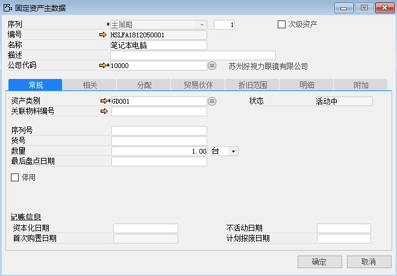

固定资产主数据是记录固定资产详细信息的卡片，它是资产业务交易的基础。

例如：创建苏州好视力眼镜有限公司的固定资产主文件‘笔记本电脑’，步骤如下：

1、 打开路径：从菜单窗口，固定资产-固定资产主文件，打开创建界面，并点击按钮准备创建；

2、 编辑固定资产主文件的公司、序列策略、名称以及描述；

- 公司代码：10000

- 名称：笔记本电脑

- 数量：1

- 单位：台

- 资产类别：GD001

3、 编辑固定资产主文件的详细信息在‘常规’，‘相关’，‘分配’，‘贸易伙伴’，‘折旧范围’，‘明细’，‘附加’选项卡下进行编辑；

- 成本中心：ZZ0002

- 勾选：折旧范围

4、 左击‘添加’进行保存，保存后自动生成资产编号,完成固定资产主数据的编辑。

