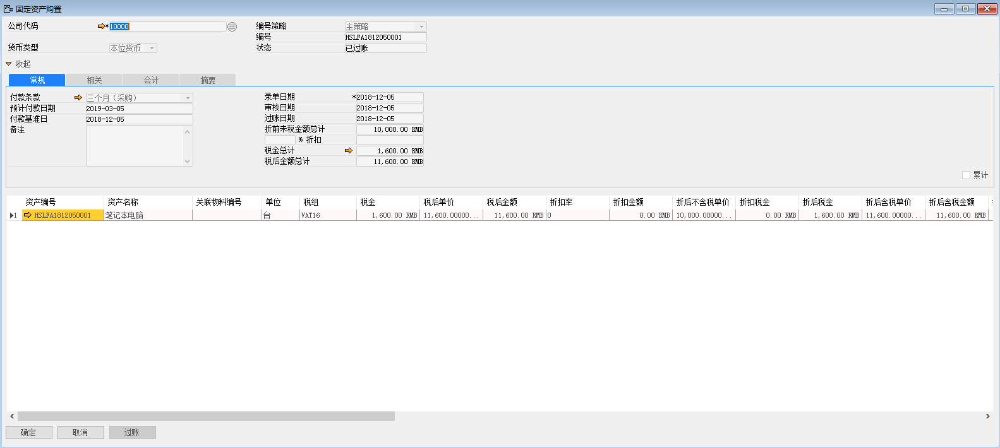
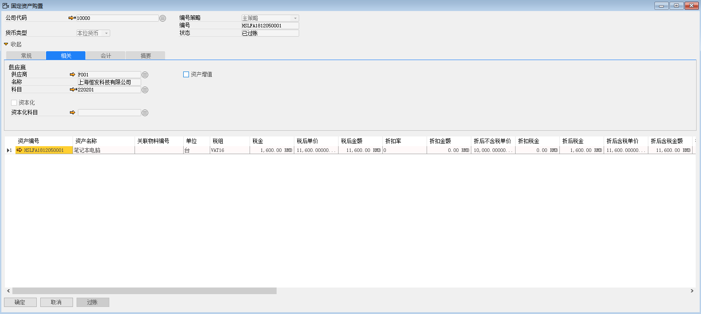

运用固定资产购置功能购买固定资产，必须定义固定资产主文件。

1、 打开路径：从菜单窗口，固定资产-固定资产购置，打开创建界面，并点击按钮准备创建；

2、 编辑购置单公司代码、货币、付款条款、税组、税后单价、成本中心以及编辑要购买的资产明细；

- 公司代码：10000

- 货币：本位币

- 付款条款：D/A

- 资产编号：HSLFA1812050001

- 税组：VAT16

- 税后单价：11600

- 成本中心：生产部

 

3、 在‘相关’选项卡下编辑供应商信息（科目一定要选择）；

- 供应商：P001

- 名称：上海恒发科技有限公司

- 科目：220201

 

4、 编辑完成，左击‘添加’按钮，审批通过后，左击‘过账’按钮，完成固定资产购置。

5、 固定资产购置产生财务凭证 

借：固定资产-计算机  10000

借：进项税额  1600

贷：上海恒发科技有限公司  11600

