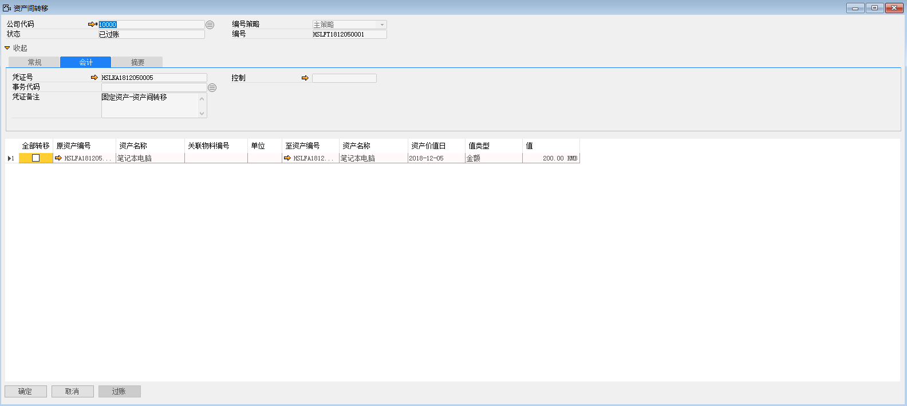
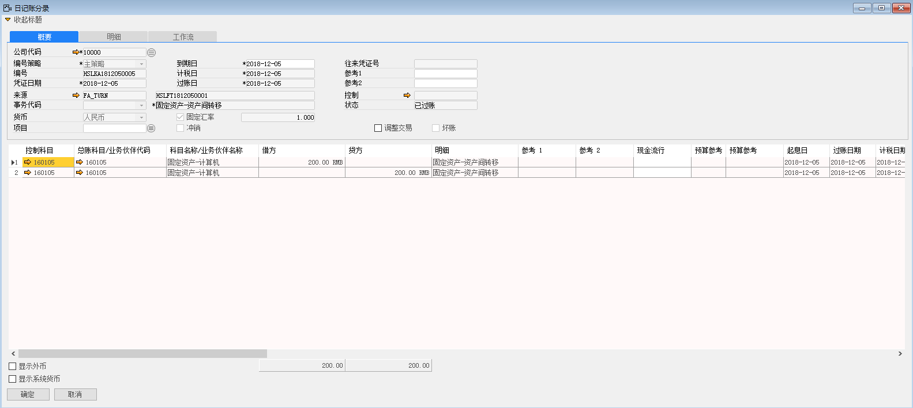

资产间转移就是将某个资产的价值转移至另一个资产中。

例如：将苏州好视力眼镜有限公司的HSLFA1812050001资产价值的200金额转移至HSLFA1812050002资产，步骤如下：

1、 打开路径：从菜单窗口，固定资产-固定资产转移-资产间转移，打开创建界面，并点击按钮准备创建；

2、 选择公司代码，编辑资产转移明细：原资产编号、至资产编号、资产价值日、值类型；

- 公司代码：10000

- 原资产编号：HSLFA1812050001

- 资产名称：笔记本电脑

- 至资产编号：HSLFA1812050002

- 资产名称：笔记本电脑

- 资产价值日：2018-12-05

- 值类型：金额

- 值：200RMB

3、 编辑完成，左击‘添加’按钮进行保存，审批通过后，左击‘过账’按钮，完成固定资产转移；

 

4、 资产间转移产生财务凭证 

借：固定资产-计算机  200

贷：固定资产-计算机  200

