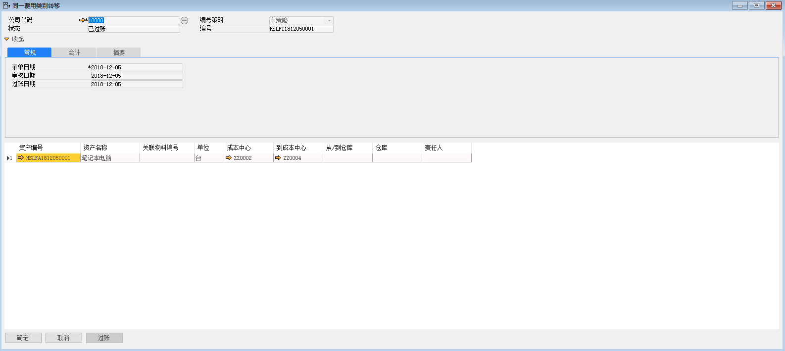

此功能主要是变更资产的成本中心

例如：将苏州好视力有限公司的HSLFA1812050001资产转移至ZZ0004成本中心，步骤如下：

1、 打开路径：从菜单窗口，固定资产-固定资产转移-同一费用类别的转移，打开创建界面，并点击按钮准备创建；

2、 选择公司代码、资产编号、资产名称、成本中心、到成本中心；

- 公司代码：10000

- 资产编号：HSLFA1812050001

- 成本中心：ZZ0002

- 到成本中心：ZZ0004

3、 编辑完成后，左击‘添加’按钮，审批通过后，左击‘过账’按钮，完成同一费用类别的转移。

