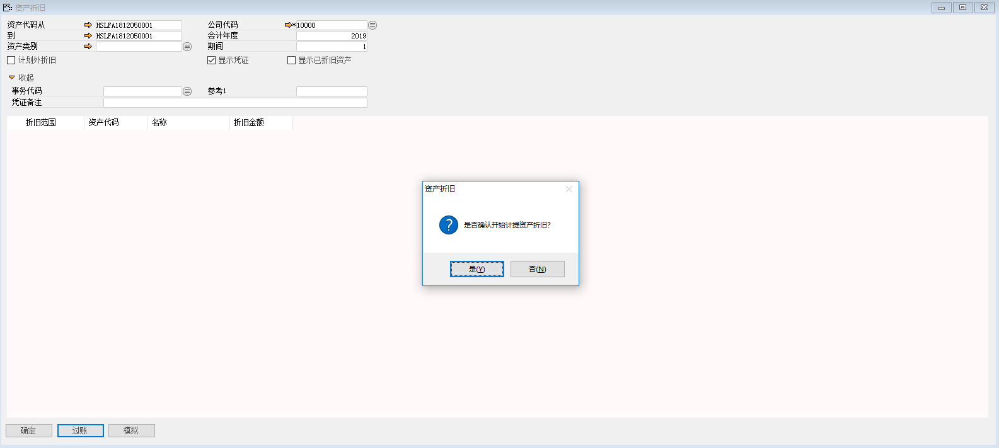
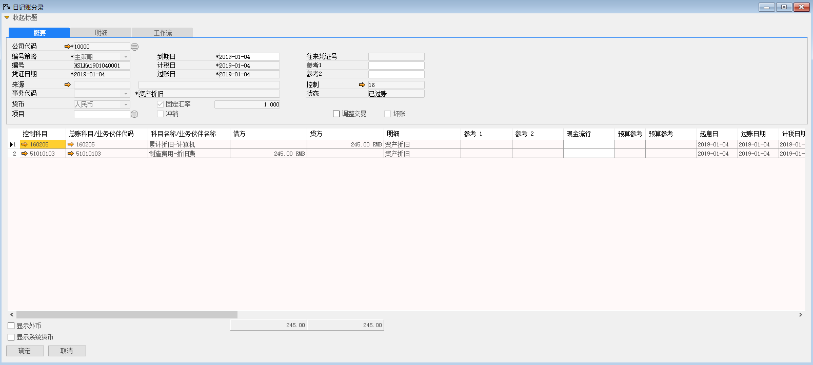
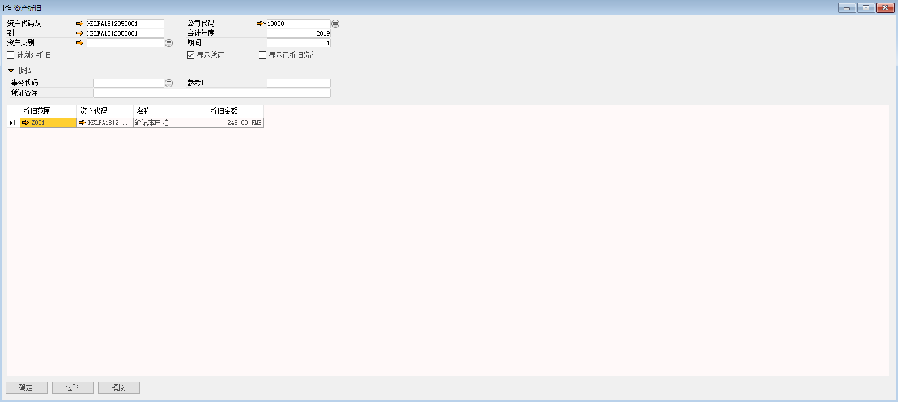

根据主文件中折旧范围设定的折旧码，按照当地法规对使用中的资产计提折旧。相同会计期间不同的折旧范围会计提不同的折旧。

例如：对苏州好视力眼镜有限公司的HSLFA1812050001资产进行普通资产折旧，步骤如下：

1、 打开路径：从菜单窗口，固定资产-固定资产折旧-普通折旧，打开创建界面，并点击按钮准备创建；

2、 选择公司、编辑资产代码从、资产代码到、会计年度、期间、勾选显示凭证，左击‘过账’按钮，系统提示：‘是否确认开始计提资产折旧’，左击‘确认’按钮，进行折旧；

- 公司代码：10000

- 资产代码从：HSLFA1812050001

- 资产代码到：HSLFA1812050001

- 会计年度：2019

- 期间：1

- 勾选：显示凭证

 

