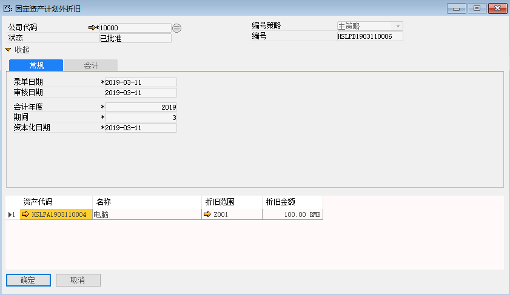
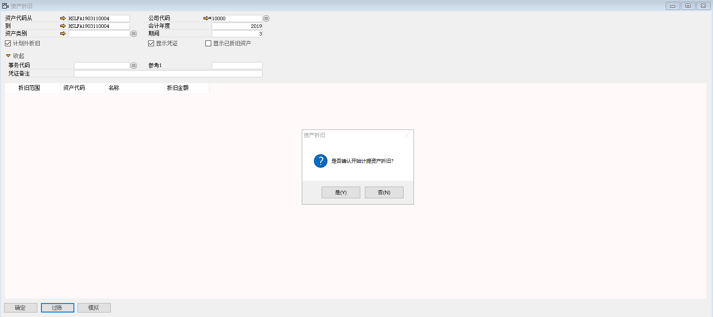
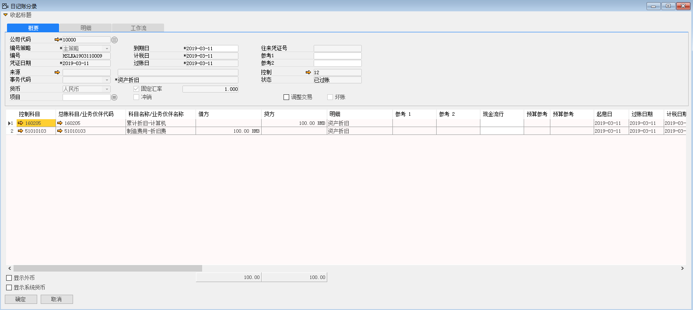
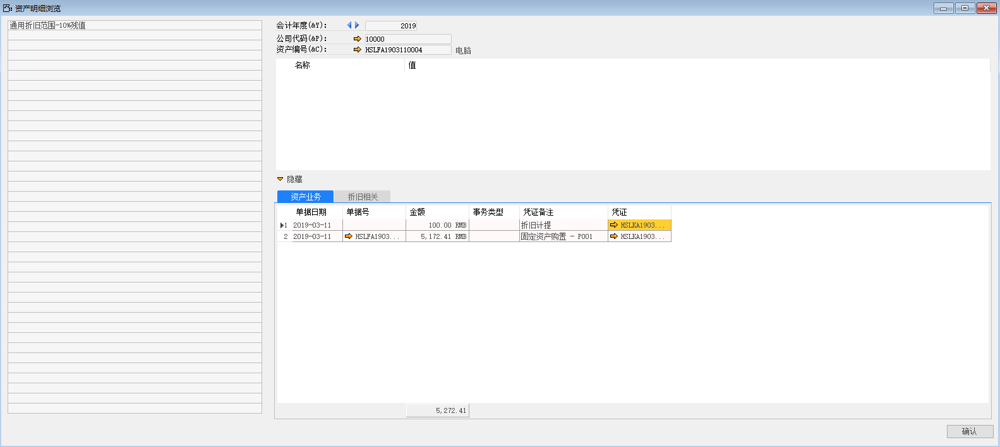

计划外折旧通常是为了资产在普通折旧的后续调整，手动指定调整金额。

例如：对苏州好视力眼镜有限公司的HSLFA1903110004资产进行计划外折旧，步骤如下：

1、 打开路径：从菜单窗口，固定资产-固定资产折旧-计划外折旧，打开创建界面，并点击按钮准备创建；

2、 选择公司、编辑资产代码、会计年度、期间，手动分配金额100元；

- 公司代码：10000

- 会计年度：2019

- 会计期间：3

- 资产代码：HSLFA1903110004

3、 左击‘添加’按钮，进行保存，发起审批；

 

4、 打开路径：从菜单窗口，固定资产-固定资产折旧-普通资产折旧，打开创建界面，并点击按钮准备创建；

5、 选择公司代码，勾选计划外折旧，勾选显示凭证，输入资产代码从、资产代码到，会计年度，期间；

- 资产代码从：HSLFA1903110004

- 资产代码到：HSLFA1903110004

- 公司代码：10000

- 会计年度：2019

- 期间：3

6、 左击‘添加’按钮，进行保存，左击‘过账’按钮，系统提示：‘是否确认开始计提资产折旧’，左击‘确认’按钮，进行折旧；

 

 

