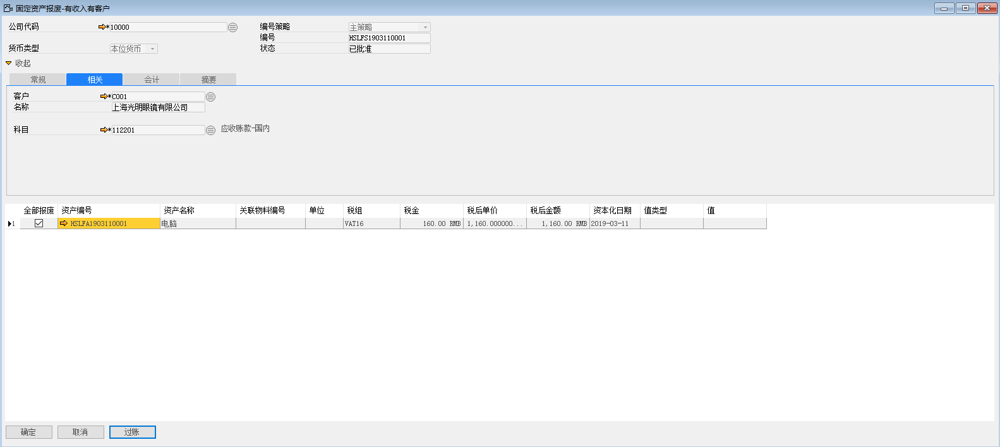

例如：对苏州好视力眼镜有限公司的HSLFA1903110001资产进行有收入有客户报废，步骤如下：

1、 打开路径：从菜单窗口，固定资产-固定资产报废-有收入有客户的报废，打开创建界面，并点击按钮准备创建；

2、 选择公司代码、资产编号、税组、税后单价、客户、科目，勾选全部报废；

- 公司代码：10000

- 资产编号：HSLFA1903110001

- 税组：VAT16

- 税后单价：1160

- 客户：C001    上海光明眼镜有限公司

- 科目：100101 现金

 

3、 左击‘添加’按钮，进行保存，发起审批；

4、 左击‘过账’按钮，系统提示‘凭证过账后将禁止被更改或删除，确定过账吗’，左击‘确定’按钮，进行过账，过账完成系统自动生成财务凭证；