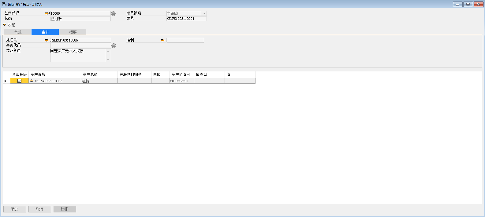

例如：对苏州好视力眼镜有限公司的HSLFA1903110003资产进行无收入的报废，步骤如下：

1、 打开路径：从菜单窗口，固定资产-固定资产报废-无收入的报废，打开创建界面，并点击按钮准备创建；

2、 选择公司代码、资产编号、资产价值日，勾选全部报废；

- 公司代码：10000

- 资产编号：HSLFA1903110003

- 资产价值日：2019-03-11

 

3、 左击‘添加’按钮，进行保存，发起审批；

4、 左击‘过账’按钮，系统提示‘凭证过账后将禁止被更改或删除，确定过账吗’，左击‘确定’按钮，进行过账，过账完成系统自动生成财务凭证；

