#### **概述**

李先生是好视力眼镜公司的设计研发部项目总监，公司开展了一项新的研发项目，制定好项目预算后，需要对研发过程中的发生的成本和制定的预算做即时控制。

#### **步骤**

1.启用“预算即时控制”功能

打开【系统运行参数】界面，于【会计】选项卡下启用【预算即时控制】

打开路径：【管理】-【系统初始化】-【系统运行参数】

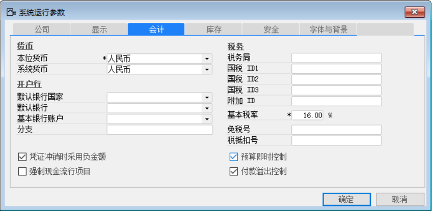 

2.定义仓库控制码

打开【定义仓库控制码】界面，勾选当前业务流程会使用到的出入库业务凭证类型；

打开路径：【项目】-【定义】-【定义仓库控制码】

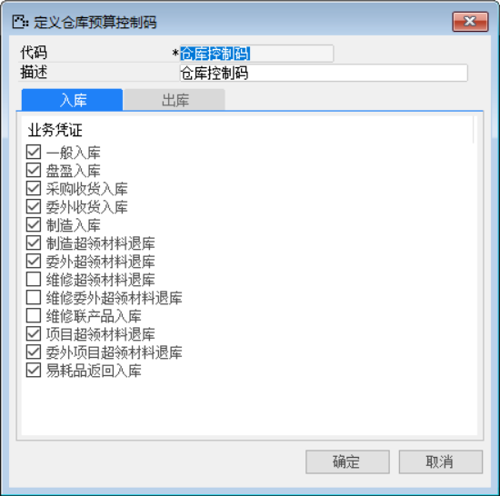 

3.定义项目控制码

打开【定义项目控制码】界面，定义新的项目控制码，并将上一步定义的“仓库控制码”分配到当前项目控制码；勾选【控制项目预算】、【物料显示在项目构建树】；

打开路径：【项目】-【定义】-【定义项目控制码】

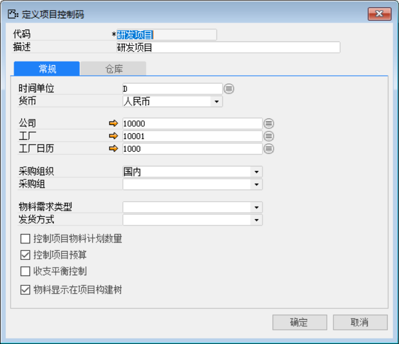 

4.定义项目

打开【定义项目】，定义新的项目代码和名称

打开路径：【管理】-【基础定义】-【一般】-【定义项目】

- 【项目代码】：HSL-FFS

- 【项目名称】：防辐射眼镜

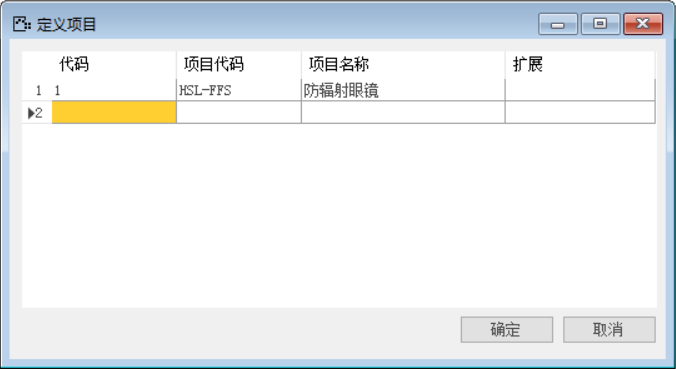 

5.项目构建与权限分配

打开【项目构建】页面，根据上述已定义项目和实际情况创建项目具体内容。

打开路径：【项目】-【项目构建】

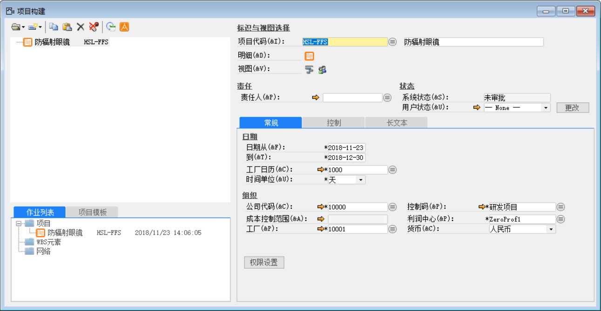 

点击【权限设置】按钮，分配用户相应权限

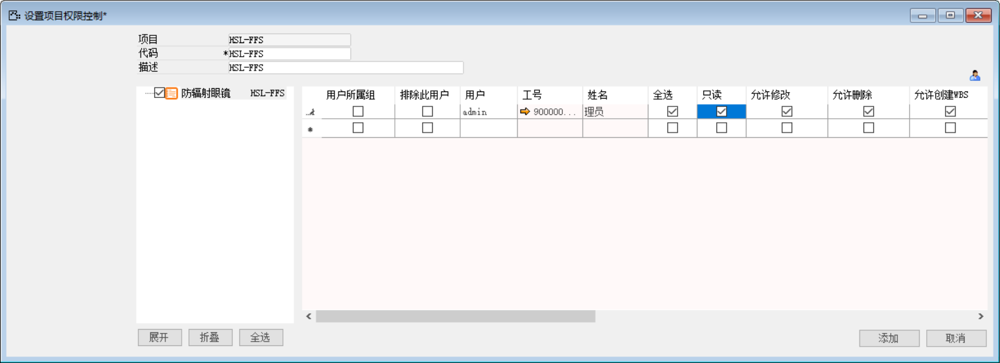 

6. 项目分解与规划

点击【项目分解WBS】按钮，对项目进行WBS分解。

对项目进行WBS分解可将项目分解为不同阶段，再对WBS进行分解，分解为内部活动（具体任务），外部活动，还可以根据实际情况添加物料、资源（人力）、项目文档、文本等。

**注意：项目分解后的WBS处于未批准状态不允许发生成本；项目只有启用审批流后才能发起审批并批准，可于【未决定的凭证】--【凭证草稿】中查看尚未批准的项目与其节点。**

**建议：项目分解WBS时建议先创建一个总WBS，再对其进行分解。这样当需要复制WBS时，即可将所有节点全部复制，有效提高工作效率和体验。**

6.1分解WBS：

对项目进行分解，创建总WBS节点HSL-FFS-001如下图所示：

隶属于：HSL-FFS

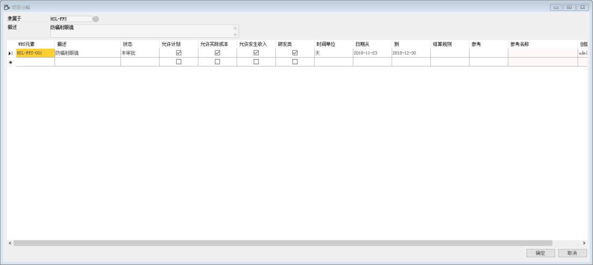 

再对总WBS节点HSL-FFS-001进行分解如下图所示：

隶属于：HSL-FFS-001

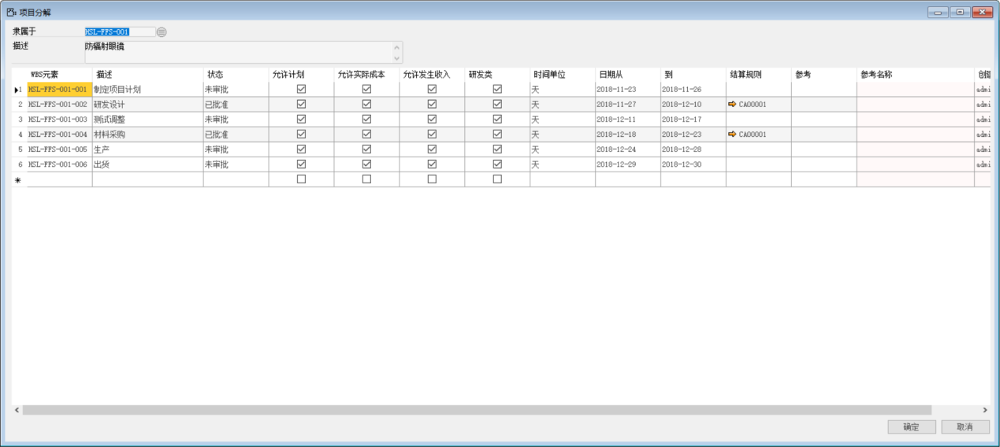 

6.2 分解内部活动：

为WBS节点HSL-FFS-001-002创建内部活动如下图所示：

隶属于：HSL-FFS-001-002

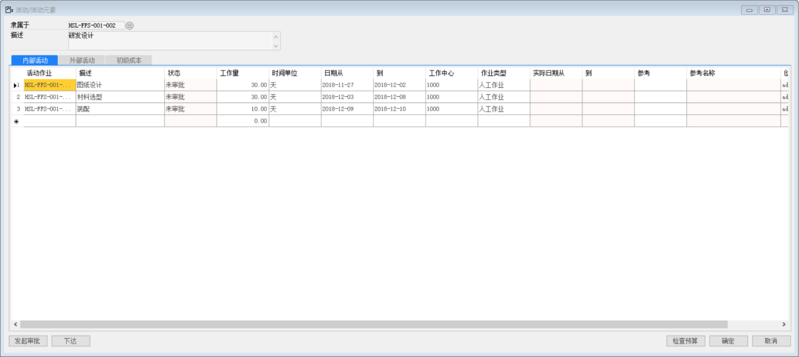 

6.3分解外部活动：

为WBS节点HSL-FFS-001-004创建外部活动如下图所示：

隶属于：HSL-FFS-001-004

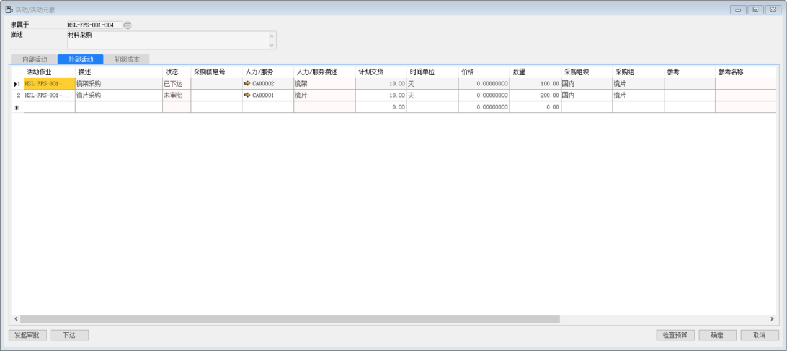 

项目分解完后，可在【项目构建】界面查看到当前项目的具体状态。

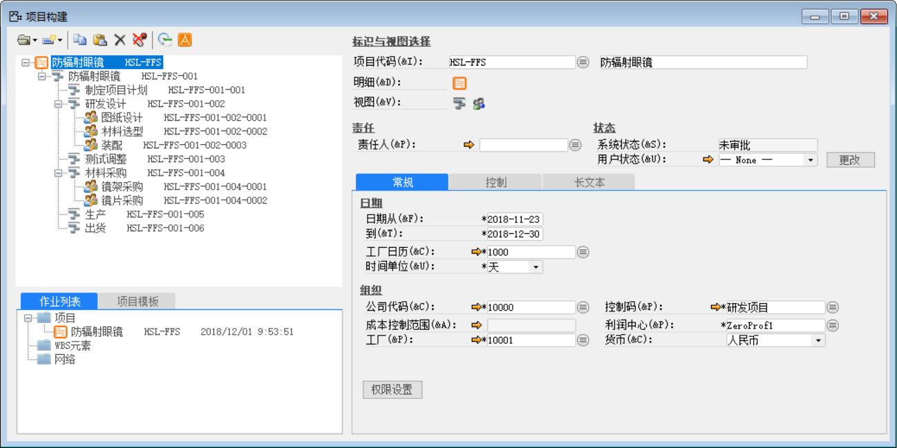 

点击左上按钮，进入【项目规划】界面，可以看到当前项目的甘特图

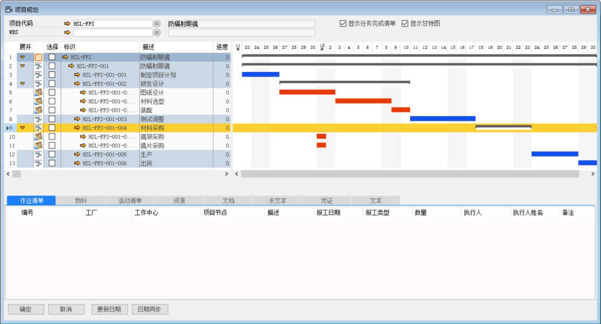 

7. 项目预算管理

李先生作为项目总监，确定当前项目的预算后，需要实时关注项目的预算发生额。

打开路径：【项目】-【规划与预算】-【项目预算】

制定项目预算：打开【项目预算】界面，在【预算】栏填入对当前项目各节点所规划的总预算并审核批准。

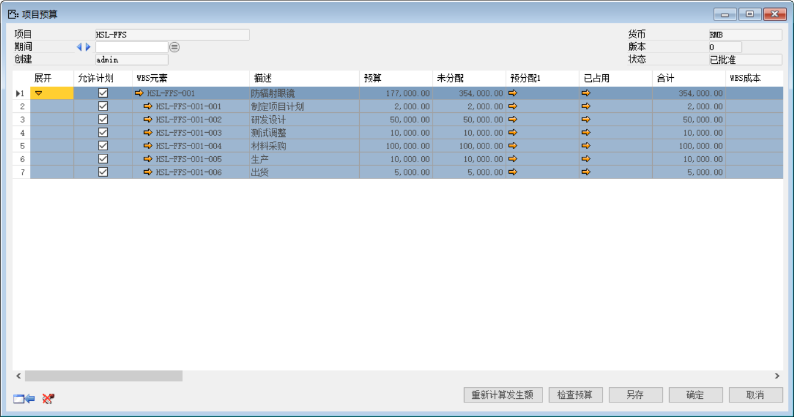 

【预分配1】：材料的【采购订单、采购收货与订单差异、发票与收货差异】+人工的【采购订单】+易耗品领用[WBS]、费用报销、服务发票、服务发票分摊,手工总账

【预分配2】(可超不做控制):材料的工地仓库直接入库、材料向工地的移库+人工收货+易耗品领用[WBS]、费用报销、服务发票、服务发票分摊 ,手工总账

【实际占用】：材料项目发货+ 人工收货+易耗品领用[WBS]、费用报销、服务发票、服务发票分摊,手工总账、一般入库(退库)

*注意：确保项目预算累计收入与累计支出能正确反映实际预算情况，事先需要保证科目表已正确配置。*

*例如：现金银行类科目正确勾选：【现金/利润中心科目】*

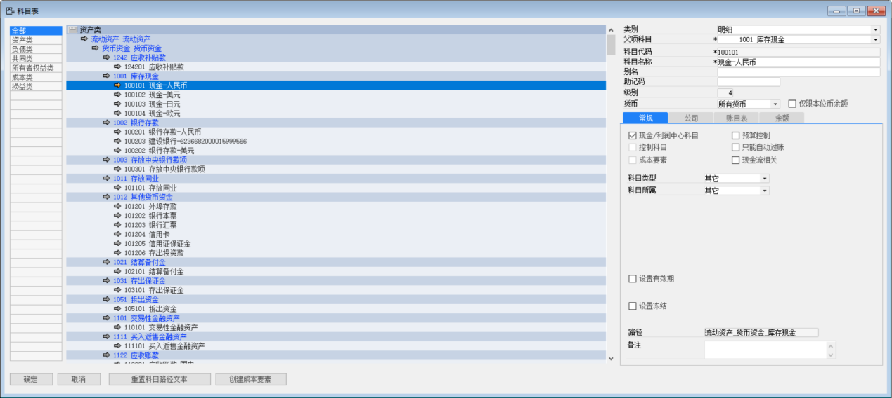 

项目研发当期发生研发费用和物料采购成本。

7.1项目研发当期发生研发费用

手工创建总账凭证，审批并过账

- 借：研发费     8000     【WBS】:HSL-FFS-001-002

- 借：工资       2000         【WBS】:HSL-FFS-001-002

- 贷：银行存款-人民币   10000

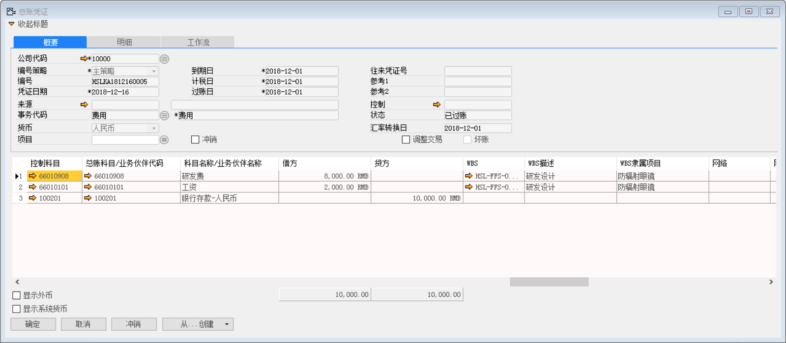 

此时，项目预算【累计收入】中会计入发生的这一笔费用10000元

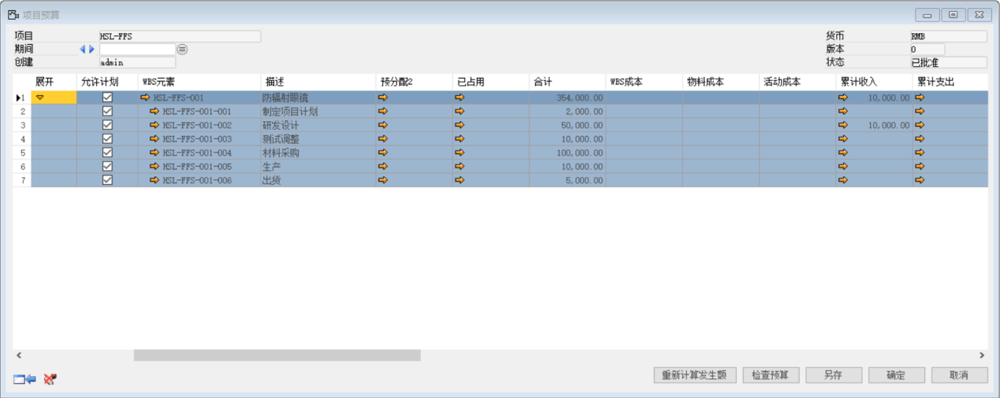 

7.2 项目研发当期发生采购事项

下达节点“HSL-FFS-004”下所属外部活动，系统自动创建为采购申请单，再创建为采购订单。

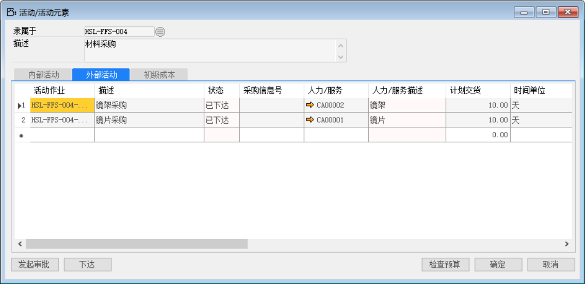 

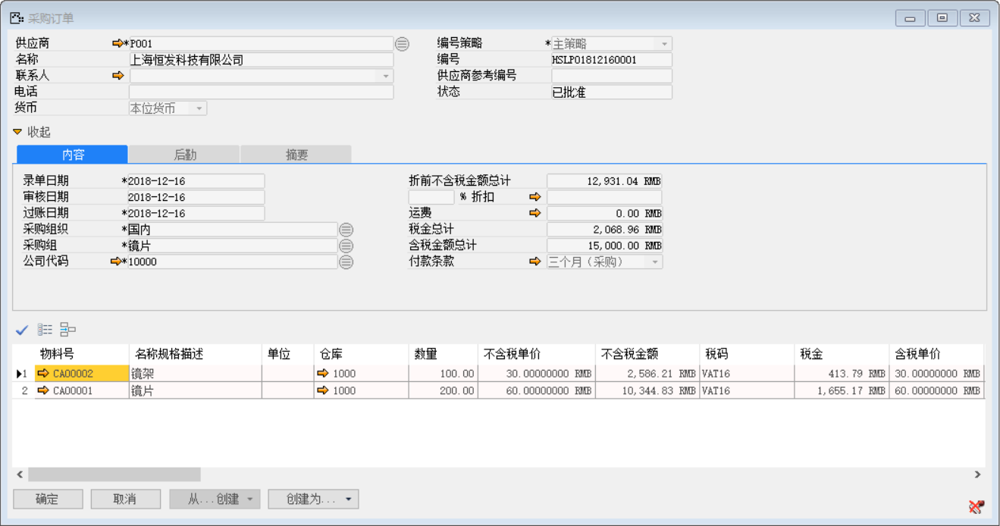 

采购订单：

【物料】：CA00002；【数量】：100；【单价】：30；【WBS】：HSL-FFS-004

【物料】：CA00001；【数量】：200；【单价】：60；【WBS】：HSL-FFS-004

此时，项目预算模块WBS节点HSL-FFS-004的【预分配1】会计入当前预计会发生的成本。

 