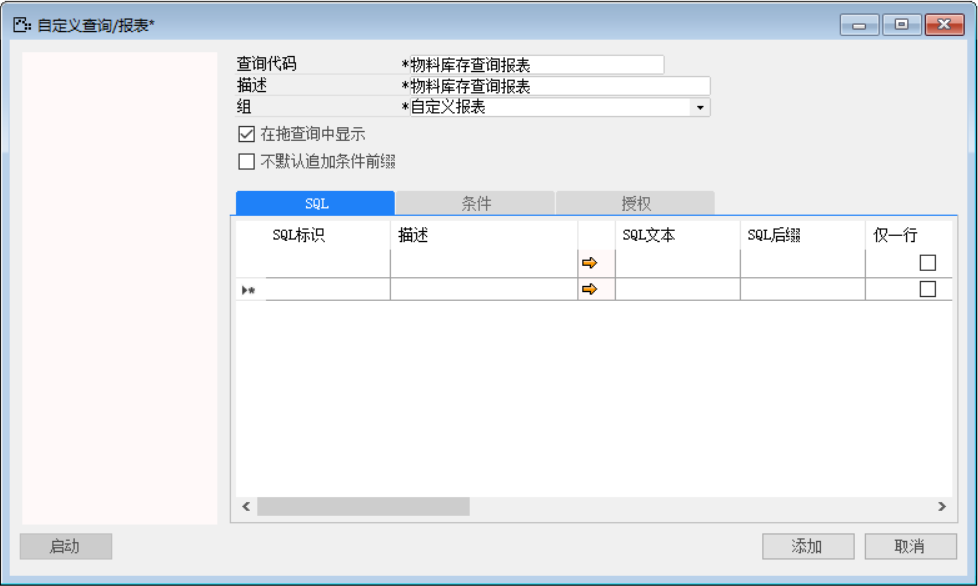
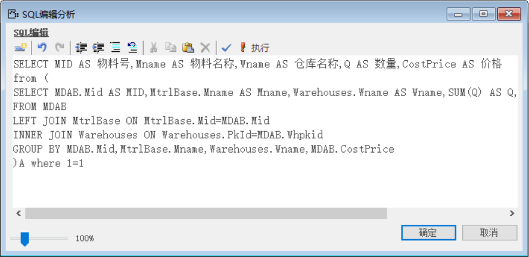
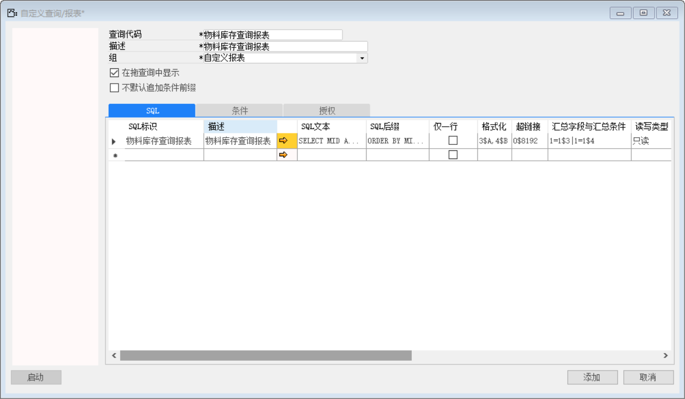
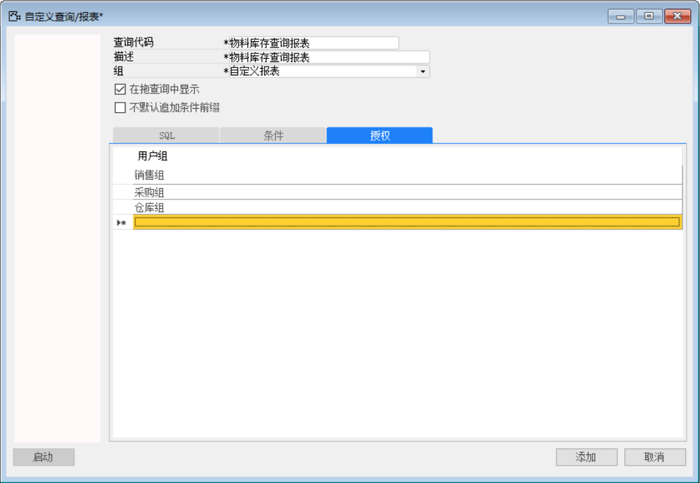
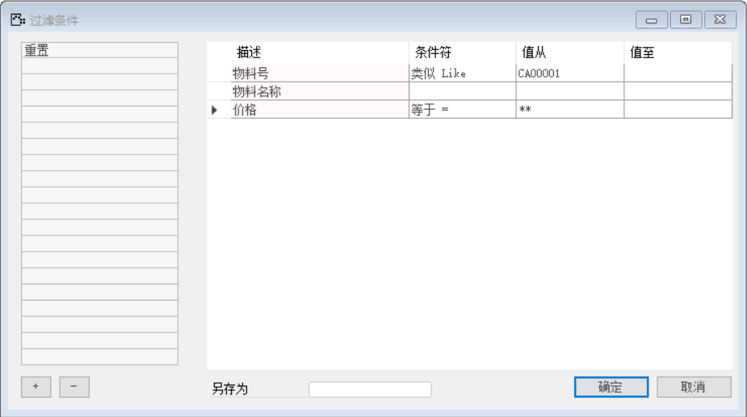
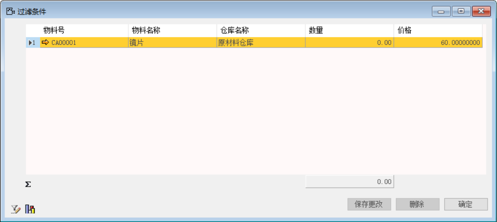
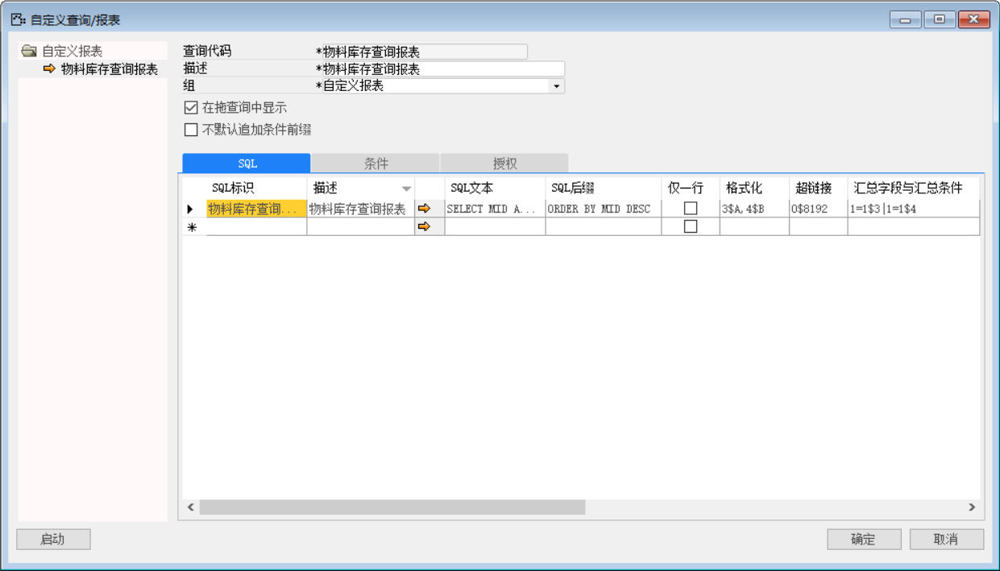
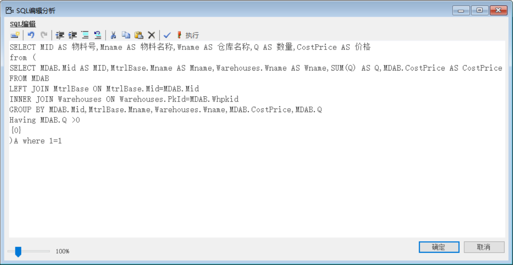
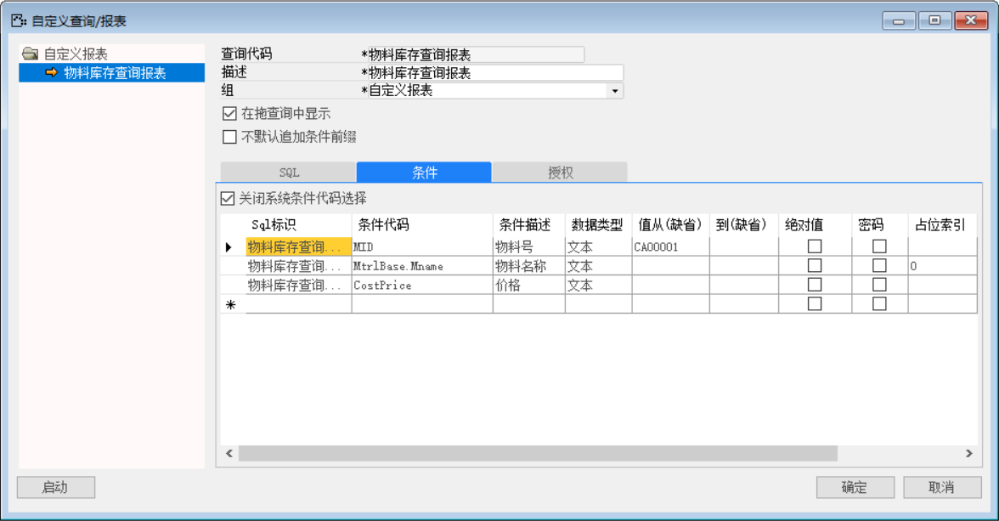
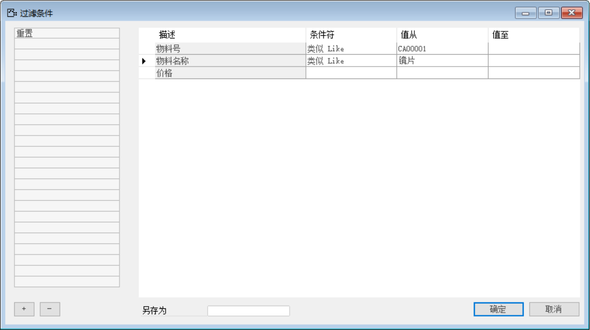

#### **概述**

本节内容介绍自定义查询/报表，此功能用来配置更多的数据查询分析结果、公式数据源、报表打印源、审批视图、警报消息来源、自动分录备注描述及其他一些扩展都需要用到自定义查询/报表。

#### **步骤**

打开路径：菜单栏—工具—自定义查询/报表

1、 打开【自定义查询/报表】界面，定义新的“自定义查询报表”；

- 查询代码：物料库存查询报表；

- 描述：物料库存查询报表；

- 组：自定义报表；

- 勾选在拖查询中显示。

 

2、 在“SQL”选项卡下定义SQL内容与格式；

- SQL标识：物料库存查询报表；

- 描述：物料库存查询报表；

- SQL文本：详细见下文图片；

SELECT MID AS 物料号,Mname AS 物料名称,Wname AS 仓库名称,Q AS 数量,CostPrice AS 价格 

from (

SELECT MDAB.Mid AS MID,MtrlBase.Mname AS Mname,Warehouses.Wname AS Wname,SUM(Q) AS Q,MDAB.CostPrice AS CostPrice

FROM MDAB

LEFT JOIN MtrlBase ON MtrlBase.Mid=MDAB.Mid 

INNER JOIN Warehouses ON Warehouses.PkId=MDAB.Whpkid

GROUP BY MDAB.Mid,MtrlBase.Mname,Warehouses.Wname,MDAB.CostPrice

)A where 1=1

- SQL后缀：ORDER BY MID DESC；

- 格式化：3$A；

- 超链接：0$8192；

- 汇总字段与汇总条件：1=1$3；

- 读写类型：选择只读；

 

 

3、 在“条件”选项卡下定义查询条件内容；

- 勾选关闭系统条件代码选择复选款；

- 设置条件内容：

| **SQL标识** | **条件代码** | **条件描述** | **数据类型** | **值从（缺省）** | **到（缺省）** | **绝对值** | **密码** |
| ------------------- | ------------ | ------------ | ------------ | ---------------- | -------------- | ---------- | -------- |
| 物料库存查询报表    | MID          | 物料号       | 文本         | CA00001          |                |            |          |
| 物料库存查询报表    | Mname        | 物料名称     | 文本         |                  |                |            |          |
| 物料库存查询报表    | Costprice    | 价格         | 文本         |                  |                | ✔          | ✔        |

 

4、 在“授权”选项卡下分配权限给用户组

 

5、 点击【保存】保存后，在左侧列表中单机选中“物料库存查询报表”点击【启动】按钮打开过滤条件界面条件符选择：类似Like、=、>、<等条件，再值从中输入所查询值；或在系统“拖&查询”菜单中的报表中打开。

 

 

#### **占位索引**

##### **概述**

自定义查询/报表配置的查询条件系统默认是加在SQL语句的最后来筛选，而位索引可以改变配置查询条件在SQL语句中的放置位置，使得查询效率得到提升。

##### **步骤**

1、 打开【自定义查询/报表】界面，在界面左侧的项目栏选择定义好的自定义查询报表：“物料库存查询报表”；

 

2、 在SQL文本中添加占位索引符至对应的位置；

SQL文本：详细见一下图片；

SELECT MID AS 物料号,Mname AS 物料名称,Wname AS 仓库名称,Q AS 数量,CostPrice AS 价格 

from (

SELECT MDAB.Mid AS MID,MtrlBase.Mname AS Mname,Warehouses.Wname AS Wname,SUM(Q) AS Q,MDAB.CostPrice AS CostPrice

FROM MDAB

LEFT JOIN MtrlBase ON MtrlBase.Mid=MDAB.Mid 

INNER JOIN Warehouses ON Warehouses.PkId=MDAB.Whpkid

GROUP BY MDAB.Mid,MtrlBase.Mname,Warehouses.Wname,MDAB.CostPrice,MDAB.Q 

Having MDAB.Q >0

{0}

)A where 1=1

 

3、 切换至‘条件’选项卡下，配置自定义查询/报表的筛选条件为‘MID’、‘MtrlBase.Mname’和‘CostPrice‘,并在占位索引栏中输入值；

 

注：占位索引,为空表示是补全，输入格式：-1，1,2。格式字符串含义为：列索引，逗号表示多列的分割符；

4、 点击【更改】保存后，在左侧列表中单机选中“物料库存查询报表”点击【启动】按钮打开过滤条件界面条件符选择：类似Like、=、>、<等条件，再值从中输入所查询值；或在系统“拖&查询”菜单中的报表中打开。

 

