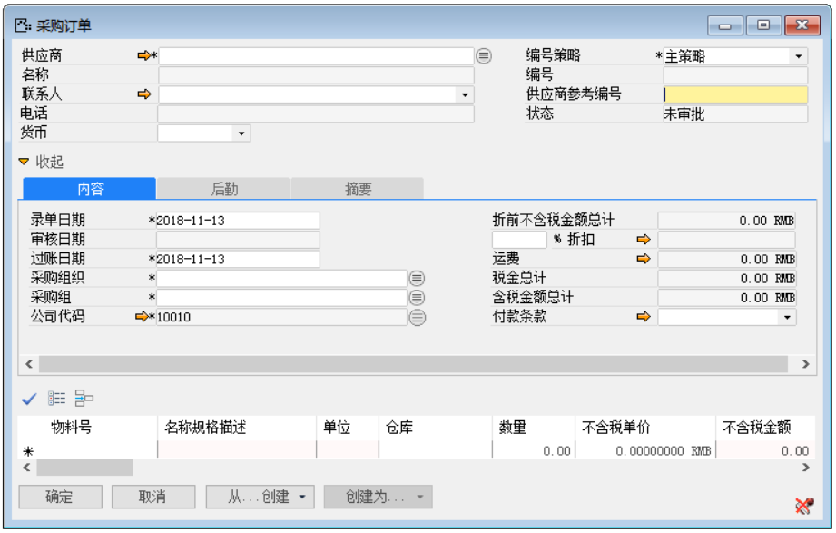
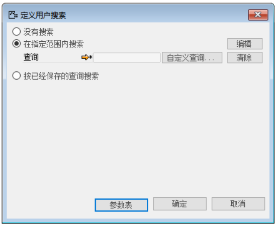
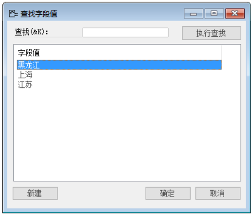
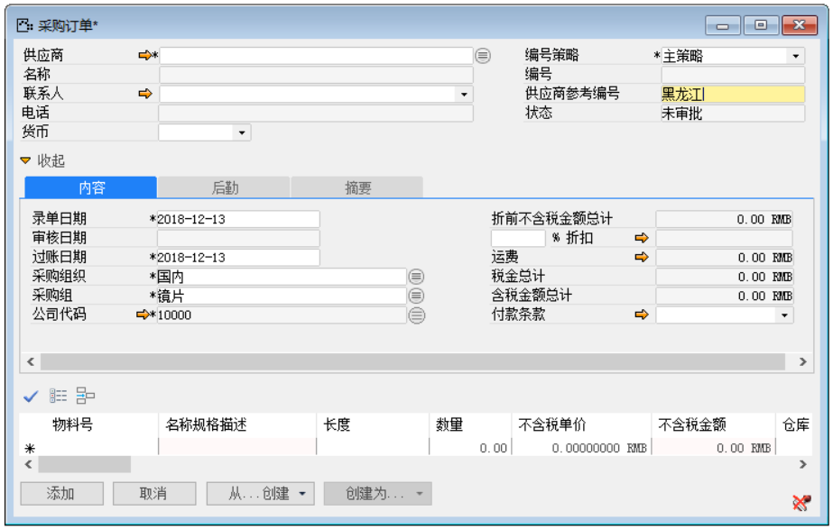

例如：用户在创建采购订单时，需要对输入项供应商输入内容，但仅仅只提供了国内这大范围类型的片面信息，用户为了方便采购，以及减少采购成本，想知道更加详细的信息，如：某某物料是来自华北地区的那个城市；某某半成品又是从东北那个城市提供的。而BAP系统缺省功能里是没有的，这个时候就用到了用户搜索中的‘在指定范围内搜索’。通过这个功能，能够更加了解供应商的详细信息，方便采购，减少采购成本，提高公司效益。

那么完成上述功能我们需要进行以下操作：

1. 首先打开一个采购订单，并使光标锁定‘供应商参考编号’文本，如图2-1-1所示；

 

**图2-1-1**

2. 打开用户搜索路径：菜单栏->工具->用户搜索->定义，如图2-1-2所示；

**图2-1-2**

3. 打开用户搜索界面，选中‘按指定范围内搜索’，如图2-1-3所示；

 

**图2-1-3**

4. 点击【编辑】字段进入编辑器，定义字段值，如图2-1-4所示；

**图2-1-4**

5. 在字段值【确定】以及用户搜索【保存】按钮、【确定】按钮后退出用户搜索设置，并对其进行测试。

6. 测试结果，在采购订单中供应商参考编号处的空白文本上，鼠标双击，跳出窗口，执行查找即可，如图2-1-5，2-1-6所示：

 

**图2-1-5**

 

**图2-1-6**