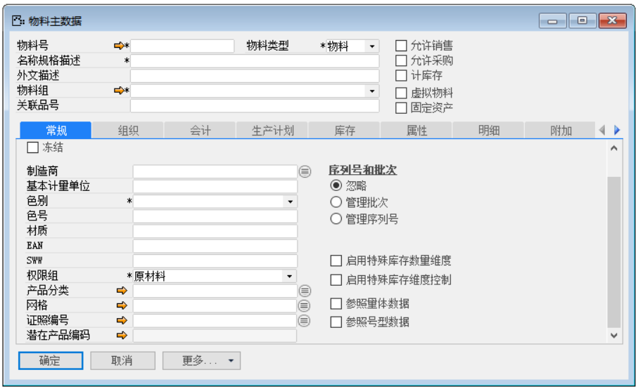
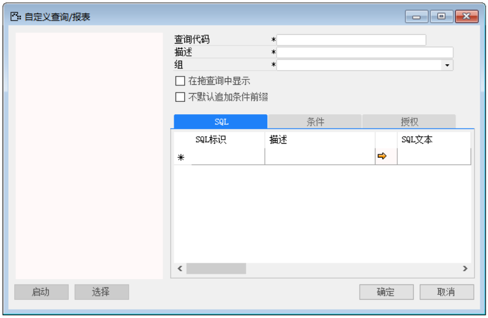
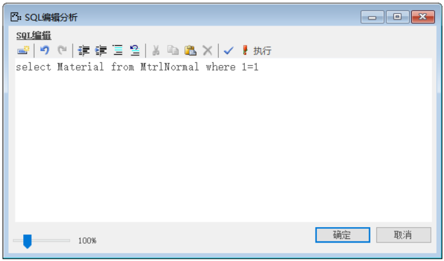
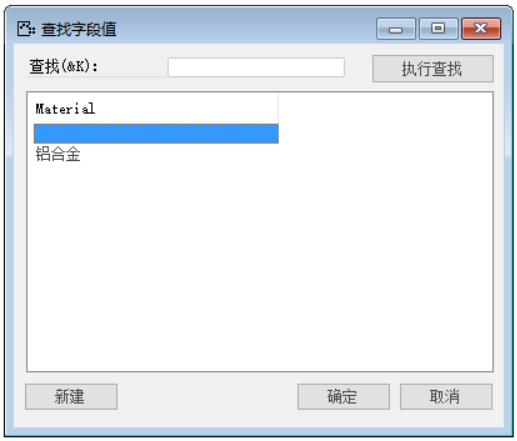
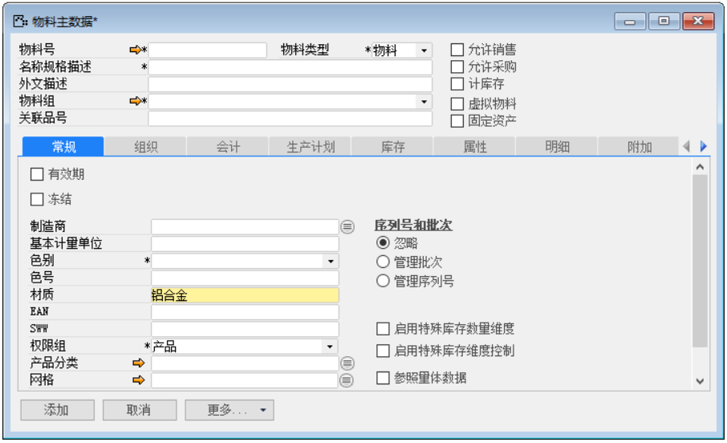

例如：用户搜索中自定义查询用来配置更多的数据查询分析结果，用户可能在创建物料主文件时，发现跟以前物料材质属性一样时，可以调用其属性。但是创建量过多，重复输入，会降低工作效率。这个时候为了减少输入工作量，就用到了用户搜索中的自定义搜索。

那么完成上述功能我们需要进行以下操作：

1. 首先打开一个物料主数据，并使光标锁定常规字段下‘材质’空白文本上，如图2-2-1所示；

 

**图2-2-1**

2. 打开用户搜索路径：菜单栏->工具->用户搜索->定义，如图2-2-2所示；

**图2-2-2**

3. 打开用户搜索界面，选中‘按指定范围内搜索’，如图2-2-3所示；

 

**图2-2-3**

4. 点击【自定义查询】按钮进入编辑器界面，如图2-2-4所示；

 

**图2-2-4**

5. 编辑查询代码，描述以及所属组，如图2-2-5所示；

 

**图2-2-5**

6. 以及编辑SQL里面的代码，如图2-2-6所示；

 

**图2-2-6**

7. 点击【确定】按钮退出SQL编辑，点击【添加】按钮保存并退出编辑器，点击【保存】按钮保存并点击【确定】退出用户搜索界面，并对其进行测试。

8. 测试结果，在物料主数据中材质处，空白文本上，鼠标双击，跳出窗口，执行查找即可，如图2-2-7，2-2-8所示：

 

**图2-2-7**

 

**图2-2-8**