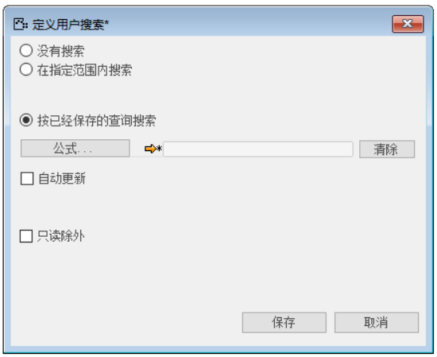
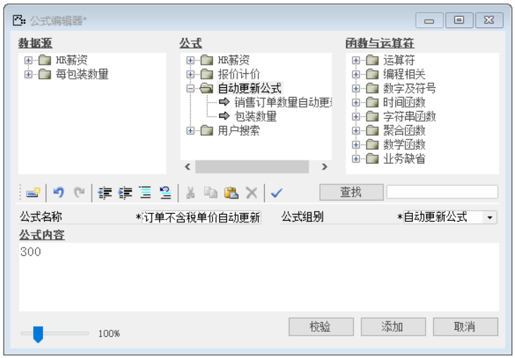
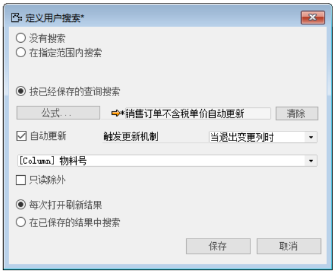
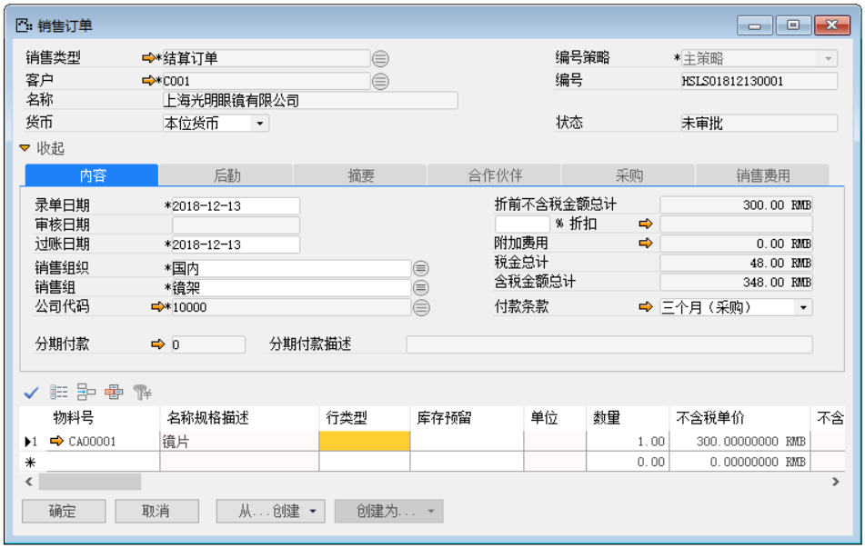

例如：用户和他的客户达成协议，客户要求销售订单中某种物料的不含税单价固定为300。这个时候为了减少流程，可以将物料的不含税自动更新，减少填写不含税单价内容的工作量，提高工作效率。

那么完成上述功能我们需要进行以下操作：

1. 首先打开一个销售订单，并使光标锁定明细行上的‘不含税单价’文本上，如图2-3-1-1所示；

 

**图2-3-1-1**

2. 打开用户搜索路径：菜单栏->工具->用户搜索->定义，如图2-3-1-2所示；

 

**图2-3-1-2**

3. 打开用户搜索界面，选中‘按已经保存的查询搜索’，如图2-3-1-3所示；

**图2-3-1-3**

4. 点击【公式】按钮进入公式编辑器界面，如图2-3-1-4所示；

 

**图2-3-1-4**

5. 编辑代码，在公式内容直接输入“300”，公式名称输入“销售订单不含税单价自动更新”，公式组别输入“自动更新公式”，如图2-3-1-5所示；

 

**图2-3-1-5**

6. 点击【添加】按钮保存并点击【确定】退出公式编辑器；

7. 勾选【自动更新】按钮，触发更新机制选择“当退出变更列时”并且选中“物料号”，如图2-3-1-6所示；

**图2-3-1-6**

8. 并点击【保存】按钮保存，【确定】退出界面，并对其进行测试。

9. 测试结果，创建一个新销售订单，在明细行上，输入物料时。系统会自动更新不含税单价内容，如图2-3-1-7所示:

 

**图2-3-1-7**