例如：用户和他的客户达成协议，客户要求某种货物按包装单位来出售，且每包数量也统一，在没有其它通知时，用户交货时包装单位数量是固定的。这个时候为了减少流程，在销售给客户时，同样可以将物料的每包单位数量自动更新，减少填写数量的工作量，提高工作效率。

那么完成上述功能我们需要进行以下操作：

1. 首先打开一个物料主数据，如图2-3-2-1所示；

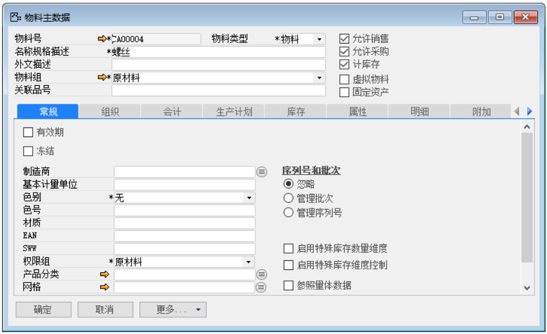 

**图2-3-2-1**

2. 点击左下角【更多...】按钮，选择‘销售、采购、库存设置’，如图2-3-2-2所示；

**图2-3-2-2**

3. 打开‘销售、采购、库存设置’界面，编辑销售字段下‘每包装单位数量’内容，如图2-3-2-3所示；

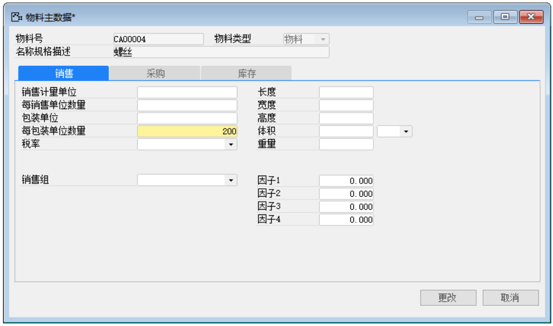 

**图2-3-2-3**

4. 点击【更改】按钮保存，并点击【确定】按钮退出‘销售、采购、库存设置’界面；

5. 创建一个自定义查询，菜单栏->工具->自定义查询/报表，如图2-3-2-4所示；

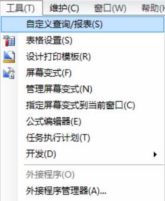

**图2-3-2-4**

6. 编辑查询代码，名称，所属组等信息，如图2-3-2-5所示；

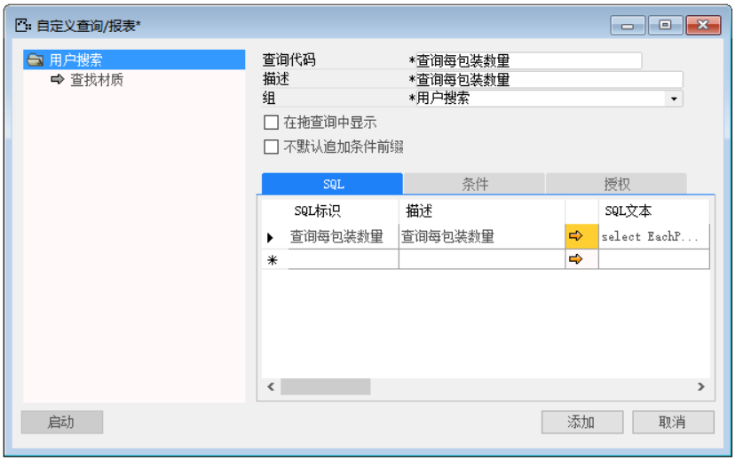 

**图2-3-2-5**

7. 编辑SQL代码，如图2-3-2-6所示；

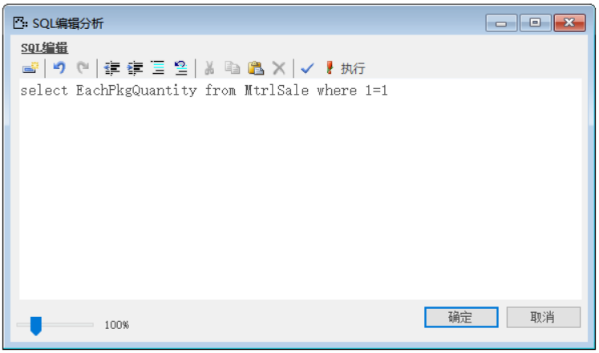 

**图2-3-2-6**

8. 点击【添加】按钮保存，并点击【确定】按钮退出编辑器，在‘条件’选项卡下首先勾选‘关闭系统条件代码选择’，并进行编辑内容，如图2-3-2-7所示；

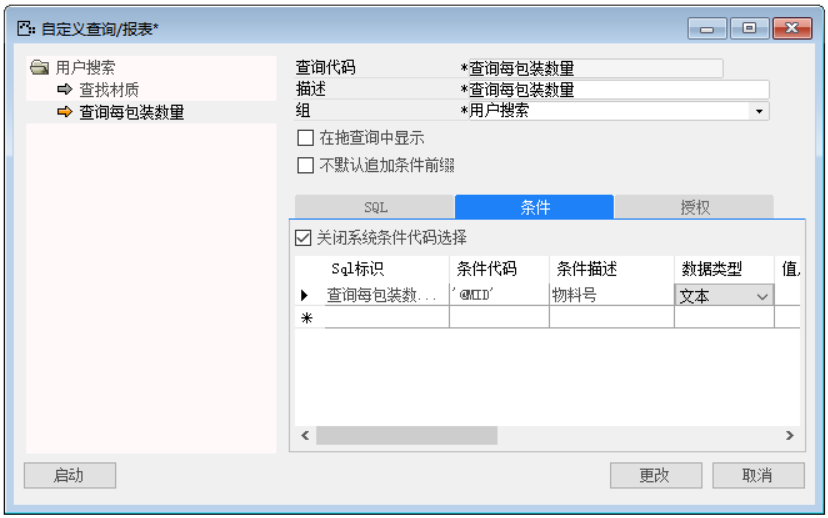

**图2-3-2-7**

9. 点击【更改】按钮保存，并点击【确定】按钮退出编辑器；

10. 第十步：打开销售订单，并使光标锁定在明细行‘数量’文本上，如图2-3-2-8所示；

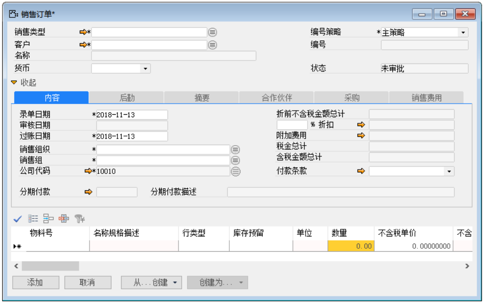 

**图2-3-2-8**

11. 打开用户搜索路径：菜单栏->工具->用户搜索->定义，如图2-3-2-9所示；

**图2-3-2-9**

12. 打开用户搜索界面，选中‘按已经保存的查询搜索’，如图2-3-2-10所示；

**图2-3-2-10**

13. 点击【公式...】按钮进入公式编辑器界面，点击数据源上空白处使的鼠标右击，选择内容‘新建数据源’，如图2-3-2-11所示；

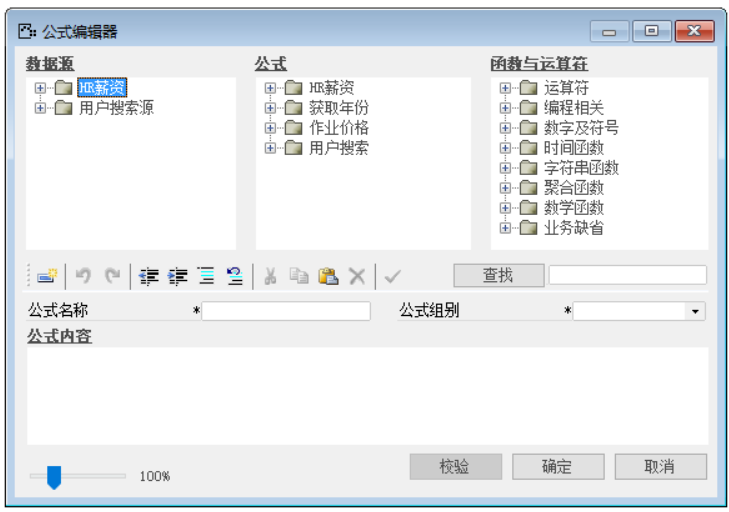 

**图2-3-2-11**

14. 编辑代码内容，选择自定义查询，进入自定义查询/报表窗口，选择定义好的数据，点击下方的‘选择’按钮，如图2-3-2-12，2-3-2-13，2-3-2-14所示；

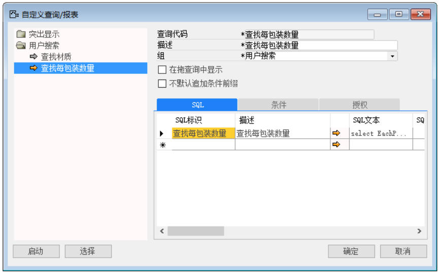 

**图2-3-2-12**

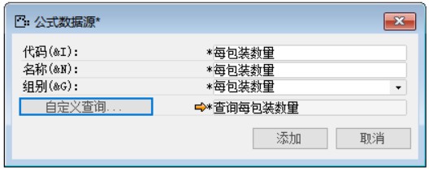 

**图2-3-2-13**

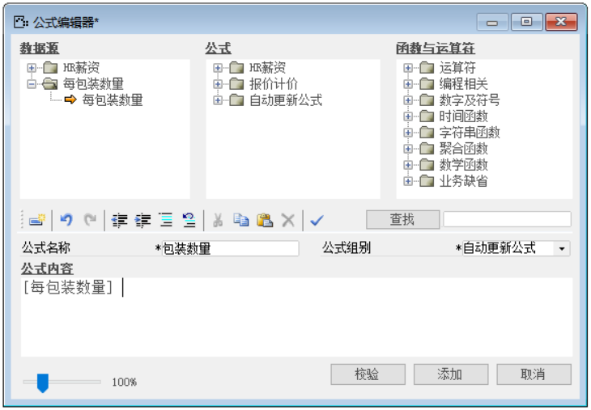 

**图2-3-2-14**  

15. 点击【添加】按钮保存，并点击【确定】按钮退出公式编辑器；

16. 点击勾选‘自动更新’，触发更新机制选择‘当退出变更列时’，并且选中“物料号”，如图2-3-2-16所示；

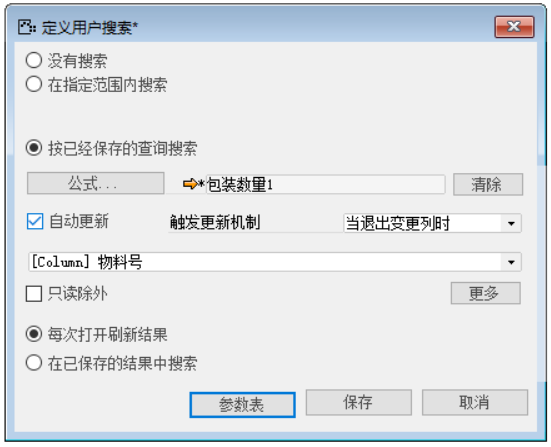

**图2-3-2-16**

17. 第十七步：点击【保存】按钮进行保存；

18. 第十八步：点击【参数表】按钮进行参数设置,如图2-3-2-15所示；

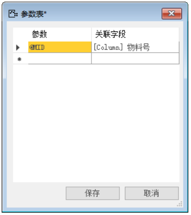

**图2-3-2-15**

19. 点击【保存】按钮保存并退出参数编辑，并对其进行测试。

20. 测试结果，创建一个销售订单，在明细行中，输入定义销售设置的每包装数量的物料号，系统会自动更新数量，如图2-3-2-17所示：

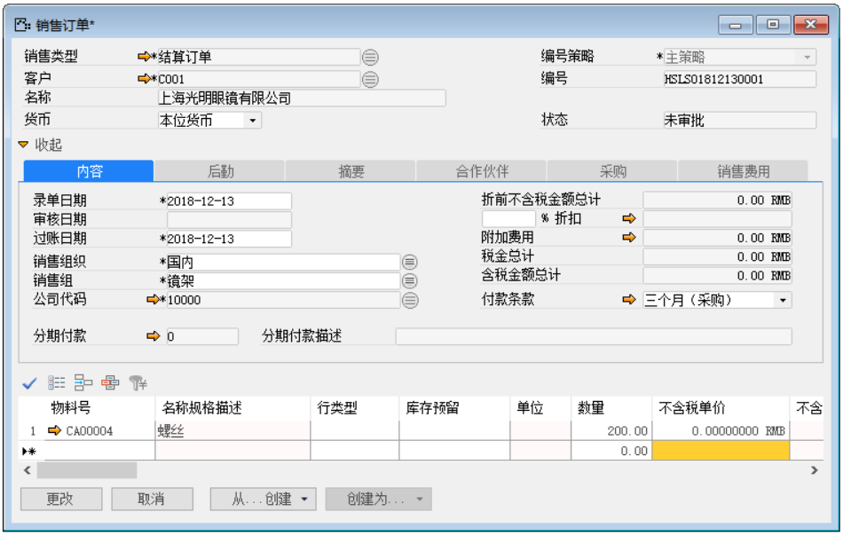 

**图2-3-2-17**
