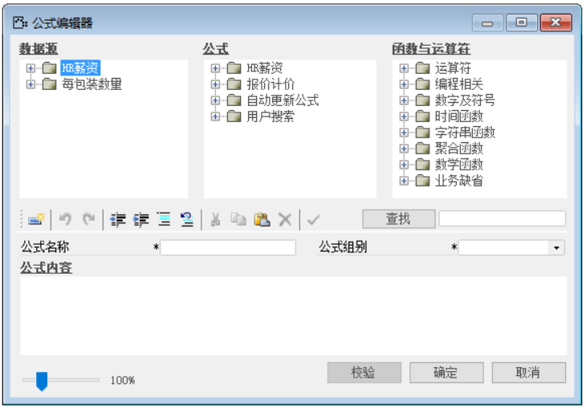
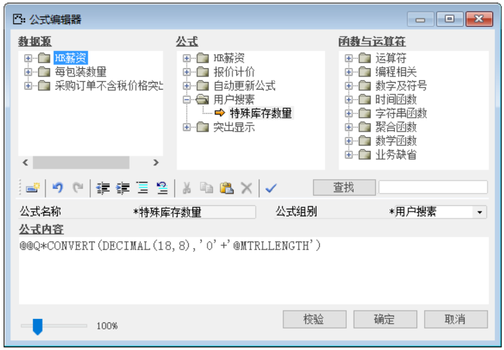
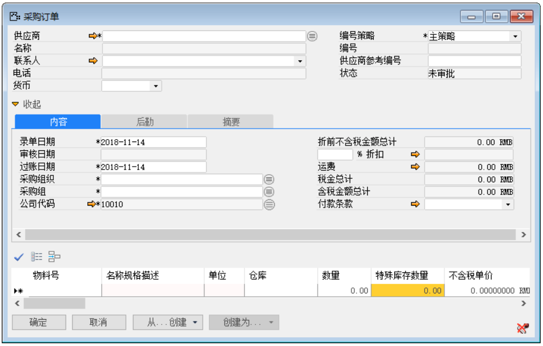
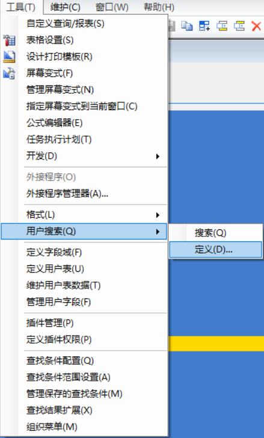
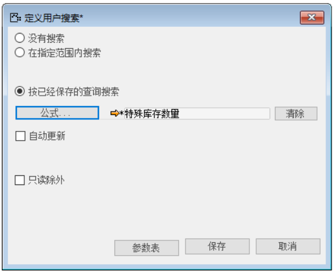
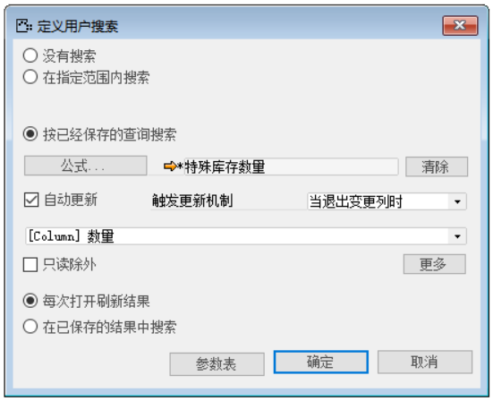
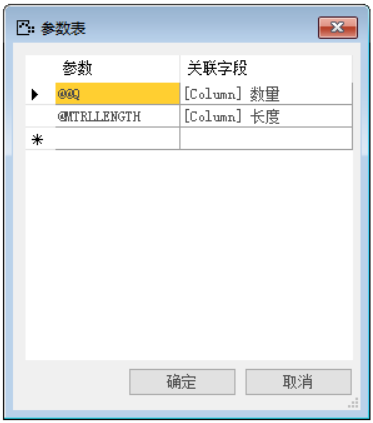
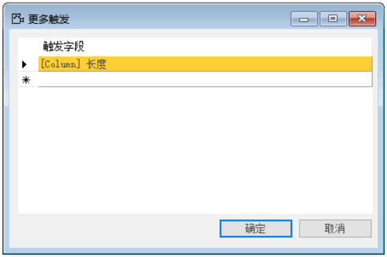
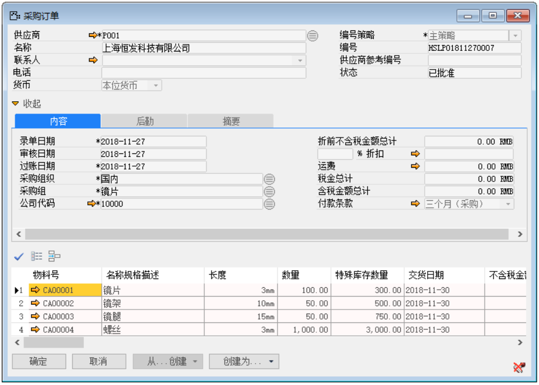

例如：我们对于一些物料的特殊要求时，需要放置在特殊库存中，且对存储数量而言，是随着物料的数量、长度的变化而变化，并且它存在这样的公式：特殊库存数量=数量*长度（取长度的数值）。

那么完成上述功能我们需要进行以下操作：

1. 打开自定义查询/报表路径，菜单栏->工具->公式编辑器，如图2-4-1所示；

 

**图2-4-1**

2. 编辑代码，运算逻辑为‘数量*长度’的公式，如图2-4-2所示（记住该公式中的参数）；

 

**图2-4-2**

3. 点击【更改】按钮保存，【确定】按钮退出公式编辑器；

4. 打开采购订单并将光标锁定至明细栏‘特殊库存数量’列，如图2-4-3所示；

 

**图2-4-3**

5. 从工具栏，工具->用户搜索->定义，如图2-4-4所示，

**图2-4-4**

6. 打开定义用户搜索界面，选中‘按已保存的查询搜索’，选择上文创建的公式，如图2-4-5所示；

 

**图2-4-5**

7. 选中‘自动更新’复选框，选择更新机制为‘退出变更列时’并选择列为‘数量’，并点击‘保存’，如图2-4-6所示；

 

**图2-4-6**

8. 设定参数值（公式中的参数需要进行声明即设定其对应的列），点击界面的【参数表】，进入设置界面，如图2-4-7所示；

**图2-4-7**

9. 点击定义界面的【更多】按钮，进入多自动更新条件编辑界面，选择如图2-4-8所示内容，并保存；

**图2-4-8**

10. 点击【保存】完成并退出用户搜索的定义，并对其进行测试；

11. 测试结果，创建采购订单，在明细行中，输入物料，在长度和数量文本上，输入内容，系统自动更新特殊库存数量，如图2-4-9所示。

 

**图2-4-9**