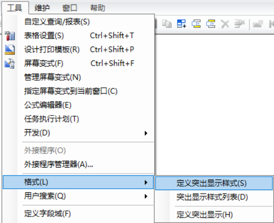
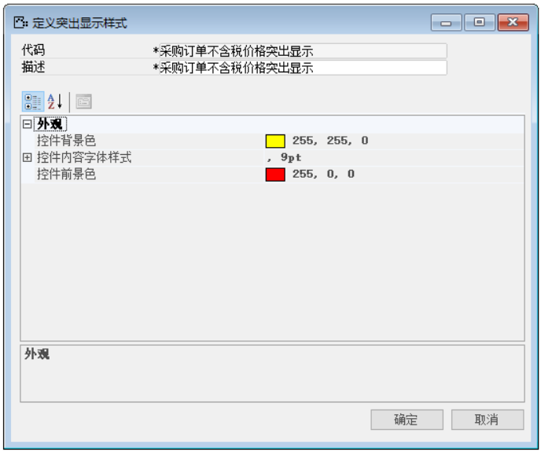

定义突出显示样式就是满足一定条件的某数据，定义突出显示样式代码、外观背景色、内容字体样式、前景色属性等显示特殊效果。

那么完成上述功能我们需要进行以下操作：

1. 打开定义突出显示样式，菜单栏->工具->格式->定义突出显示样式，如图3-1-1-1所示；

 

**图3-1-1-1**

2. 打开定义突出显示样式窗口，并编辑定义突出显示内容，如图3-1-1-2所示；

**图3-1-1-2**

3. 点击【添加】按钮进行保存，【确定】按钮退出编辑窗口，并对其进行测试。