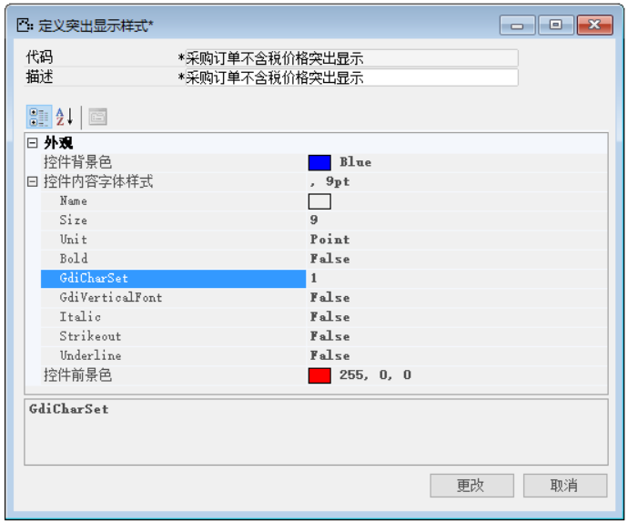

那么完成上述功能我们需要进行以下操作：

1. 打开定义突出显示样式，菜单栏->工具->格式->定义突出显示样式，如图3-1-2-1所示；

 

**图3-1-2-1**

2. 打开需要更改的定义突出显示样式窗口，如图3-1-2-2所示；

 

**图3-1-2-2**

3. 根据需求更改样式内容，选择‘控件背景色’颜色更改为“蓝色”如图3-1-2-3所示；

 

**图3-1-2-3**

4. 点击【更改】按钮进行保存，【确定】退出编辑窗口，并对其进行测试。