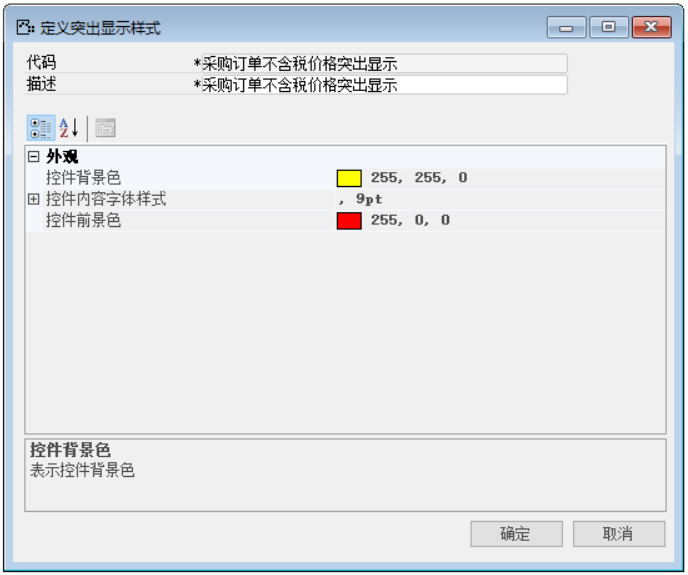
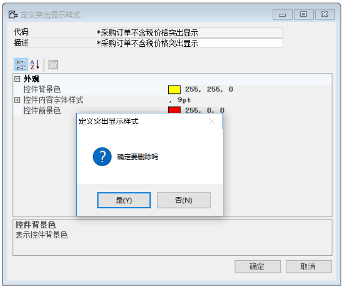

那么完成上述功能我们需要进行以下操作：

1. 打开定义突出显示样式，菜单栏->工具->格式->定义突出显示样式，如图3-1-3-1所示；

 

**图3-1-3-1**

2. 打开需要删除的定义突出显示样式窗口，如图3-1-3-2所示；

 

**图3-1-3-2**

3. 点击工具栏上的【】按钮进行删除操作，如图3-1-3-3所示；

 

**图3-1-3-3**

4. 点击【是】按钮确定删除，删除完成，并对其进行测试。