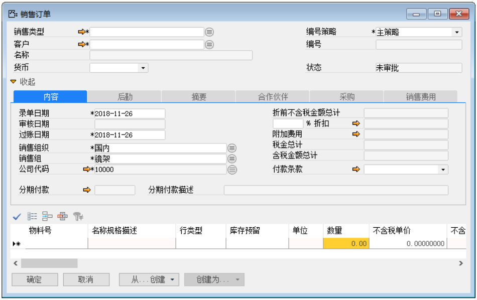
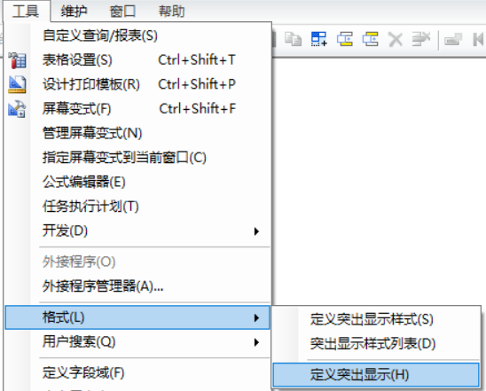
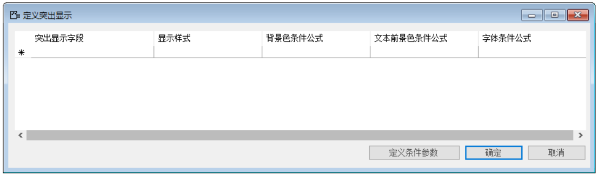
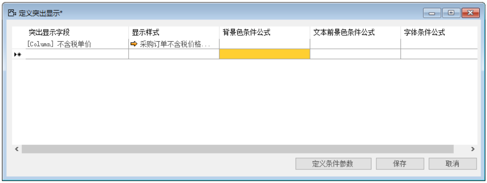

在前提要求定义突出显示样式，以及公式代码定义完成之后，方可将某字段数据定义为突出显示。

那么完成上述功能我们需要进行以下操作：

1. 任意打开一个凭证/单据，打开窗口，并使光标锁定任意一个字段上，如图3-3-1所示；

 

**图3-3-1**

2. 打开定义突出显示，菜单栏->工具->格式->定义突出显示，打开窗口，如图3-3-2,3-3-3所示；

 

**图3-3-2**

 

**图3-3-3**

3. 编辑突出显示内容，如图3-3-4所示；

 

**图3-3-4**

点击【保存】按钮进行保存，【确认】按钮退出编辑窗口，并对其进行测试。

