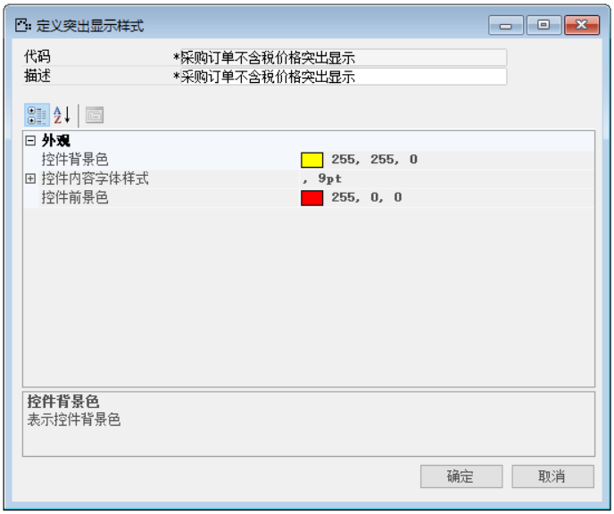
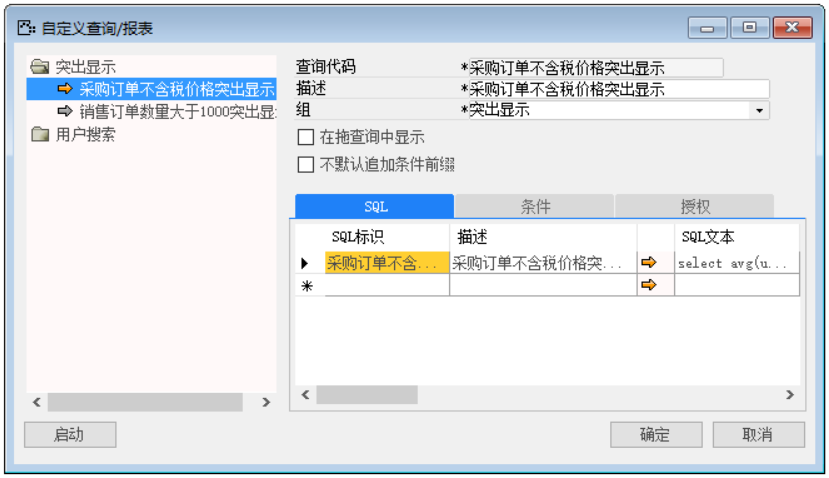
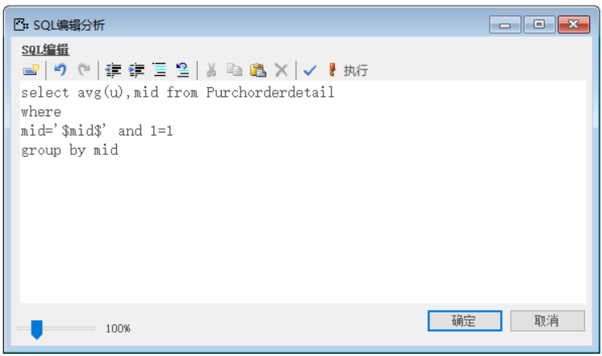
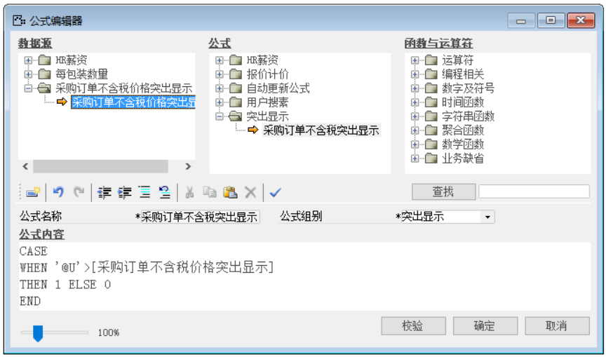
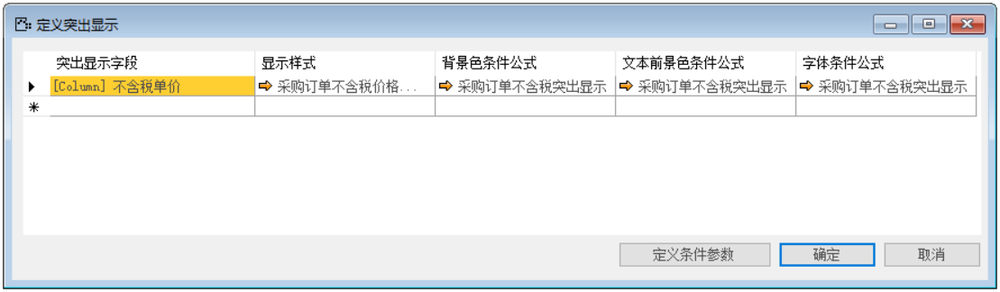
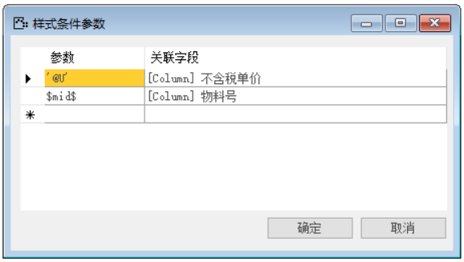
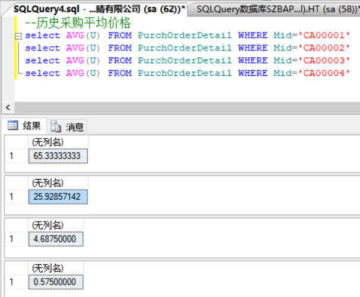
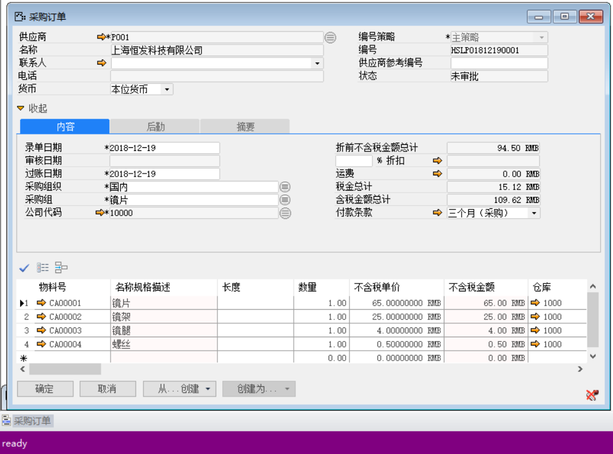
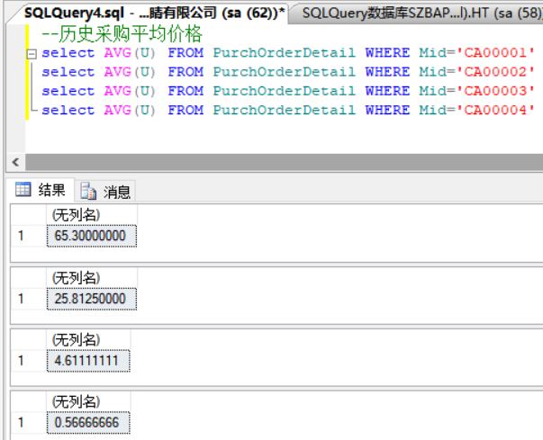
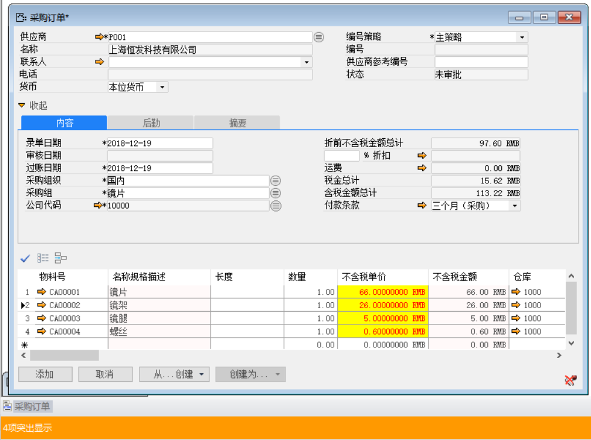

例如：用户在采购物料时，当有某种物料历史采购账本遗漏或缺失时，只能通过查看历史物料订单中平均成交价格，利于重新制定物料采购价格，超出价格时显示红色,提醒用户价格超出,及时控制价格。

那么完成上述功能我们需要进行以下操作：

1. 定义前提条件突出显示样式，如图3-4-1所示；

 

**图3-4-1**

2. 定义前提条件自定义查询/报表，从菜单栏->工具->自定义查询/报表，打开窗口，并编辑内容，如图3-4-2所示；

 

**图3-4-2**

3. 编辑SQL文本代码，如图3-4-3所示：

 

**图3-4-3**

4. 定义前提条件公式代码，从菜单栏->工具->公式编辑器，打开窗口，并编辑如下内容，新建数据源，将自定义查询/报表定义的sql运用到公式编辑器中来，如“采购订单不含税价格突出显示”，并输入公式名称为“采购订单不含税突出显示”，公式组别为“突出显示”，并输入公式代码内容，如图3-4-4所示；

 

**图3-4-4**

5. 打开采购订单，并打开定义突出显示，编辑突出显示字段、显示样式、背景色条件公式等内容，如图3-4-5所示；

 

**图3-4-5**

6. 点击【定义条件参数】按钮，设置参数，如图3-4-6所示；

 

**图3-4-6**

7. 点击【保存】按钮进行保存，【确定】按钮退出编辑窗口，并对其进行测试；

8. 测试物料历史平均价格，进入SqlServer数据库，新建查询空白页，输入查询代码，如图3-4-7所示；创建新采购订单，按照数据库平均历史价格，给与物料不同价格，添加保存后，查看消息/通知栏是否有突出显示信息提示；有，则超出历史平均价格；无，则控制在平均价格之下；如此处没有突出显示效果，如图3-4-8所示：

 

**图3-4-7**

 

**图3-4-8**

9. 再次测试物料历史平均价格，如图3-4-9所示；再次给与物料不同价格，超过历史平均价格测试,有字体为红色，黄色背景突出显示效果，如图3-4-10所示。

 

**图3-4-9**

 

**图3-4-10**
