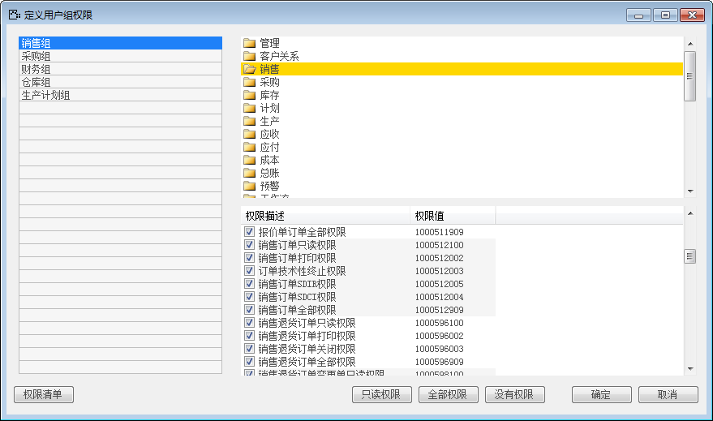
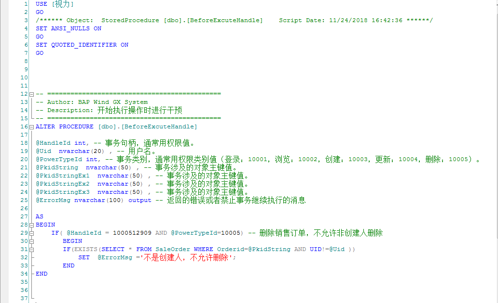
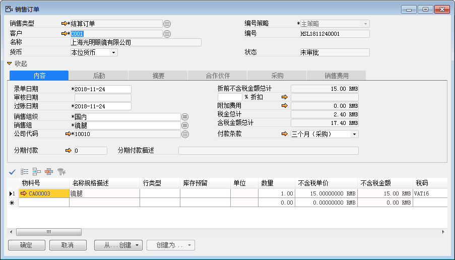
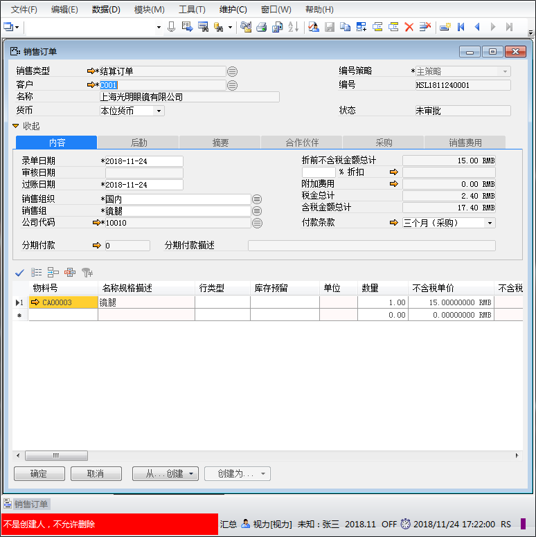

#### **概述**

系统存储过程是指BAP默认提供的两个关键存储过程，所有用户自定义存储过程将依赖关键存储过程执行， 关键存储过程默认随账套一起生成。（BeforeExcuteHandle和BeforeSaveCommitHandle）存储过程控制是指BAP NICER 5默认提供的两个关键存储过程, 所有用户自定义存储过程并通过执行控制BAP NICER 5对象操作流程，主要存储过程：BeforeExcuteHandle、BeforeSaveCommitHandle。

#### **步骤**

1. **BeforeExcuteHandle**

在业务开始执行时控制。通常指BAP NICER 5对象操作开始前的干预。只要控制不通过，系统就禁止继续往下执行，尽快释放系统占用资源，快速给出操 作用户信息提示。

例如：销售订单必须选择工厂信息

参数：

@HandleId：事务句柄，通常用权限值，可以通过相关资料或者通过打开BAP NICER 5系统【定义用 户组权限】界面获得

@PowerTypeId：事务类别，通常用权限类别值（登录：1001，浏览：1002，创建：1003，更新：1004，删除：1005）。

@PkidString： 事务涉及的对象主键值。

@PkidStringEx1： 事务涉及的对象主键值。

@PkidStringEx2：事务涉及的对象主键值。

@PkidStringEx3： 事务涉及的对象主键值。

@ErrorMsg：返回的错误或者禁止事务继续执行的消息

2. **BeforeSaveCommitHandle**

在业务完成前控制。通常指BAP NICER 5对象操作作为 一个事务执行完成前的干预。系统默认逻辑都执行完毕，但是存储过程控制不通过，系统仍然会禁 止提交事务，所有已执行逻辑回滚，给出操作用户信息提示。

例如：删除销售订单，不允许非创建人删除

参数：

@HandleId：事务句柄，通常用权限值，可以通过相关资料或者通过打开BAP NICER 5系统【定义用 户组权限】界面获得

@PowerTypeId：事务类别，通常用权限类别值（登录：1001，浏览：1002，创建：1003，更新：1004，删除：1005）。

@PkidString： 事务涉及的对象主键值。

@PkidStringEx1： 事务涉及的对象主键值。

@PkidStringEx2：事务涉及的对象主键值。

@PkidStringEx3： 事务涉及的对象主键值。

@ErrorMsg：返回的错误或者禁止事务继续执行的消息

3. **存储过程使用**

用户可以自定义存储过程，然后在BAP NICER 5系统存储过程中引用，也可以在BAP NICER 5系统存储过程中直接添加自定义逻辑控制甚至与第三方系统的交互。考虑安全性和可维护性，一般建议复杂的逻辑采 用自定义存储过程方式，简单的控制采用在BAP系统存储过程中添加SQL语句控制。

例如：某公司有代码为10010名称销售部部门，销售专员系统做一张订单，其他销售人员不能删除。实现所述控制业务流程需要如何配置，进行以下步骤：

1、 打开sql sever中数据库->项目名称：【视力】->【可编程性】->【存储过程】；

2、 打开“dbo.BeforeExcuteHandle”，编写特定功能的SQL 语句集并执行；

- 权限值：打开BAP  NICER 5主菜单中选择【管理】->【基础定义】->

【一般】->【定义用户权限组】，查找销售订单全部权限：1000512909

 

- 编写SQL 语句，用权限值“@HandleId = 1000512909”， 权限类别值“PowerTypeId=10005”，具体语句如图所示：

 

- 执行语句。

3、 打开BAP  NICER 5主菜单中选择【销售】->【订单】->【销售订单】；

4、 创建一张编号为HSL1811240001销售订单，如图所示：

 

5、 更换用户登录，用户：张三；

6、 打开一张编号为HSL1811240001销售订单，点击“删除”按钮，效果如下：

