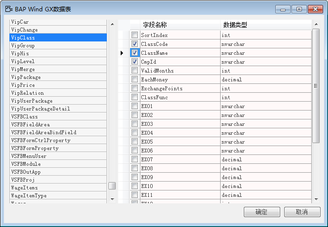
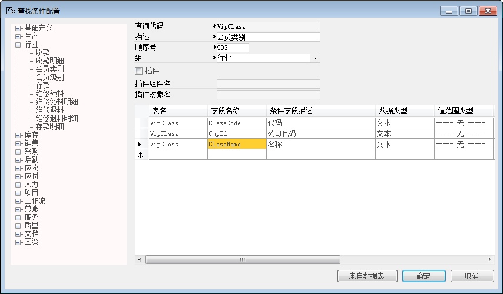
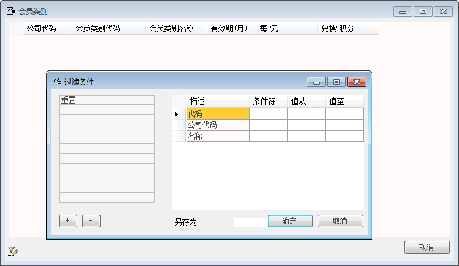

例如配置会员类别过滤条件，步骤如下：

1. 登录BAP NICER 5客户端系统，从【菜单窗口】->【工具】->【查找条件配置】，打开查找条件配置窗口；

2. 输入查询代码“VipClass（表名）”、输入描述“会员类别”、输入顺序号“993”，选择组“行业”；

3. 明细表可以直接输入条件，也可以点击【来自数据表】按钮，打开BAP Wind GX数据表窗口；

 

4. 选择表名VipClass，选择字段，点击【确定】按钮，则转到查找条件配置，点击【添加】按钮，保存查找条件配置；

 

5. 打开数据行会员类别，预览配置条件。

