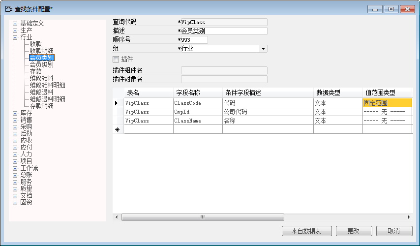
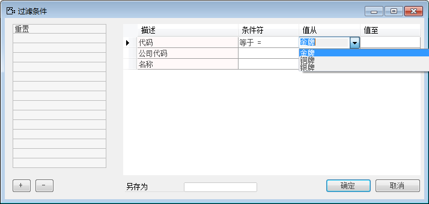

对于有固定范围查询条件的，则可以在系统中配置固定范围查询条件，当设置成固定范围值时，进行筛选条件时如果选择“等于”或“不等于”在“从值”栏中就可以从固定范围中选择条件。

例如配置数据行会员类别中会员名称查询条件设置为过滤条件，步骤如下：

1. 登录BAP客户端系统，从【菜单窗口】->【工具】->【查找条件配置】，打开查找条件配置窗口；

2. 如果左边已有会员类别，则点击打开。如果没有则添加，输入查询代码“VipClass（表名）”、输入描述“会员类别”、输入顺序号“993”，选择组“行业”；

3. 在查找条件区域找字段名称“ClassCode”行，值范围类型选择“固定范围”；

 

4. 点击【更改】保存，并退出；

5. 从菜单栏【工具】->【查询条件范围设置】，进入查询条件范围设置界面；

6. 选中条件代码为“ClassCode”会员代码的行；

7. 在“范围值”栏中输入固定范围值；

 

8. 点击【更改】保存设置；

9. 点击【托查询】->【行业】->【会员类别】，点击 按钮，查看结果。

