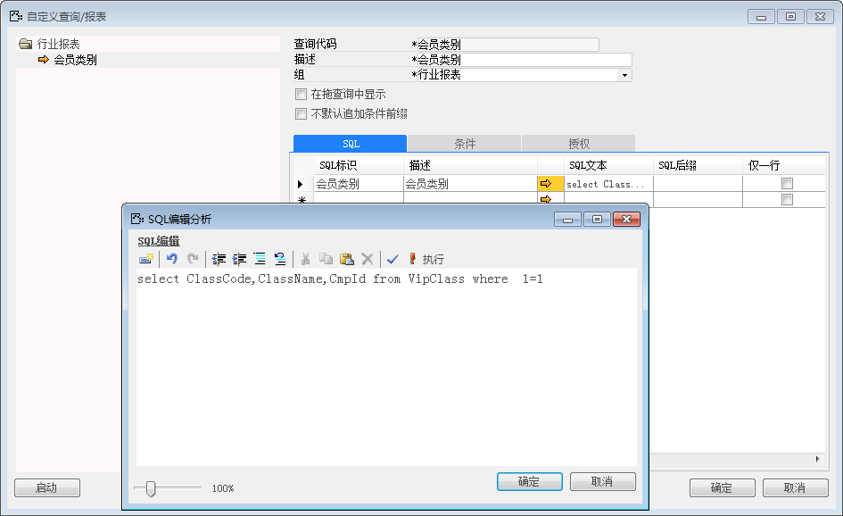
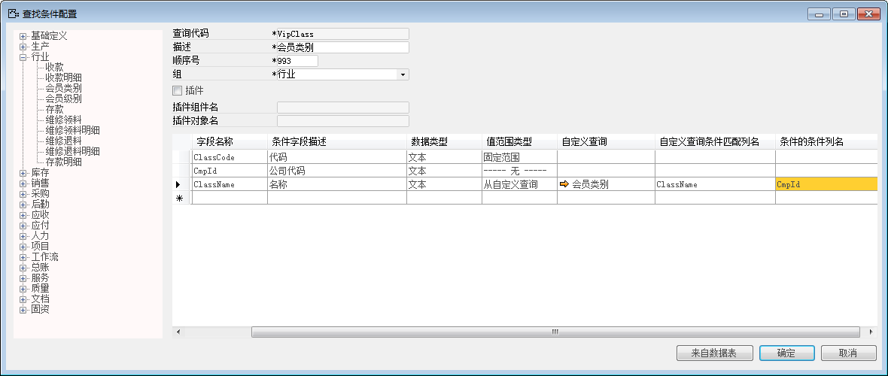
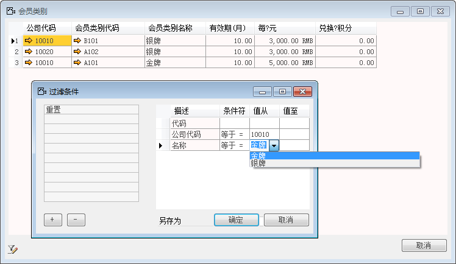

自定义查询的条件值范围与固定范围类似，只是数据的来源不是手动设置，而是通过执行SQL语句的自定义查询获取，灵活性高于固定条件值范围。

例如配置数据行会员名称查询条件来源于自定义查询，步骤如下： 

1. 登录BAP客户端系统，从【菜单窗口】->【工具】->【自定义查询/报表】，打开自定义查询/报表 界面；

2. 创建查询会员类别的自定义查询“会员类别”，并保存自定义查询/报表；

 

3. 从【菜单窗口】->【工具】->【查找条件配置】,打开查找条件配置窗口；

4. 如果左边类别中已有会员类别，则点开打开。如果没有则要添加，输入查询代码“VipClass（表名）”、 输入描述“会员类别”、输入顺序号“993”，选择组行业；

5. 设置条件会员类别名称“ClassName”的值范围类型为“从自定义查询”，并选择创建的“会员类别” 自定义查询；

6. 输入自定义查询匹配列名字段为“ClassName”；

7. 如果需要增加先前条件，则在条件的条件列名中输入“CmpId”；

 

8. 点击【拖&查询】->【行业】->【会员类别】，点击 按钮；

9. 选择公司代码等于“10010”作为条件，再选择名称等于，则会根据公司代码条件而查出名称。

