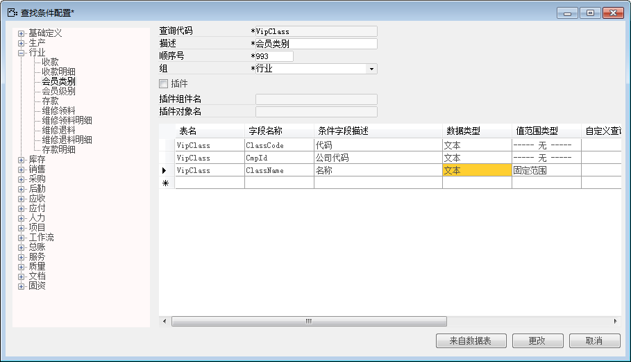
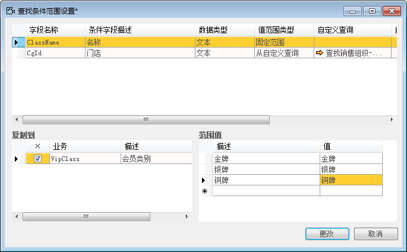

对于有固定范围查询条件的，则可以在系统中配置固定范围查询条件，当设置成固定范围值时，进行筛 选条件时如果选择“等于”或“不等于”在“从值”栏中就可以从固定范围中选择条件。

例如将会员类别的名称查询条件设置成固定范围值，步骤如下：

1. 登录BAP NICER 5客户端系统，从【菜单窗口】->【工具】->【查找条件配置】,打开查找条件配置窗口；

2. 左边列表选择“会员类别”，右边列表明细中找到“名称”行，设置值范围类型为“固定范围”， 点击【更改】按钮保存；

 

3. 从【菜单窗口】->【工具】->【查找条件范围设置】,打开查找条件范围设置窗口；

4. 选择条件“名称”行，在范围值中，输入描述及值为洗车卡、代金卡，点击【更改】按钮保存；

 

5. 打开数据行会员类别，点击过滤条件，查看名称固定值设置。

