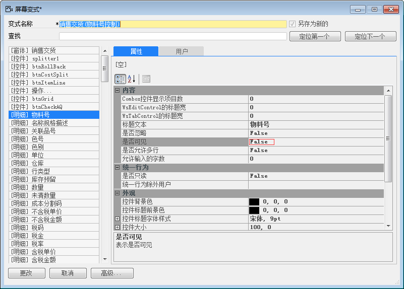
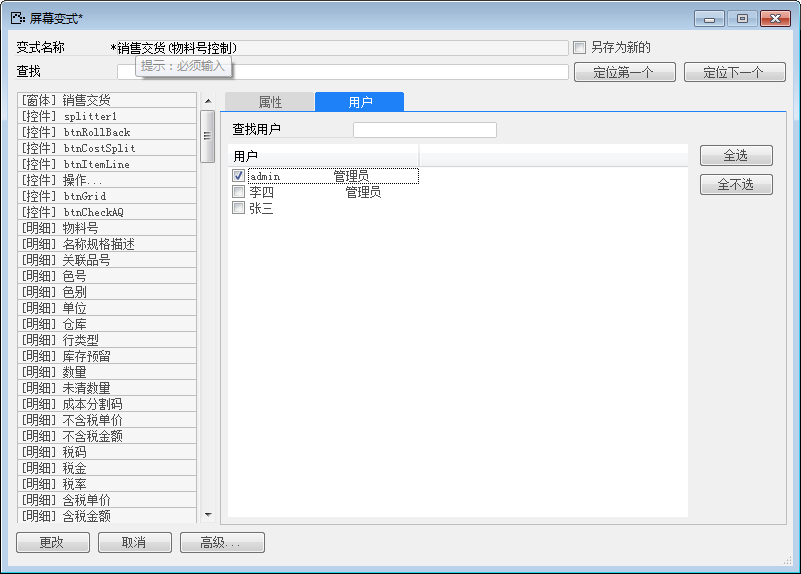
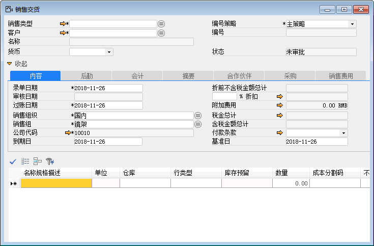

在对窗口添加屏幕变式之前注意一下几点：

- 创建屏幕变式时，必须先打开一个需要定义屏幕变式的窗口，并取得窗口焦点。

- 所有的窗口的屏幕变式名称不能重复。

例如：某公司销售交货添加屏幕变式，实现销售交货对用户admin不可见物料号功能。

实现以上功能需要进行以下操作：

1. 从BAP  NICER 5中【菜单窗口】->【销售】->【销售交货】，打开销售交货一个窗口；

2. 单击工具栏按钮，打开屏幕变式设置窗口；

3. 选中【物料号】控件，输入【变式名称】：销售交货(物料号控制)，选择【编辑属性】： FALSE；

 

4. 将屏幕变式分配给指定用户：admin；

 

5. 点击【更改】保存设置；

6. 检查是否成功，重新打开销售交货窗口，明细表【物料号】是隐藏的：

