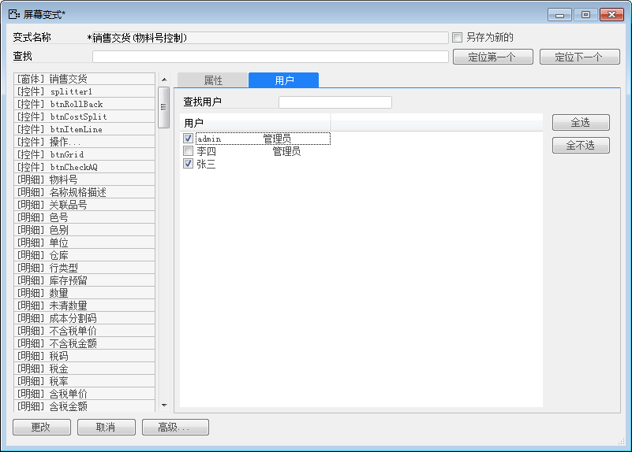

在对窗口更改屏幕变式之前注意一下几点：

变更屏幕变式必须先从菜单打开一个已经定义了屏幕变式的 BAP  NICER 5 窗口。

例如：某公司销售交货更改屏幕变式，实现销售交货对用户admin不可见物料号功能增加用户张三。

实现以上功能需要进行以下操作：

1. 从BAP  NICER 5打开销售交货一个已经被定义了屏幕变式的窗口；

2. 从选择屏幕变式窗口中选择一个屏幕变式，单击“打开”按钮或双击屏幕变式，打开窗口；

3. 单击工具栏按钮，打开屏幕变式设置窗口；

4. 编辑对象属性和用户，勾选用户“张三”；

 

5. 单击【更改】按钮；

6. 用户张三登录也能实现销售交货不可见物料号功能。
