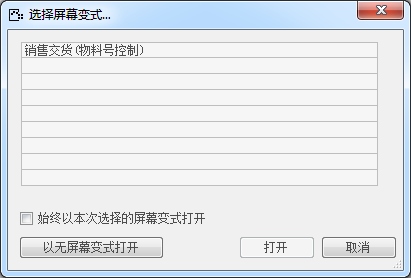

在对窗口更改屏幕变式之前注意一下几点：

窗口一旦定义了屏幕变式，每次打开窗口时就需要用户选择一个屏幕变式以继续。

实现以上功能需要进行以下操作：

1. 从BAP  NICER 5打开销售交货一个已经被定义了屏幕变式的窗口；

2. 从选择屏幕变式窗口中选择一个屏幕变式，选择屏幕变式方式：

- 选择“以无屏幕变式打开”，窗口没有任何布局；

- 选中屏幕变式名称，点击“打开”按钮，窗口实现屏幕变式功能

