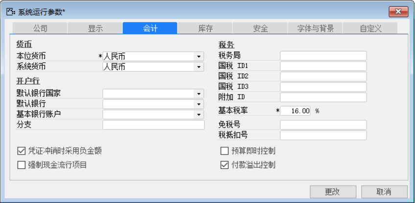
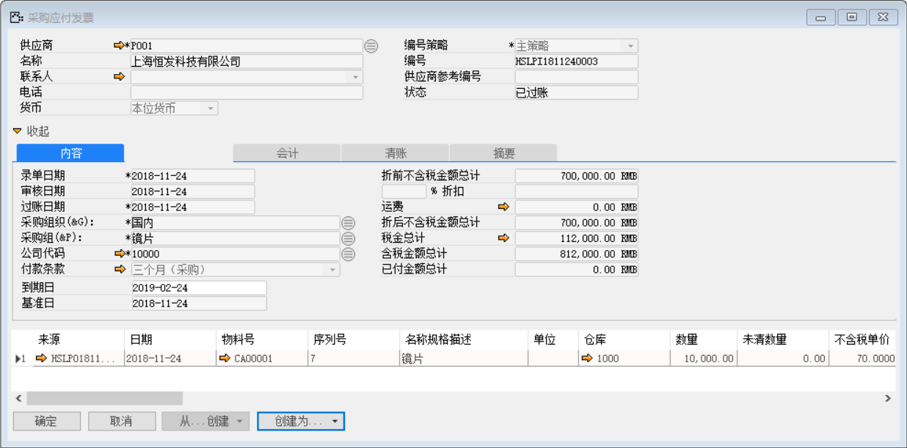
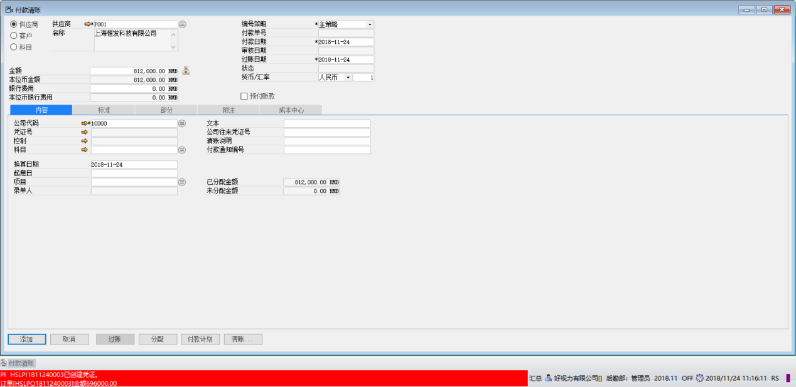

#### **概述**

王先生是好视力眼镜公司的采购部主管，为了加强对采购付款的控制，不允许出现采购业务的应付发票总金额大于其来源的采购订单总金额。于是启用了系统提供的“付款溢出控制”功能。

#### **步骤**

1、 打开【系统运行参数】，在【会计】选项卡下，勾选【付款溢出控制】；

 

2、 创建新【采购订单】

- 【含税金额总计】：696000

- 【编号】：HSLPO1811240003

 

3、 从上述采购订单创建【应付发票】时

- 【含税金额总计】：812000

- 【编号】：HSLPI1811240003

 

4、  从上述应付发票创建【付款】，系统报错“PI  HSLPI1811240003已创建凭证。订单[HSLPO1811240003]金额696000.00。可能来源相关凭证已创建预付款,总支付金额大于应付金额, 超出[116000.00]！”应付发票金额减去订单金额即为超出金额。

 

