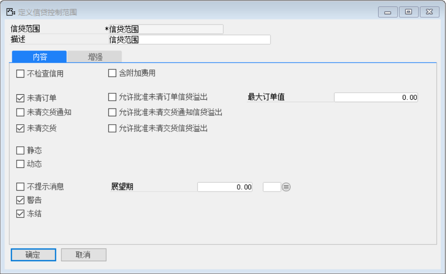
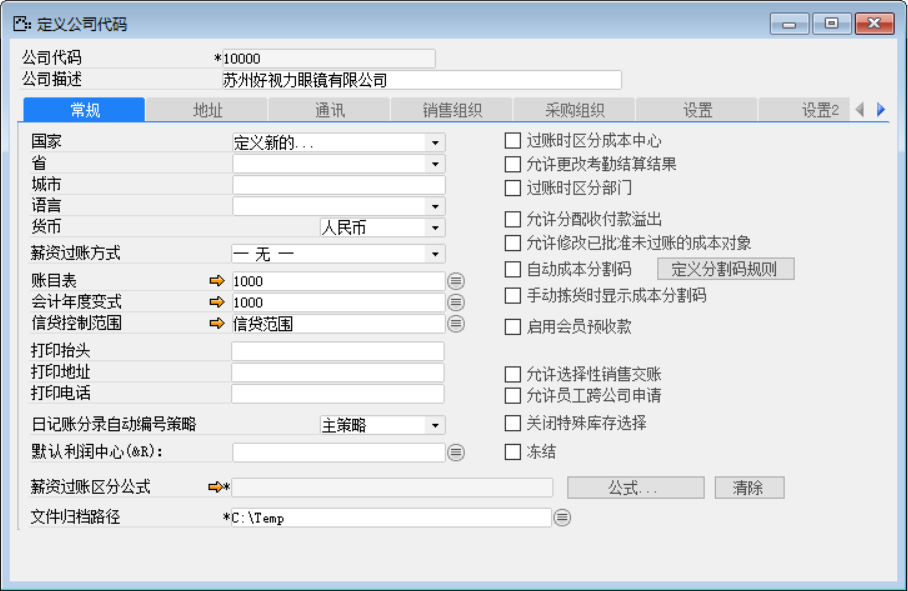
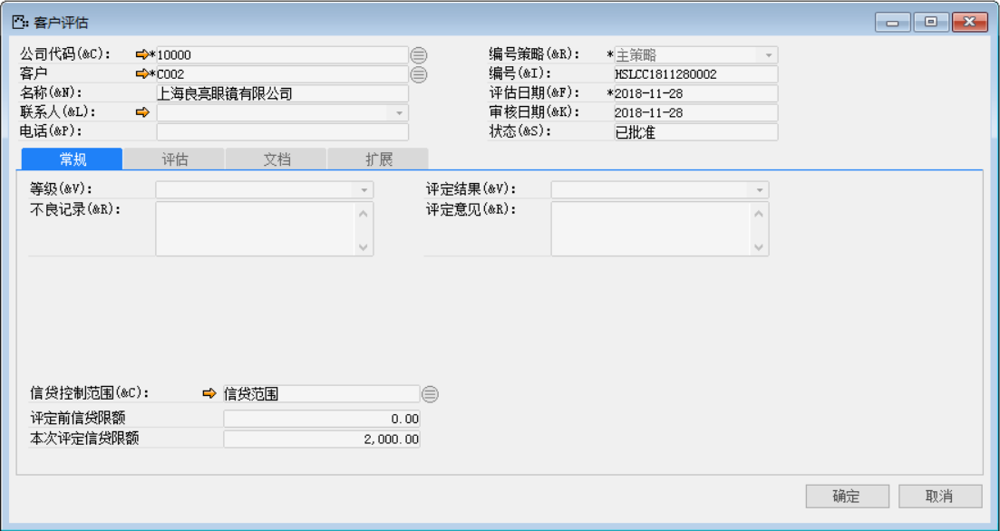
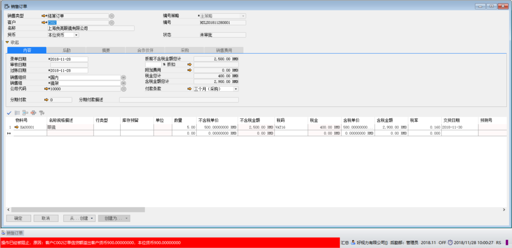
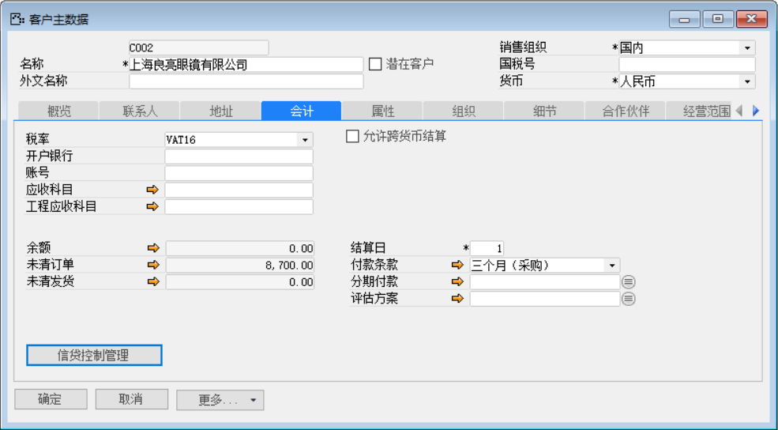
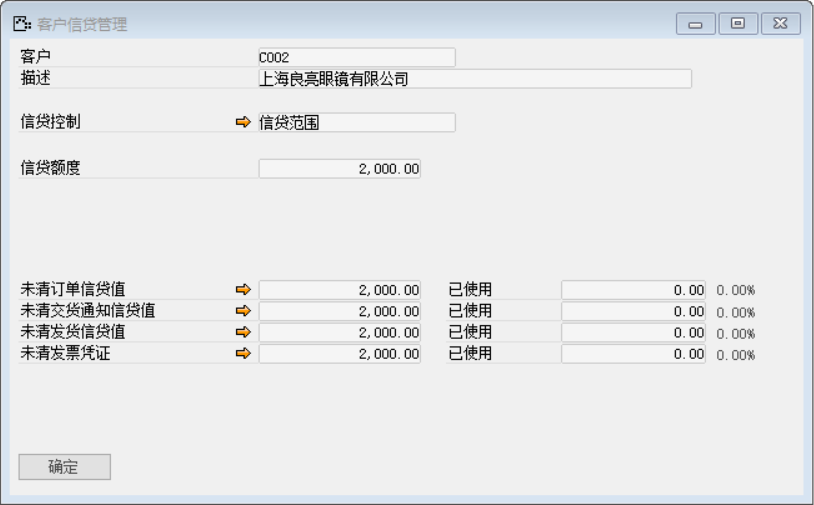

#### **概述**

张经理是好视力有限公司的销售部经理，由于与客户“C002”刚开始合作，他希望能够控制该客户的未清订单和未清交货的总信贷额度为2000，当该客户的未清金额超过信贷额度时，系统加以提醒与控制。

#### **步骤**

1、 定义新的“信贷控制范围”

打开【定义信贷控制范围】界面，定义新的“信贷范围”；

- 信贷范围：信贷范围

- 描述：信贷范围

- 内容：勾选【未清订单】、【未清交货】、【警告】、【冻结】

 

2、 将定义的“信贷控制范围”分配到公司

打开【定义公司代码】界面，在【信贷控制范围】内选择第一步定义的“信贷范围”

 

3、 为具体客户设置相应的信贷额度

打开【客户评估】界面，为客户“C002”添加信贷额度

- 在【信贷控制范围】中选择已定义的“信贷范围”

- 【本次评定信贷限额】：2000

 

4、 创建销售订单，查看【信贷控制范围】具体效果

打开【销售订单】界面，创建一张新的销售订单

- 【含税金额总计】：2900元

 

系统报错“操作已经被阻止，原因：客户C002订单信贷额溢出客户货币900.00000000，本位货币900.00000000”

 

5、 查看具体客户信贷额度

打开【客户主数据】界面，点击【会计】选项卡下【信贷控制管理】按钮，可查看该客户的信贷管理。

 

