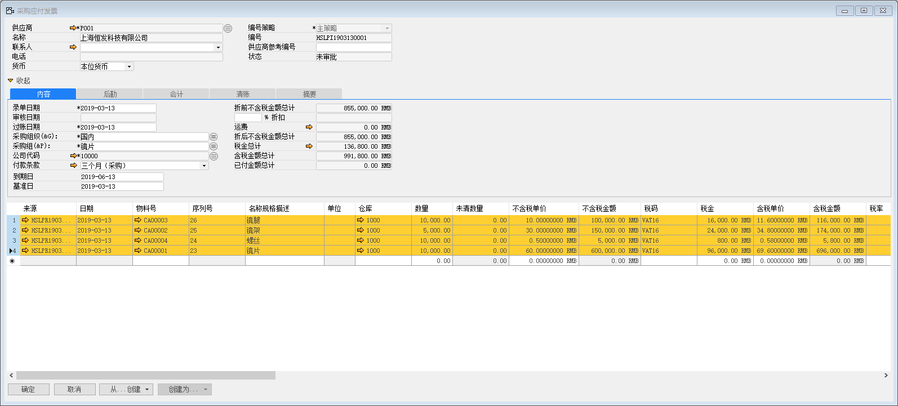
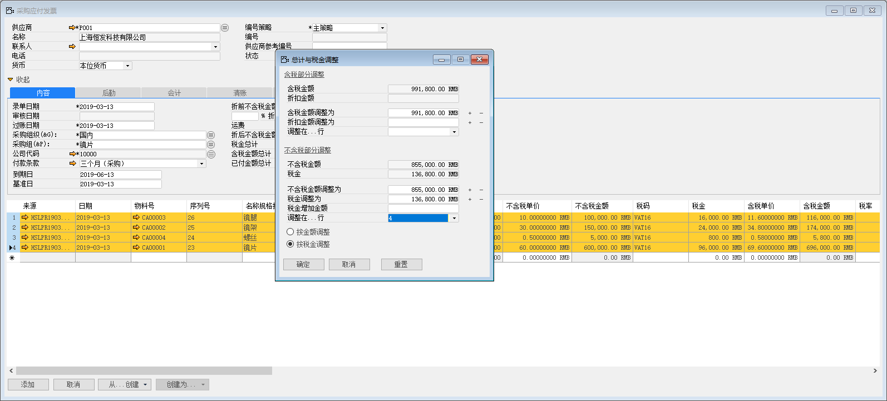
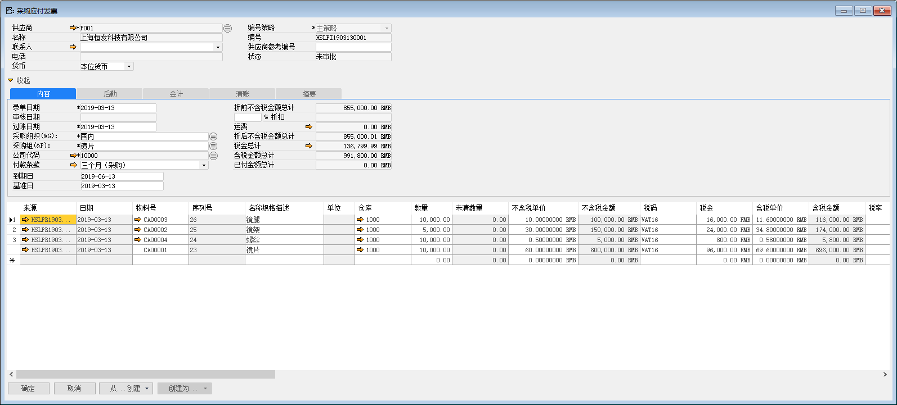

#### **概述**

本章主要讲解如何在系统内调整价税和税差，指供应商开的应付发票会和我们系统应付发票因为供应商的开票机和我们系统计算方式不一致导致会出现几分钱的差异。

#### **步骤**

例如：苏州好视力眼镜有限公司系统内创建应付发票HSLPI1903130001，系统内不含税金额为855000RMB，但是供应商实际开过来的应付发票不含税金额为855000.1RMB，含税金额不变，系统内调整步骤如下：

1、 选中4行明细行，左击‘税金总计’黄色箭头按钮，进入到调整界面；

 

2、 在不含税金额行上左击‘+’按钮，在税金调整为行上左击‘-’按钮，调整在….行选择4行；左击‘确定’按钮，进行保存，调整完成。

 

 

注：按金额调整指按照金额的权重进行调整
按税金调整指按照税金的权重进行调整