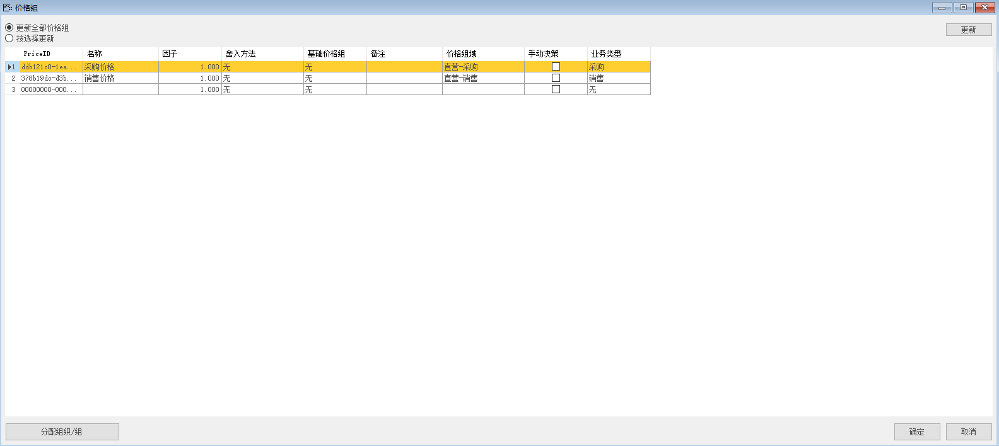
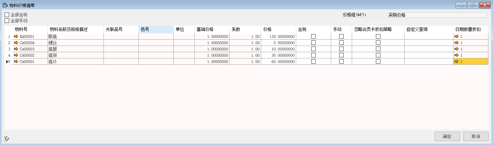
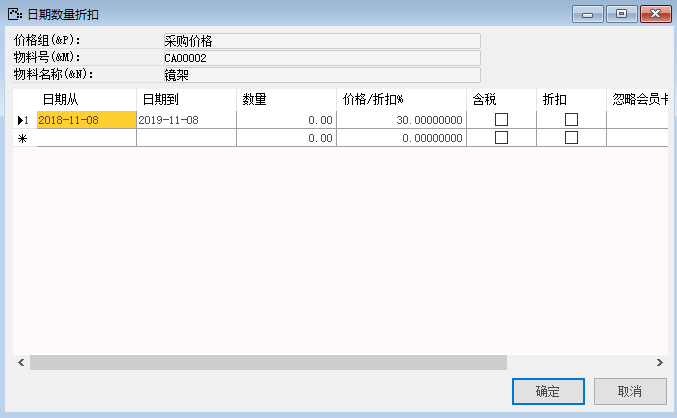
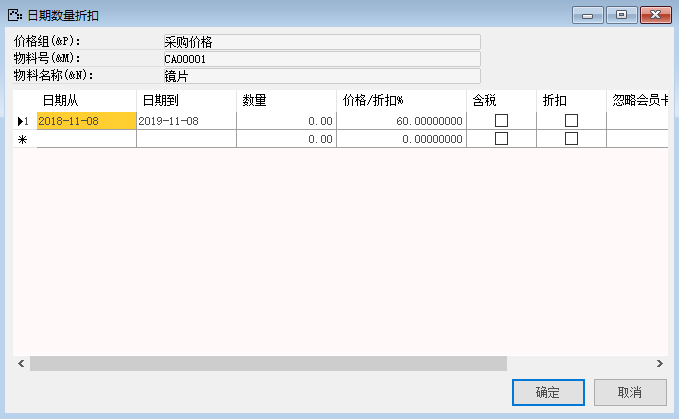
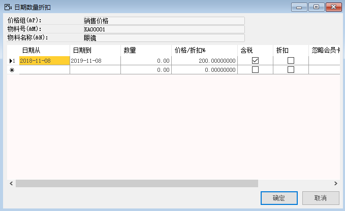
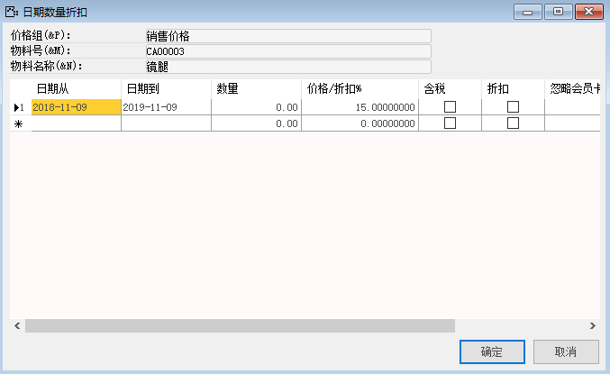
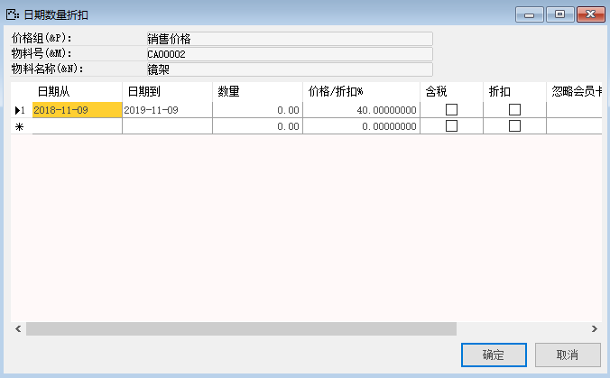
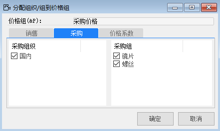

#### **概述**

本章主要讲解如何在系统内管理销售价格和采购价格。

#### **步骤**

1、 打开路径：从菜单窗口，管理-基础定义-一般-定义价格组，打开创建界面；

2、 编辑名称、价格组域、业务类型；

- 名称：采购价格、销售价格

- 价格组域：直营-采购、直营-销售

- 业务类型：采购、销售

3、 编辑完成，左击‘添加’按钮进行保存

 

4、 选中采购价格行，双击行头，进入物料价格清单，编辑物料的采购价格，编辑物料号，物料描述，价格，编辑日期数量折扣填写日期从、日期到、价格/折扣；

- 物料号：KA00001；描述：眼镜；日期从：2018-11-08；日期到：2019-11-08；价格/折扣：130；

- 物料号：CA00004；描述：螺丝；日期从：2018-11-08；日期到：2019-11-08；价格/折扣：0.5；

- 物料号：CA00003；描述：镜腿；日期从：2018-11-08；日期到：2019-11-08；价格/折扣：10；

- 物料号：CA00002；描述：镜架；日期从：2018-11-08；日期到：2019-11-08；价格/折扣：30；

- 物料号：CA00001；描述：镜片；日期从：2018-11-08；日期到：2019-11-08；价格/折扣：60；

 

 

 

5、 选中销售价格行，双击行头，进入物料价格清单，编辑物料的销售价格，编辑物料号，物料描述，价格，编辑日期数量折扣填写日期从、日期到、价格/折扣；

- 物料号：KA00001；描述：眼镜；日期从：2018-11-08；日期到：2019-11-08；价格/折扣：200；

- 物料号：CA00004；描述：螺丝；日期从：2018-11-08；日期到：2019-11-08；价格/折扣：1；

- 物料号：CA00003；描述：镜腿；日期从：2018-11-08；日期到：2019-11-08；价格/折扣：15；

- 物料号：CA00002；描述：镜架；日期从：2018-11-08；日期到：2019-11-08；价格/折扣：40；

- 物料号：CA00001；描述：镜片；日期从：2018-11-08；日期到：2019-11-08；价格/折扣：100

 

6、 编辑完成左击‘确定’按钮，返回到最初页面，选中销售价格行，左击‘分配组织/组’按钮，进行分配销售组织，销售组；

销售组织：国内；销售组：镜架、镜腿

 

7、 选中采购价格行，左击‘分配组织/组’按钮，进行分配采购组织，采购组；

采购组织：国内；采购组：镜片、螺丝；

 

8、 分配完成，销售采购价格定义完成，在销售或采购订单选择已分配销售采购价格的物料后，价格会自动带出分配的价格。