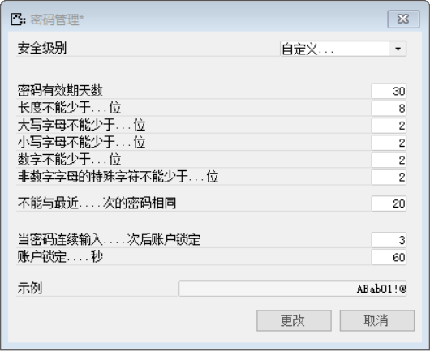
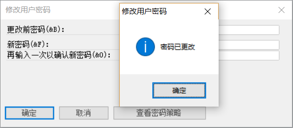

#### **概述**

本节介绍对用户密码管理的设置和用户修改密码，密码管理内提供高、中、低、自定义四种安全级别的选项，其中您可以采用高、中、低系统默认的三种，也可以自定义密码强度。

#### **步骤**

##### **密码管理**

打开路径：菜单栏—文件—密码管理

- 打开【密码管理】界面，设置新的“密码管理”；

- 安全级别：选择自定义；

- 内容：

| **名称**                        | **输入内容** |
| ------------------------------- | ------------ |
| 密码有效期天数                  | 30           |
| 长度不能少于…位                 | 8            |
| 大写字母不能少于…位             | 2            |
| 小写字母不能少于…位             | 2            |
| 数字不能少于…位                 | 2            |
| 非数字字母的的书字符不能少于…位 | 2            |
| 不能与最近….次的密码相同        | 20           |
| 当前密码连续输入….次后账户锁定  | 3            |
| 账户锁定….秒                    | 60           |

- 示例：ABab01!@

 

##### **修改用户密码**

**步骤**

打开路径：菜单栏—文件—修改用户密码

1、 打开【修改用户密码】界面，修改“用户密码”,修改密码前可以点击【查看密码策略】按钮查看密码管理格式；

2、 输入一个不满足密码管理的密码，系统提示报错；

- 更改前密码（&B）：12QWas!!；

- 新密码（&F）：34ERdf；

- 再输入一次以确认新密码（&0）：34ERdf；

 

3、 输入一个满足密码管理的密码，保存成功；

- 更改前密码（&B）：12QWas!!；

- 新密码（&F）：34ERdf@@；

- 再输入一次以确认新密码（&0）：34ERdf@@；

 

*注：输入的内容都以“\*”显示。*