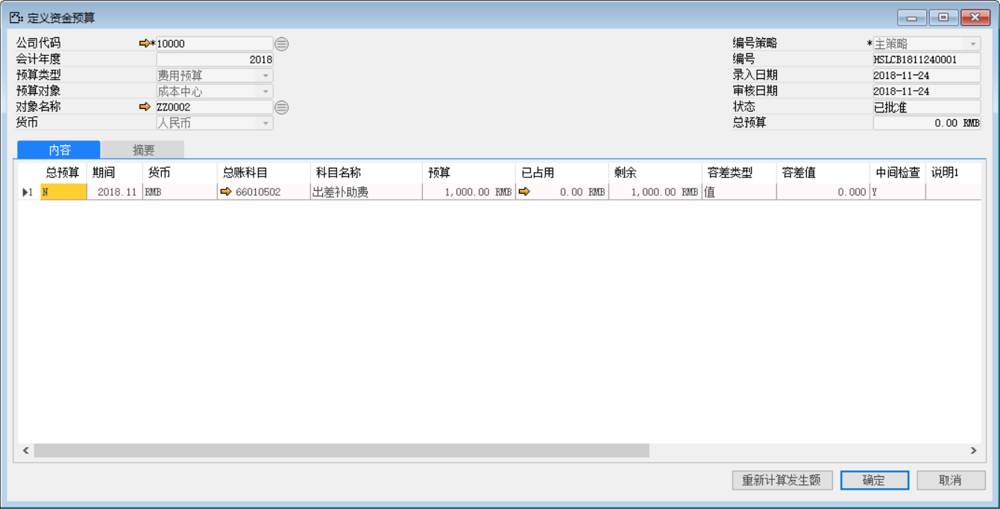
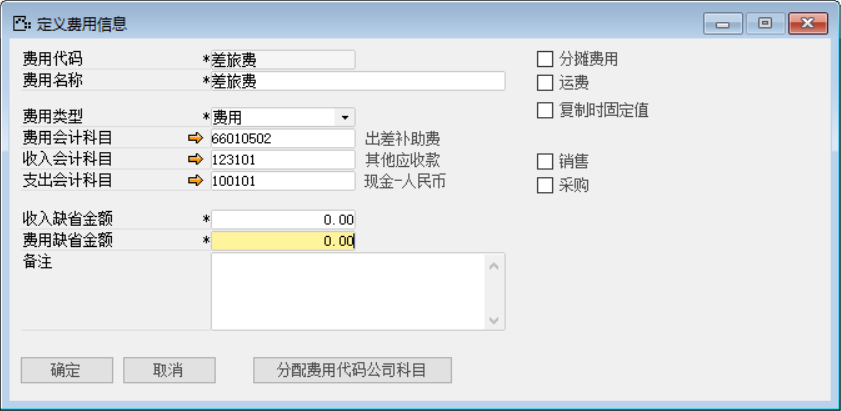
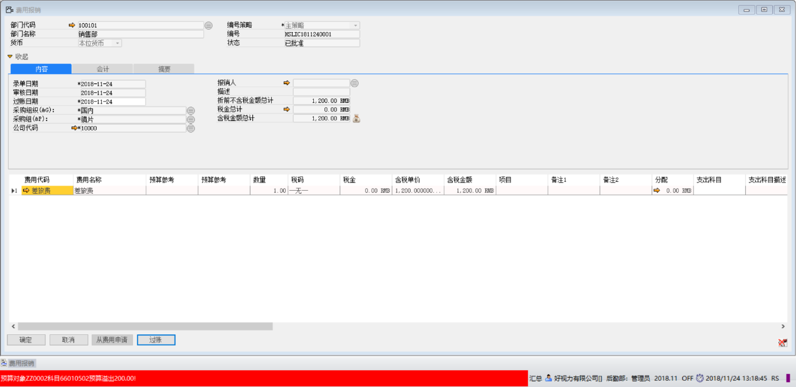
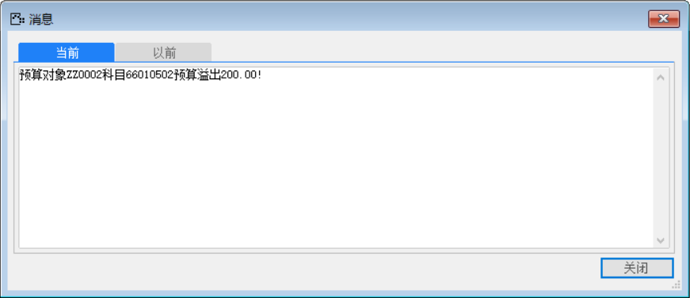

1、 打开【定义资金预算计划】界面，定义新的资金预算方案

打开路径：【预算】-【定义资金预算计划】

- 【预算类型】：费用预算；

- 【预算对象】：成本中心；

- 【对象名称】：ZZ0002（销售部）

- 【总账科目】：66010502 ；【科目名称】：销售费用-出差补助费；

- 【预算】：1000元

 

2、 打开【定义费用代码】界面，定义新的费用信息“差旅费”

打开路径：【管理】-【基础定义】-【会计】
q
- 【费用代码】：差旅费；【费用名称】：差旅费；【费用类型】：费用

- 【费用会计科目】：66010502；【收入会计科目】：123101；【支出会计科目】：100101

3、 打开【费用报销】界面，创建一张“费用报销单”

打开路径：【后勤】-【费用报销】

- 【费用代码】：差旅费；

- 【数量】：1；

- 【金额】：1200

 

4、 当对该费用报销单过账时，系统报错“预算对象ZZ0002科目66010502预算溢出200.00!”

 

