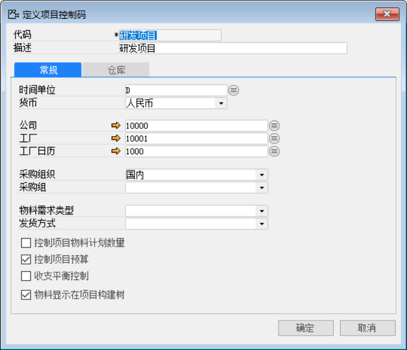
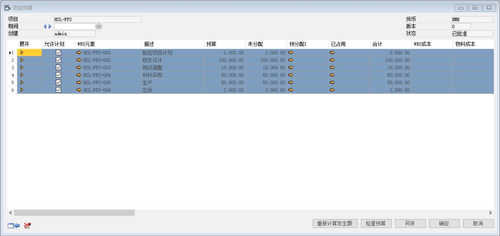
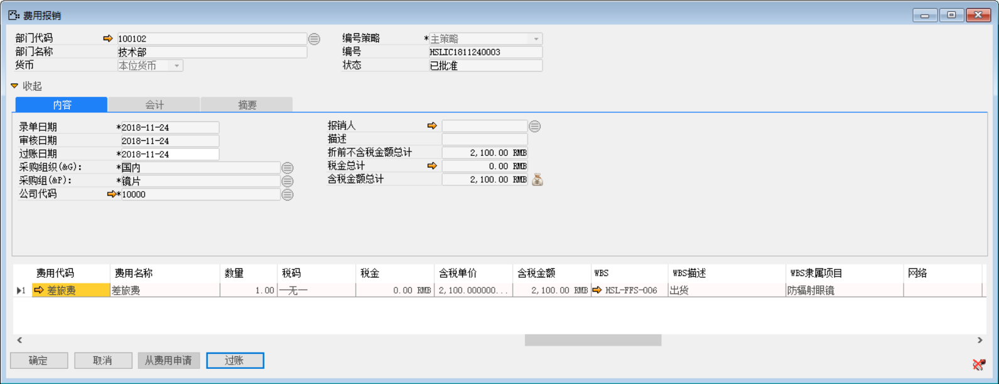
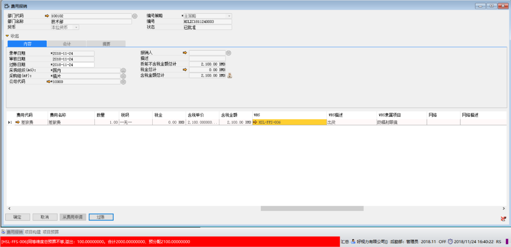
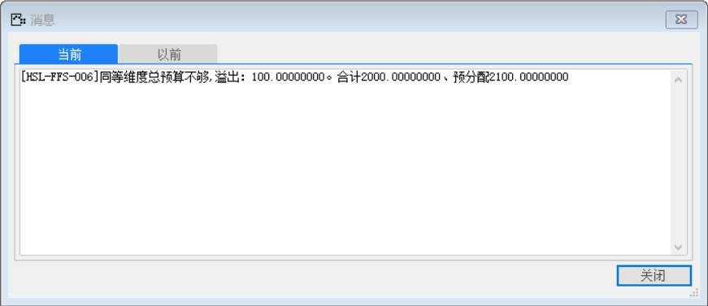

为项目制定预算额度，当WBS节点发生成本大于预算时，系统对预算超出部分报错。

1. 创建并分解项目，具体见“项目管理”章节；并且【项目控制码】勾选“控制项目预算”。

打开路径：【项目】-【定义】-【定义项目控制码】

 

2. 打开【项目预算】界面，设置项目预算金额并审批

打开路径：【项目】-【规划与预算】-【项目预算】

- 【描述】：出货；【预算】：2000

 

3.  打开【费用报销单】界面，创建一张费用报销

- 【费用代码】：差旅费；

- 【数量】：1；【金额】：2100

- 【WBS】：HSL-FFS-006；【WBS描述】：出货

 

4. 过账时，系统报错“[HSL-FFS-006]同等维度总预算不够,溢出：100.00000000。合计2000.00000000、预分配2100.00000000”

 

