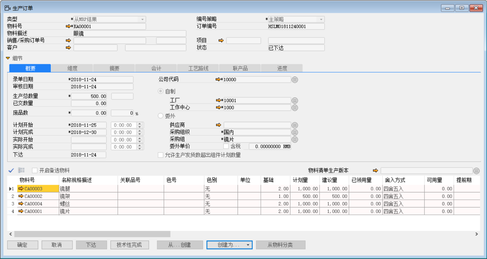
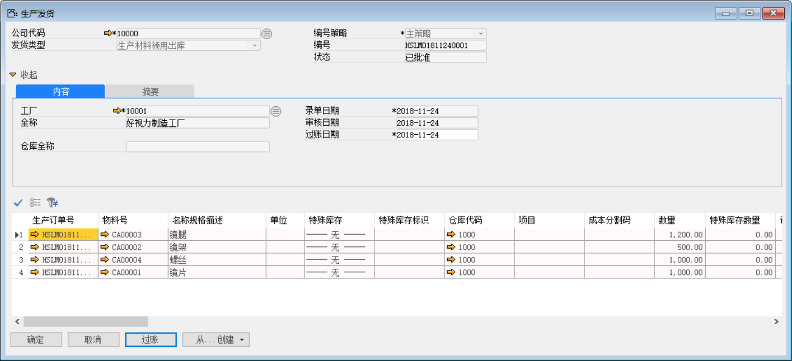
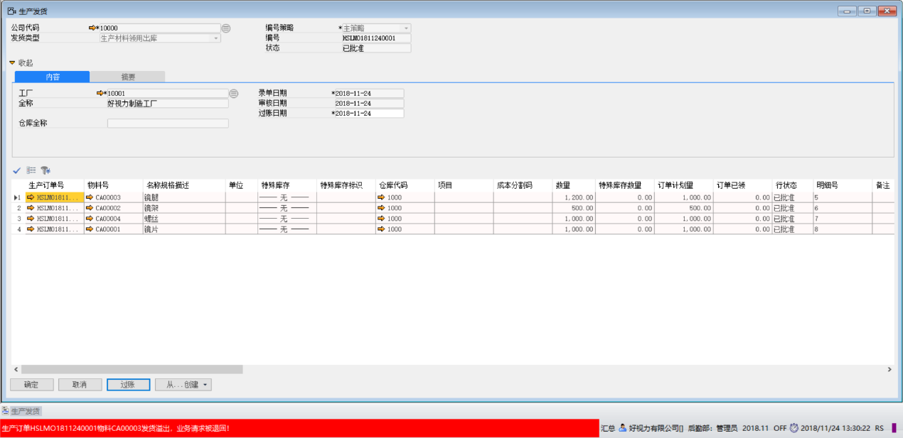
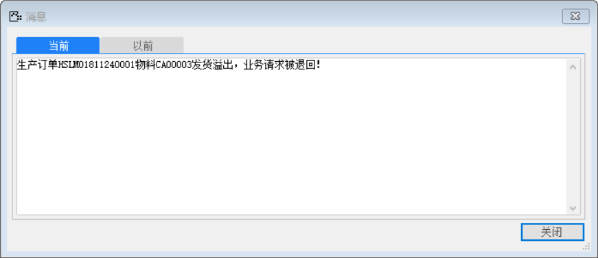

1、 打开【生产订单】界面，创建新的生产订单

- 【（产品）物料号】：KA00001；   【生产总数量】：500

- 【（生产组件）物料号】：CA00003；【计划量】：1000

- 【（生产组件）物料号】：CA00002；【计划量】：500

- 【（生产组件）物料号】：CA00004；【计划量】：1000

- 【（生产组件）物料号】：CA00001；【计划量】：1000

- 【允许生产发货数超过组件计划数量】：请勿勾选

 

2、 从上述【生产订单】创建【生产发货单】

 

3、 当物料号：CA00003的【数量】从【生产订单】中的1000变更为1200时，系统报错“生产订单HSLMO1811240001物料CA00003发货溢出，业务请求被退回！”

 

