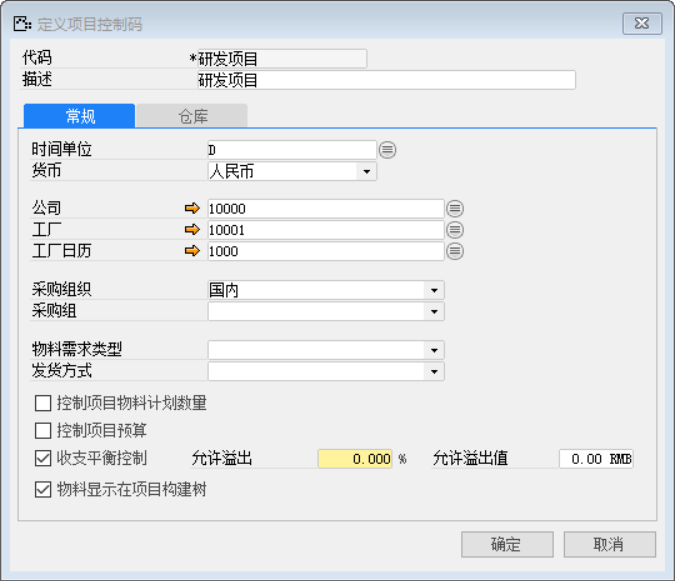
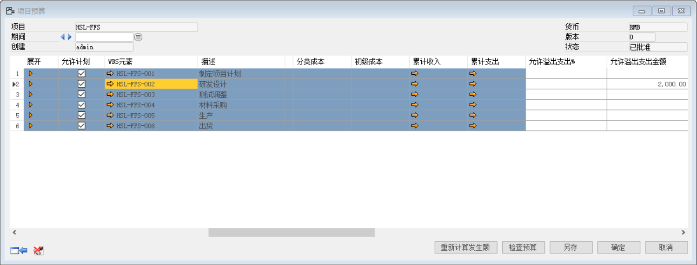
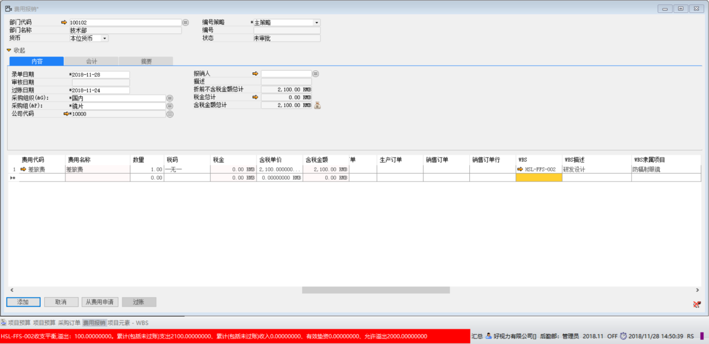
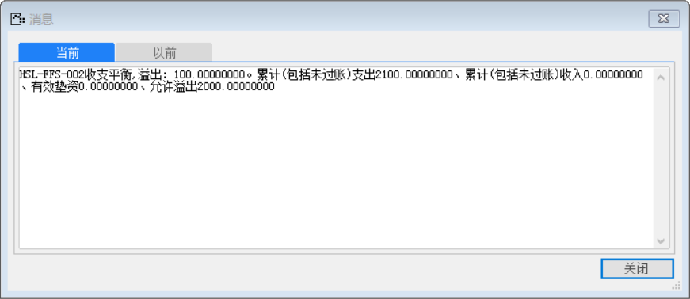

#### **概述**

李先生作为项目总监，深知研发阶段至关重要，因此允许研发设计阶段收支平衡允许溢出2000元

#### **步骤**

1. 设置具体项目节点的允许溢出支出金额

当前项目的【项目控制码】勾选【收支平衡控制】

 

打开【项目预算】界面，对WBS元素“HSL-FFS-002”设置【允许溢出支出金额】为2000元，并审核批准。

 

2. 创建【费用报销单】，查看具体效果

打开【费用报销】界面，创建一张费用报销单，报销单含税金额总计为2100元，选择【WBS】

为“HSL-FFS-002”

 

系统报错：“HSL-FFS-002收支平衡,溢出：100.00000000。累计(包括未过账)支出2100.00000000、累计(包括未过账)收入0.00000000、有效垫资0.00000000、允许溢出2000.00000000”

