#### **概述**

本部分主要讲述如何定义审批流，定义满足不同需求下的审批，并且支持内部用户审批、短信审批以及邮件审批。

#### **步骤**

1、 打开【管理】->【审批流程】->【定义审批流程】，设置新的“审批流程”； 

- 审批表单：销售订单；

- 启用：勾选

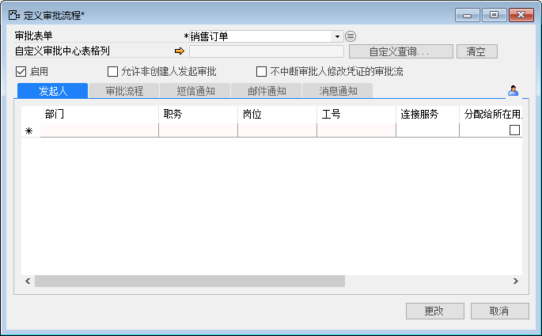 

2、 单击【发起人】选项卡，在发起人一列处，选择此业务凭证审批流程的发起人（也可以单击按钮，打开选择用户窗口，在此窗口中选择发起人）； 

- 发起人：李四；

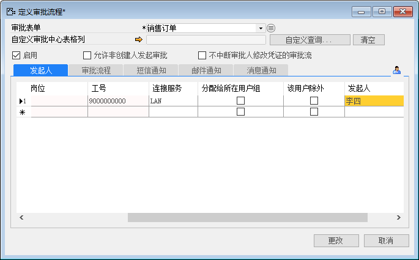 

3、 单击【审批流程】选项卡，单击【增加】按钮，选择一个或多个审批阶段；

- 增加：审批、签字；

- 消息通知：勾选；

- 邮件通知：勾选；

- 短信通知：勾选；

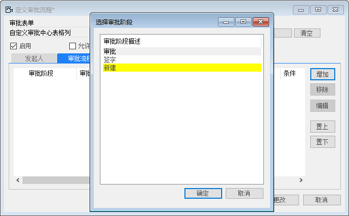 

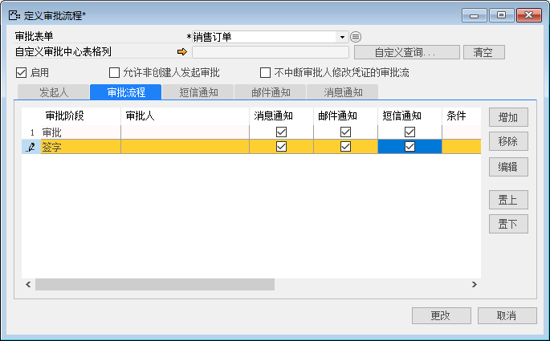 

4、 选择需要编辑的审批阶段，单击【编辑】按钮，打开编辑审批流程阶段窗口；

 

5、 在编辑审批流程阶段窗口中，单击【审批人】选项卡，在【审批人】一列处，选择该审批阶段的审批人（也可以单击按钮，打开选择用户窗口，在此窗口中选择发起人）；

- 审批阶段审批人：张经理；

- 签字阶段审批人：赵总；

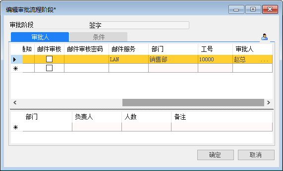

6、 选择通知方式、审核方式及审核密码；（此步骤为可选）

- 通知方式：消息通知、短信通知；

- 审核方式：短信审核；

- 审核密码：123

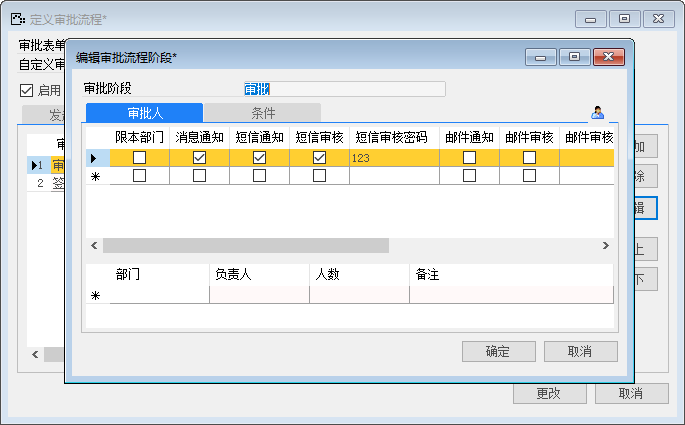 

7、 单击【条件】选项卡，输入预定义的条件和值；（此步骤为可选）

- 描述：税金总计；

- 条件：大于；

- 值：10000

 

8、 单击自定义审批条件部分的【自定义查询】按钮，打开自定义查询/报表窗口，选择所需要的查询；（此步骤为可选）

- 创建一个自定义审批流条件：销售订单总价大于10000的订单号；

- 语句：and OrderID in (select OrderId from SaleOrder where TotalA>100000 )

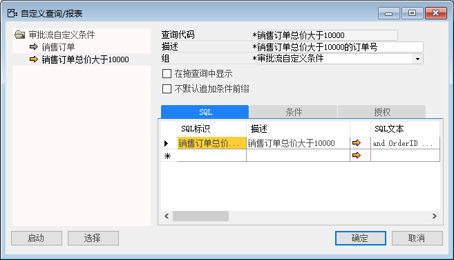 

 

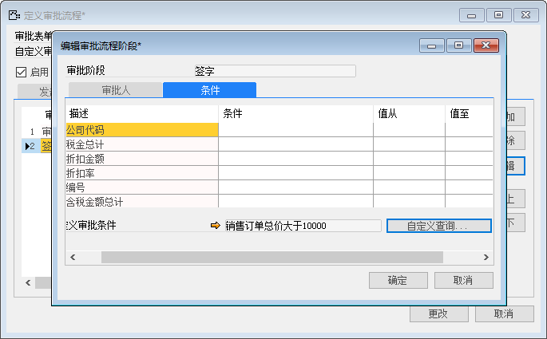 

9、 在【短信通知】选项卡中，选择发送字段和格式；（此步骤为可选）

- 发送字段：编号、客户号、名称；

- 格式：文本；

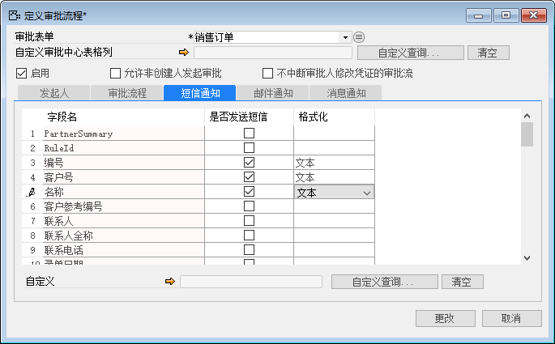 

10、 在【邮件通知】选项卡中，选择发送字段和格式；（此步骤为可选）

- 发送字段：编号、客户号、名称；

- 格式：文本；

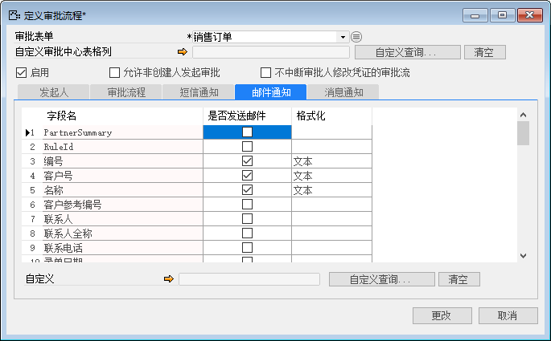 

11、 在【消息通知】选项卡中，选择发送字段和格式；（此步骤为可选）

- 发送字段：编号、客户号、名称；

- 格式：文本；

 

12、 单击【更改】按钮。

13、 创建一张销售订单，因为含税金额总计大于10000，所以需要审批；

- 客户：C001；

- 物料号：KA00001；

- 数量：5000；

- 含税金额总计：2900000；

 

14、 打开审批人的邮箱的审批邮件；

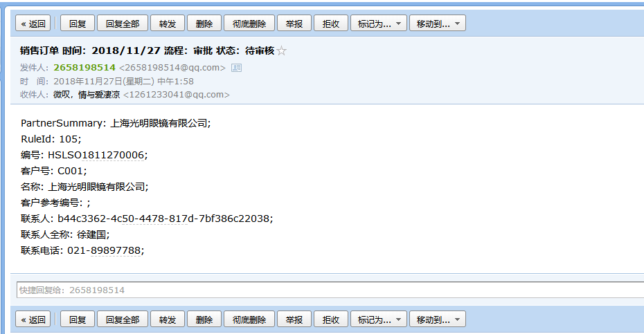