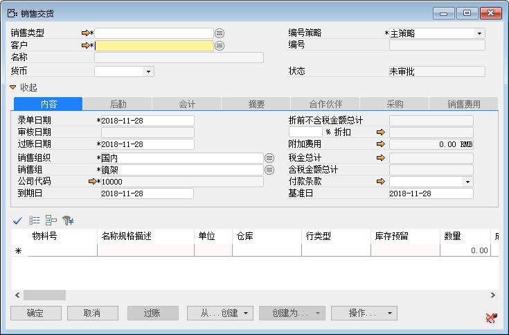
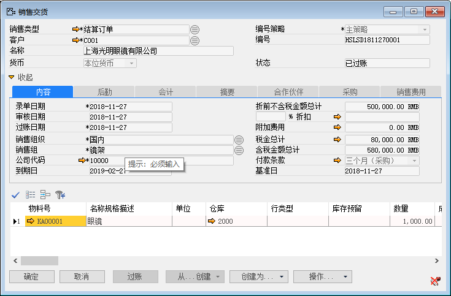
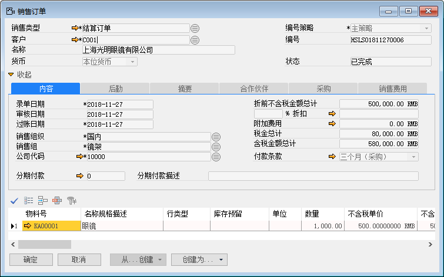

#### **概述**

每一个业务流程通常是由多个业务凭证组成，譬如销售业务流程就包括了从销售订单、销售交货通知、销售交货、应收发票、付款等业务凭证，而这些凭证之间并不是绝对的包含关系，而是存在着分解与聚合的关系，通过凭证流查询就能清楚地查询得到业务流程的具体凭证路线。

#### **步骤**

**业务场景：系统里有一张已经开了发票的销售交货单，通过工具栏的凭证流查询得到销售业务流程的具体凭证路线**。

1、 打开一个业务窗口，如销售交货业务窗口； 

 

2、 单击工具栏 ，查找历史收货凭证，如图查找订单；

 

3、 单击工具栏  按钮，打开凭证流窗口，通过凭证流能清楚地查询得到业务流程的具体凭证路线； 

  

4、 单击销售订单凭证前面的 超链接，可以得到单据的具体信息； 

 
