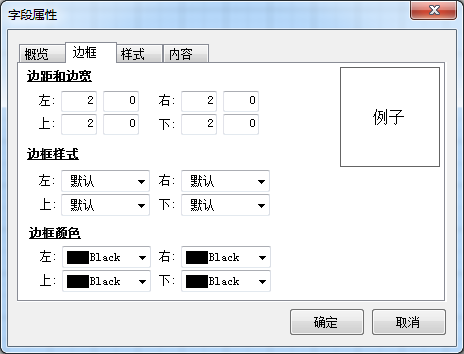
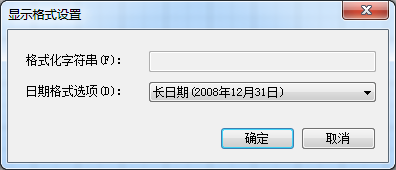
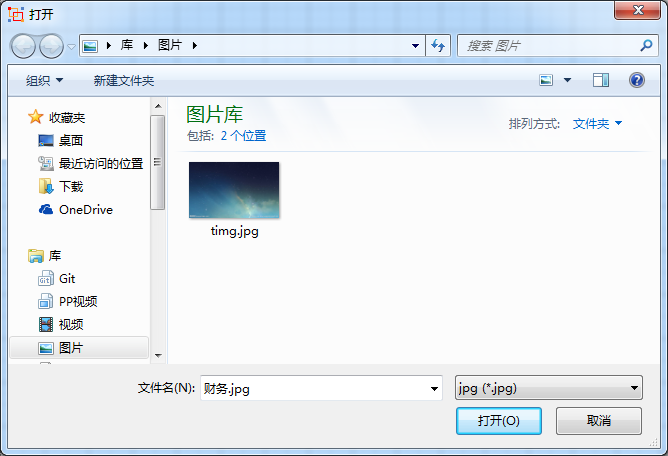
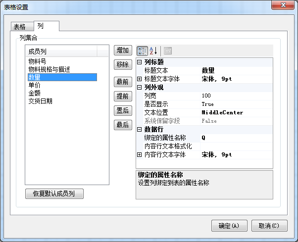

BAP表单打印模板设计器提供了基本的数据绑定、图片、表格、线、日期、普通文本以及丰富的设计样式功能。

例如打印一份销售订单的打印模板，实现上述功能的具体操作：

1. 从【菜单窗口】->【销售】->【订单】->【销售订单】，打开销售订单窗口；

2. 再从【菜单窗口】->【工具】->【设置打印模板】,或者点击工具栏按钮,打开设置打印模板窗口；

 

3. 产品基本功能使用

1) 创建标题文本：

标题文本即普通文本，可由用户自行输入显示文本。

用户通过BAP表单打印模板设计器插入标题文本步骤如下：

- 在设计界面空白部分，右击选择【插入】->【标题文本】，添加一个普通文本。

 

- 双击该文本重命名，或选中该文本至工具栏标题图标，将其重命名为销售订单。

在工具栏上选择字体 “宋体”，字号“小四”，点击 水平垂直居中。

 

- 右击选择【字段属性】，系统弹出【字段属性】窗体。切换至边框选项卡，给“销售订单”选择边框样式及颜色。切换至边框选项卡，给“销售订单”选择样式。

 

2) 创建字段文本：

字段文本显示的是动态文本，需绑定数据源使用。如果字段资源管理器中的资源为空，用户需联系开发商，或者自己写查询语句绑定所需使用的数据源。

用户通过BAP表单打印模板设计器插入字段文本步骤如下：

- 在设计界面空白部分，右击选择【插入】->【字段文本】，添加一个字段文本。

 

- 提示：字段文本需指定数据源，所以应先检查字段管理器是否绑定了数据源。

 

- 选中该字段文本，右击选择【数据绑定】，系统弹出【数据绑定】窗体，在此指定该字段绑定到的 属性。此处绑定到凭证编号（OrderId）属性。

 

- 在工具栏上选择字体“宋体”，字号“五号”，点击 左边垂直居中。

- 如果该字段需要格式化，可右击选择“显示格式”，系统弹出【显示格式】对话框。

 

提示: 在此可以格式化显示字符串。例如日期，小数位数等。

3) 创建自动日期文本：

自动日期用于显示系统时间。例如记录打印时间日期等。用户只需设定显示格式即可。 用户通过BAP表单打印模板设计器插入自动日期文本步骤如下：

- 在设计界面空白部分，右击选择【插入】—【自动日期文本】，添加一个自动日期文本。

 

- 右击选择【显示格式】，系统弹出【显示格式设置】窗体，选择日期的显示格式。

 

4) 创建图片 ：

图片可由用户从本地导入。

用户通过BAP表单打印模板设计器插入图片步骤如下：

- 在设计界面空白部分，右击选择【插入】->【图片】，添加一个空白图片。

 

- 右击选择【背景图片】，系统弹出【选择】窗体。

 

5) 创建表格：

表格可以绑定数据源显示动态数据或不绑定数据源。

- 在设计界面空白部分，右击选择【插入】->【表格】，添加一个默认表格。

 

- 右击选择【表格属性】或单击 ，系统弹出【表格设置】窗体。

- 在数据栏选择表格绑定的数据源。此处选择绑定的表名为“SaleOrderDetail”。 

 

提示：创建该种表格首先需确认【字段资源管理器】数据表资源是否有数据源。否则此处无法选择。

- 切换至列选项卡。点击【恢复默认成员列】按钮，系统加载当前绑定数据源的列。

 

提示： 【属性栏数据行】：系统默认加载绑定的属性名称。内容行文本格式用来格式化列。如数量小数位数、日 期等。

- 最后点击 保存模板。

