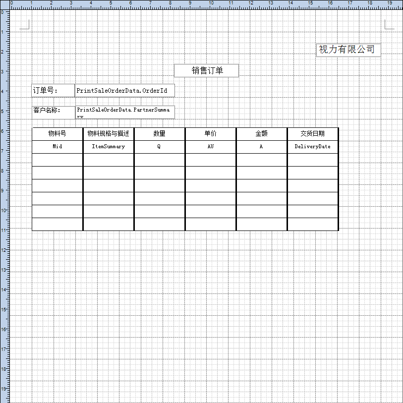

对视力有限公司销售订单，设置单页打印模板，步骤如下： 

1. 登录BAP客户端系统，从【菜单窗口】->【销售】->【销售订单】,打开销售订 单窗口；

2. 再从【菜单窗口】->【工具】->【设置打印模板】,或者点击工具栏按钮，打开设置打印模板窗口；

3. 设置页面格式，选择纸张大小，步骤如下：

- 从模板设计界面，从【菜单栏】->【样式】->【页面设置】，打开页面设置窗口； 

- 点击按钮，选择纸张大小A4，确定纸张方向纵项，以及页边距上下左右值为10；

- 编辑纸张的页面背景为白色，选择默认打印机设备；

4. 依据设计模板基本功能设计一份打印模板；

 

5. 点击工具栏 按钮，保存打印模板，预览打印模板。

