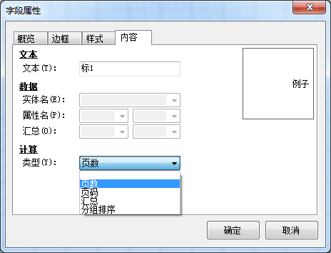
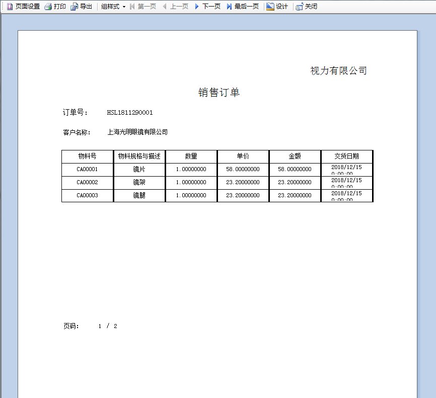
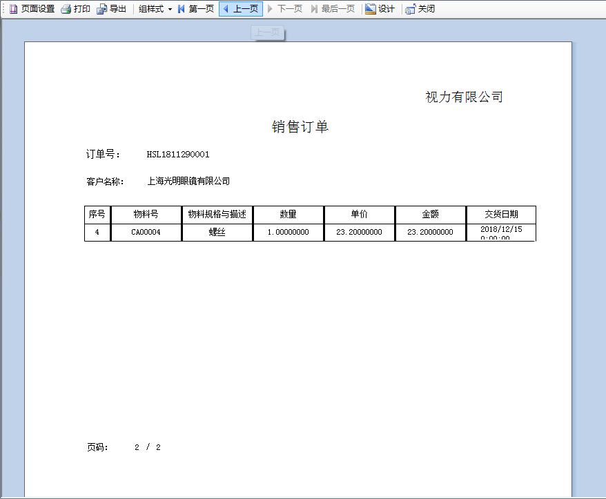

对视力有限公司销售订单，设置分页打印模板。

分页打印前面的步骤和单页打印一致，下面介绍如何实现分页打印： 

例如：在单页打印的基础上创建销售订单的多页打印模板，步骤如下： 

1. 打印模板中字段文本、标题文本、表格都设置页眉，如：左击表格->选择字段属性->选择“页眉”->点击“确定”；

2. 从打印模板中【菜单栏】->【插入】->【标题文本】,插入四个标题文本，调整文本框位置大小 以及文本对齐方式；

3. 第一个标题文本中输入“页码”并调整文本对齐方式和字体；右击第二个标题文本框，选择【字段属性】，打开字段属性，在内容选项卡中，选择类型为“页 码”；

 

4. 第三个标题文本中输入页码分割付“/”；第四个标题文本，参照第二个标题文本的操作，不同的是选择“页数”；

5. 打印模板中设置分页的四个标题文本设置页脚，如：左击标题文本“页码”->选择字段属性->选择“页脚”->点击“确定”；

6. 保存打印模板，预览分页打印模板。

 

提示：如果在表格设置时选中了“延续到下一页”，那么分 页打印时第二页的序号显示。

