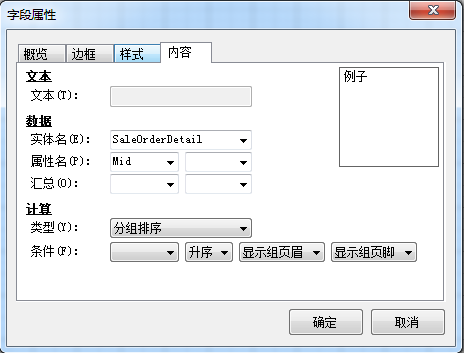

对视力有限公司销售订单，设置分组排序打印模板。 

BAP打印模板设计器只支持对表格内的数据进行分组，并且需从表格外部插入字段文本作为分组依据 

例如：配置上文的销售订单打印模板，按物料号分组排序打印，步骤如下： 

1. 从设置打印模板中【菜单栏】->【插入】->【字段文本】,插入一个字段文本； 

2. 右击该字段文本，选项【字段属性】，打开字段属性；

3. 在内容选项卡中，数据下选项实体名和表格绑定的数据源；

4. 在计算类型下选择分组排序，并选择分组条件，点击【确定】按钮；

 

提示： 

- 选项显示组页眉，分组名会单独在表格中插入新行显示，否则仅对分组字段进行排序； 

- 选项显示组页脚，用户汇总表中的数据。

5.  点击工具栏按钮保存模板，预览分组排序打印模板。

