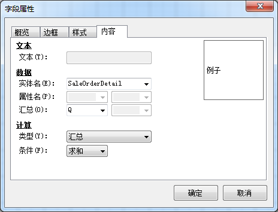
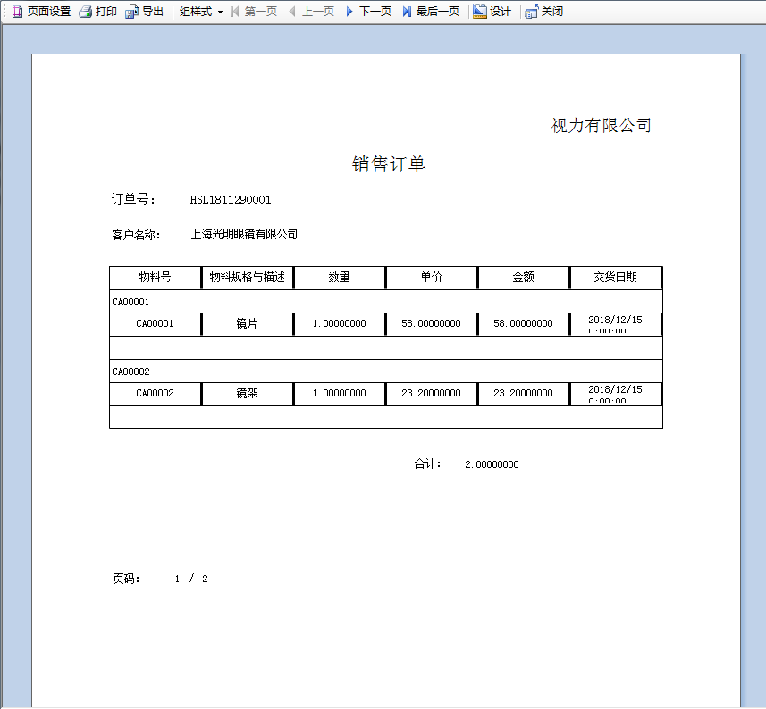

对视力有限公司销售订单，设置汇总打印模板。 

例如：对上文创建的销售订单打印模板的每一页的数量进行汇总，步骤如下：

1. 从打印模板中【菜单栏】->【插入】->【标题文本】（鼠标右击选择）,插入一个标题文本，输入合计，选择该字段属性为页脚；

2. 从【菜单栏】->【插入】->【字段文本】（鼠标右击选择）,插入一个字段文本，选择该字段属 性为页脚，对字段文本右击，选则【字段属性】，在内容选项卡中，选择实体名，汇总Q，选项类型汇总， 条件求和，点击【确定】按钮；

 

3. 点击工具栏 按钮保存模板，预览页汇总打印模板。

