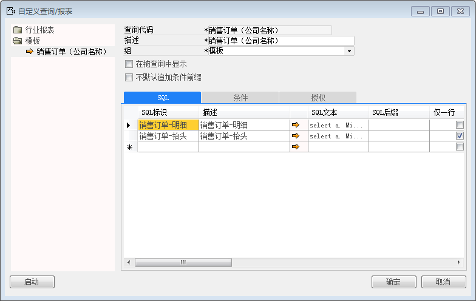
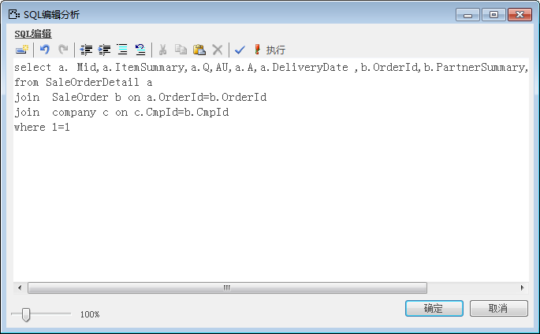
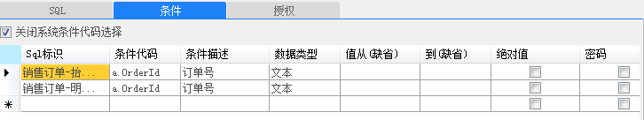
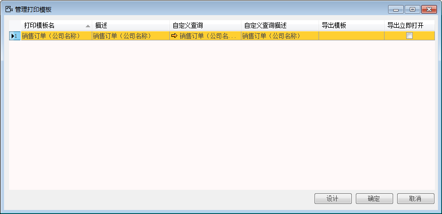
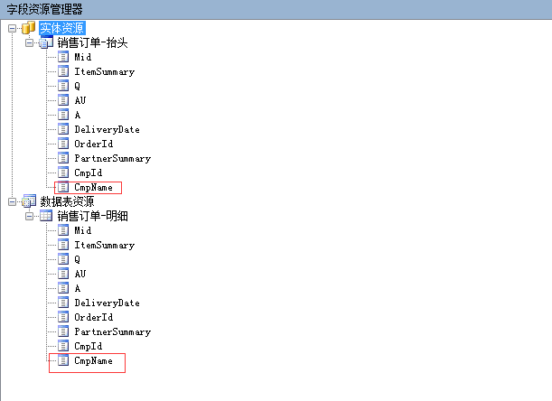

设计打印模板的数据表资源和实体资源也可以自定义查询获取，用户可以通过编写SQL语句执行获取不同单据上需要字段。

例如：销售订单的打印模板要有公司名称，具体操作如下：

1. 登录BAP NICER 5客户端系统，从【菜单窗口】->【工具】->【自定义查询/报表】，打开自定义查询/报表窗口；

2. 对自定义查询/报表主数据介绍描述【查询代码】：销售订单（公司名称），【描述】：销售订单（公司名称），【组】：模板，具体如图： 

 

3. 在“SQL”选项卡主要用于定义SQL语句以及报表最终显示。通过点击箭头打开SQL编辑分析窗口， 在这里我们可以类似使用MS SQL查询分析器一样编写SQL语句：

Select a.Mid,a.ItemSummary,a.Q,a.AU,a.A,a.DeliveryDate,b.OrderId,b.PartnerSummary,c.CmpId,c.CmpName

From SaleOrderDetail a

Join SaleOrder b on b.OrderId=a.OrderId

Join Company c on c. CmpId=b. CmpId

Where 1=1

 

4. 授权选项卡授权给用户，条件选项卡，输入如图所示：

 

5. 点击【添加】按钮，保存设置；

6. 单击【菜单模块】-〉【管理】-〉【系统初始化】-〉【管理打印模板】，打开管理打印模板窗口；

7. 选择打印模板名为“销售订单（公司名称）”，点击【设计】； 

 

8. 在设计模板查看数据源有公司名称字段属性：

