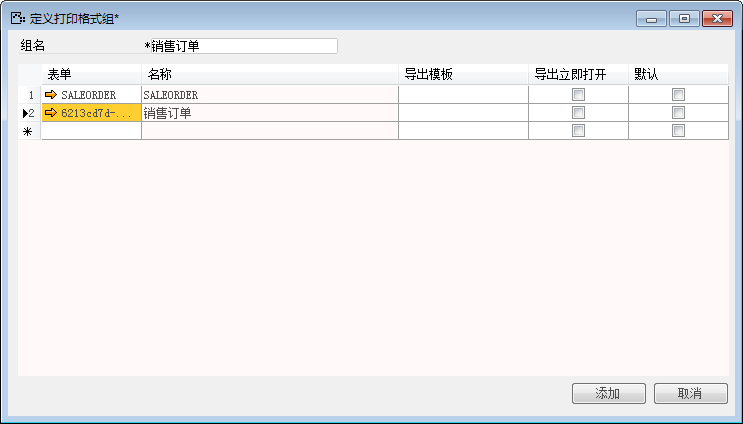
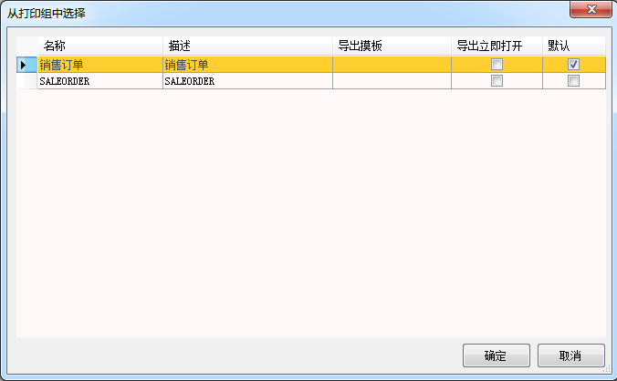

使用打印格式组将同一类别凭证的不同打印格式归纳到同一打印格式组中，以方便针对不同的打印格式需求使用不同的打印格式。

例如：视力有限公司有多份打印格式，实现上述情况具体步骤如下：

1. 打开BAP  NICER 5主菜单中选择【管理】->【系统初始化】->【定义打印组】,打开定义打印组窗口；

2. 输入打印格式组名：销售订单；

3. 在表单列，选择打印模板，重复该步骤可添加更多的打印格式；

 

提示：

- 若要启动打印格式组，必需将表单默认的打印格式和其他打印格式加入到同一组中。

- 管理员分配打印权限给用户

4. 点击【添加】，保存设置；

5. 检验效果，打开任意销售订单，点击打印按钮结果如下：

