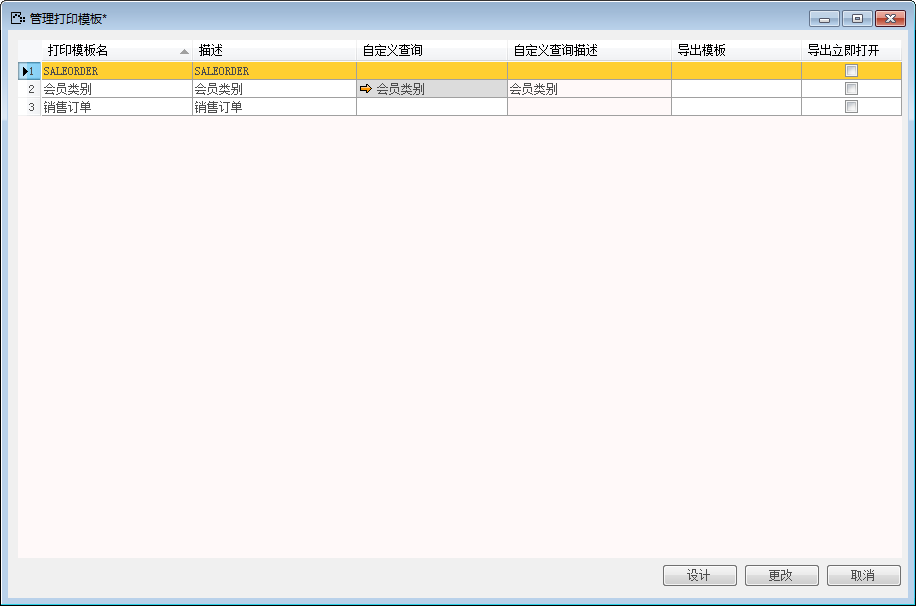

BAP NICER 5 中所有的打印模板均在此显示，当需要设计或修改某一打印格式时，可进入此界面集中进行操作。

**创建打印模板**

1. 单击【菜单模块】-〉【管理】-〉【系统初始化】-〉【管理打印模板】，打开管理打印模板窗口；

2. 选择一个需要打印的凭证或自定义查询，打印模板名：SALEORDER；

 

3. 单击“设计”按钮，打开“BAP表单打印模板设计器”窗口；

4. 设计打印模板；

5. 单击工具中的“保存”按钮。

**修改打印模板**

1. 单击【菜单模块】-〉【管理】-〉【系统初始化】-〉【管理打印模板】，打开管理打印模板窗口；

2. 选择需要修改模板的凭证或自定义查询,打印模板名：SALEORDER；

3. 单击【设计】按钮，打开“BAP表单打印模板设计器”窗口；

4. 修改打印模板；

5. 单击工具中的“保存”按钮。

**删除打印模板**

1. 单击【菜单模块】-〉【管理】-〉【系统初始化】-〉【管理打印模板】，打开管理打印模板窗口；

2. 选择需要删除模板的凭证或自定义查询；

3. 单击“设计”按钮，打开“BAP表单打印模板设计器”窗口, 打印模板名：SALEORDER；

4. 单击菜单栏中的“文件”，选择“删除表单”。

